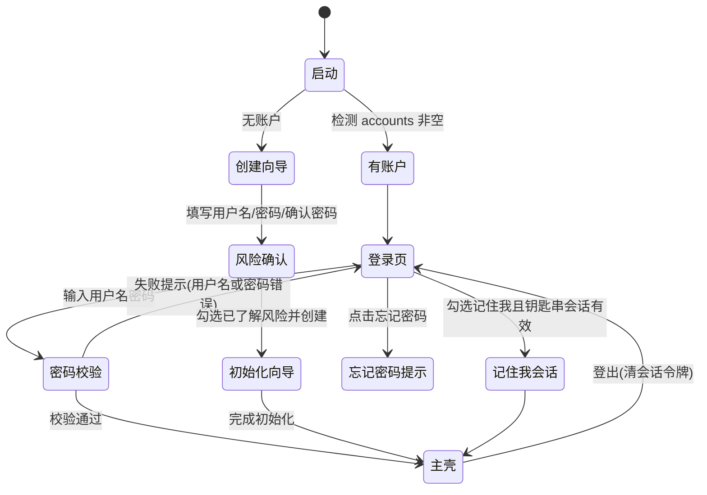
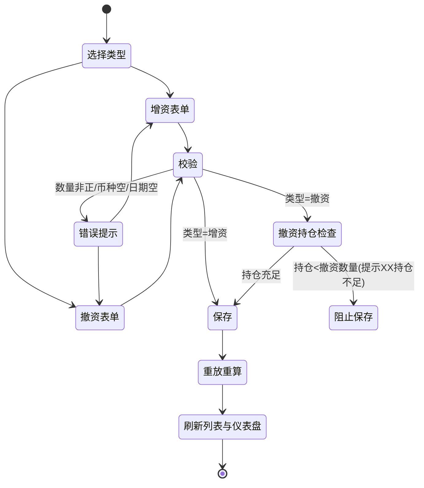
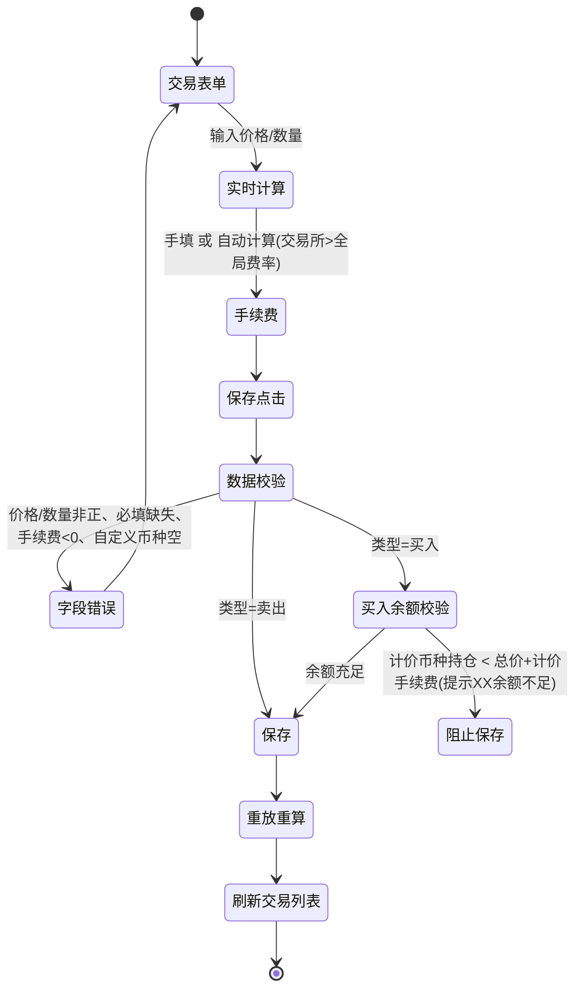
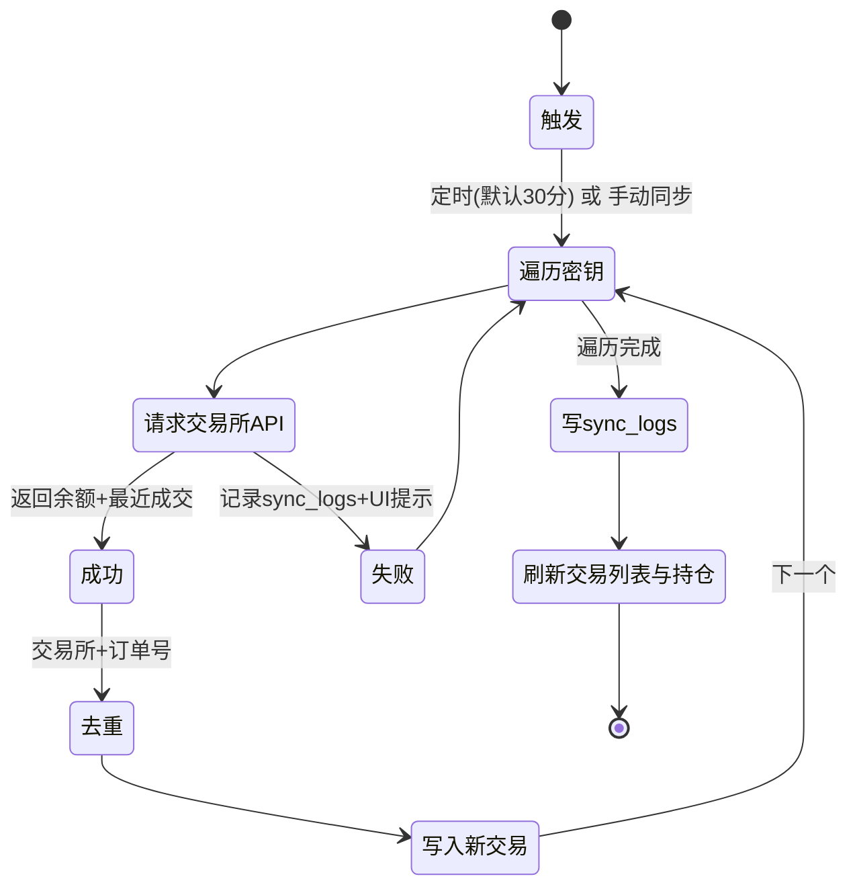
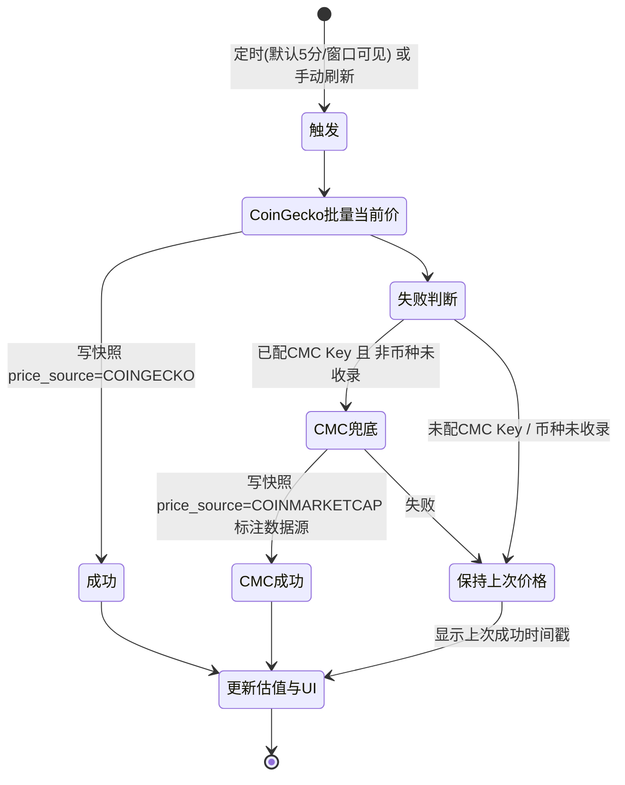
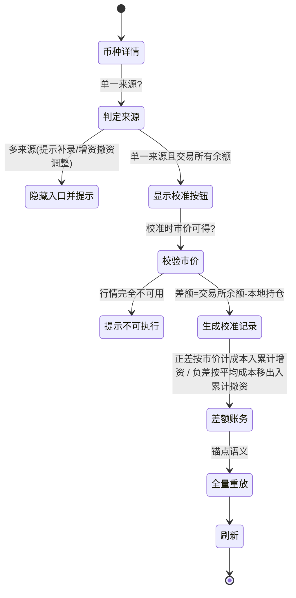
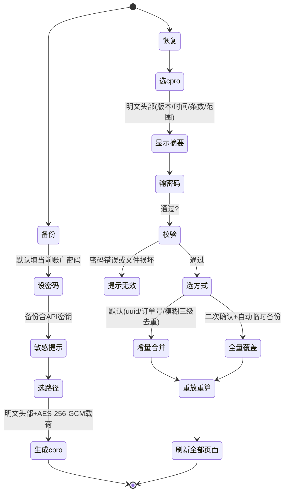
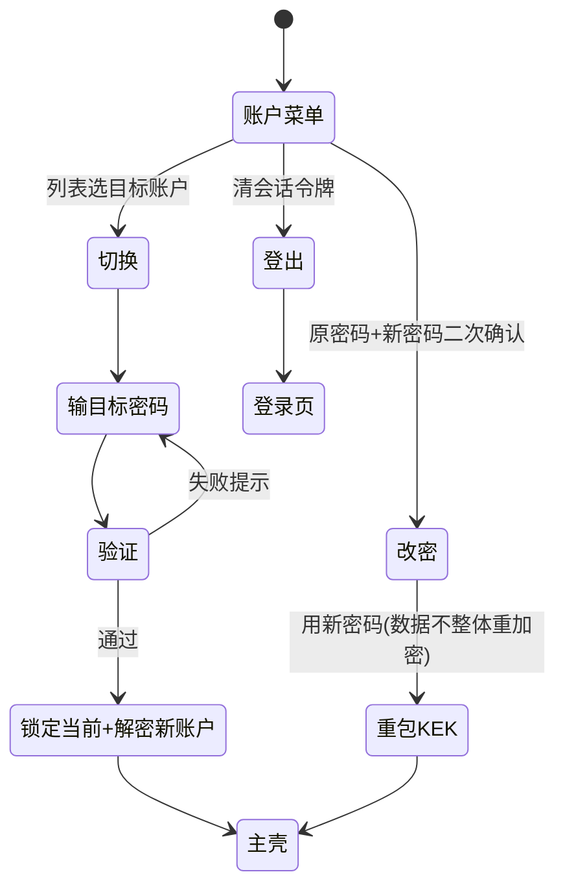

# WuZhuFolio 核心用户流程与状态机（flows.md）

> P1 产物 · 桌面端 · 依据 `docs/prd/桌面端prd.md` V1.9 第 8 章功能流程图 + 第 9 章交互细节 + `跨端共享规范.md`。
> 流程图为状态机视角（含分支与回退），供 P2 任务拆解与 P6 测试用例引用。

---

## 1. 登录 / 记住我 / 账户创建

**关键规则**：
- 创建账户：密码强度校验（最小长度/含数字与字母）、二次确认、风险确认必须勾选（PRD 1.1）。
- 记住我：仅会话令牌入 OS 钥匙串，密码永不落盘；不勾选则每次启动重输密码。
- 忘记密码：提示“本产品无法找回密码，可通过记得密码的备份恢复”。
- 从备份恢复（全新安装入口）：恢复前先创建（或选定）目标账户，导入数据归入该账户（PRD 5.2-8、流程图 1）。
- 关联交易所 API（推荐）路径：密钥保存（测试请求验证通过并加密落库）后立即执行首次同步（PRD 流程图 3）。

---

## 2. 增资 / 撤资

**关键规则**：
- 币种基于 coins 目录自动补全+归一；输入法币代码提示改为记录兑换后到账的稳定币；默认取基础法币对应稳定币（USD→USDT，其余→USDC）。
- 折算基础法币金额按“记录时行情价”取数（本地快照优先 → 行情 API 回填）；离线标记「待定价/估算中」。
- 删除资金记录触发全量重放重算（确认框“将删除 N 条资金记录并重算投入本金与 ROI”）。

---

## 3. 交易（买入/卖出 + 手续费）

**关键规则**：
- 总价 = 价格 × 数量，实时显示；手续费币种（计价/基础/第三币种）决定联动扣减与成本计算口径。
- 买入：基础币种持仓增加（成本含手续费），计价币种持仓扣减（总价+以计价币种计的手续费）；卖出相反（总价−手续费）。
- 编辑历史记录触发重放校验：若重放任一时点持仓为负则阻止并提示冲突原因（如“该笔增资已被后续买入消耗…”）。

---

## 4. API 同步（交易数据）

**关键规则**：
- MVP 仅 Binance（api_key + secret_key，只读）；同步增量，不自动覆盖本地持仓余额。
- 交易所 API 仅返回最近 500 条成交，更早需 CSV 补录。
- 后台同步期间前台编辑入队等待并显示“同步中”（单写队列）。
- 保存 API 密钥（测试请求验证通过）后**立即执行首次同步**；保存后提示用户清理系统剪贴板（剪贴板历史云同步是真实泄露面，PRD 流程图 3 / 9.10）。

---

## 5. 行情数据刷新（CoinGecko → CoinMarketCap 兜底）

**关键规则**：
- 行情刷新与交易同步相互独立（各自定时任务/频率/日志）。
- 兜底仅在主源失败（网络/超时/429/额度耗尽/币种未收录）时启用；主源恢复自动回落。
- 无 Key 模式：429 指数退避+降频；429 频发提示注册个人 Key。配置个人 Key 后启用月度额度治理（80% 自动降一档）。

---

## 6. 持仓校准（单一数据来源）

**关键规则**：
- 校准记录为锚点事件参与全量重放；锚点前历史编辑/删除不回滚校准效果。
- 差额视同系统生成资金操作，不产生盈亏，恒等式保持成立。
- 校准记录以“校准”类型进入资金管理列表，详情页可见校准历史。

---

## 7. 备份 / 恢复

**关键规则**：
- 备份不含账户信息；备份密码独立于账户密码；跨设备/跨账户恢复只依赖备份文件密码。
- 明文导出（CSV：交易/资金流水/持仓汇总）不含 API 密钥。
- 全新安装（无账户）从初始化向导进入恢复：**先创建（或选定）目标账户**，导入数据归入该账户（PRD 5.2-8、流程图 1）；恢复只依赖备份文件密码，与原账户密码无关。

---

## 8. 切换账户 / 修改密码 / 登出

**关键规则**：
- 严格模式：切换必须重新输入目标账户密码；无密码无法解密。
- 改密仅重新包裹 KEK，历史备份仍按导出时备份密码解密。

---

## 9. 全量重放（通用引擎，被 2/3/6/7 复用）

1. 输入：账户内 transactions + capital_flows + reconciliation_records，按时间升序。
2. 逐条推导每币种持仓与平均成本；校准记录作为锚点强制对齐。
3. 校验：手动路径负持仓即阻止；导入路径负持仓标记「持仓异常」。
4. 输出：持仓、累计增资/撤资、投入本金（净）、总收益、ROI、已实现盈亏。
5. 触发：任何历史记录新增/编辑/删除、校准、导入、恢复。
