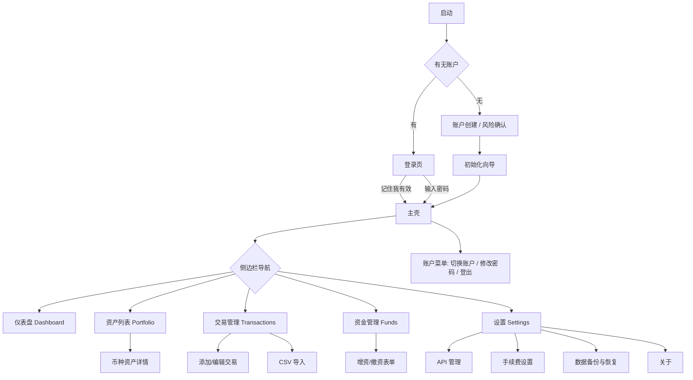

# WuZhuFolio 信息架构与页面清单（ia.md）

> P1 产物 · 桌面端 · 依据 `docs/prd/桌面端prd.md` V1.9（定稿）+ `docs/prd/跨端共享规范.md` V1.0。
> 本文件是 P2 任务拆解的页面来源、P4 模块 UI 的基准之一。所有页面仅桌面端；移动端归入下一版本。

---

## 1. 信息架构总览

登录/初始化 → 主壳（顶栏 + 侧边栏 + 内容区 + 状态栏）。

### 1.1 主壳（登录后常驻）

| 区域 | 核心元素 | 数据来源 |
|------|----------|----------|
| 顶栏 | 应用名 + 当前账户名（点击展开账户菜单）、行情数据源徽章（CoinGecko/CoinMarketCap/上次成功时间戳）、手动刷新行情按钮、手动同步交易按钮、同步中指示 | accounts、settings、行情/同步任务状态 |
| 侧边栏 | 仪表盘 / 资产列表 / 交易管理 / 资金管理 / 设置 五个一级入口 | — |
| 状态栏（底部） | 网络/同步状态图标（成功/失败/离线）、**代理指示（直连 / 系统代理，PRD 4.2 验收 3）**、数据源标注、上次价格更新时间、备份提醒（距上次备份>30 天） | sync_logs、settings、price_snapshots、系统代理检测结果 |
| 内容区 | 随导航切换（见 §2 页面清单） | 各页面 |

> 说明：主题（明/暗）顶栏提供 ☾/☀ 快捷切换，并在「设置 → 通用」提供常驻入口，两处状态同步（符合 PRD 6.1）；盈亏颜色方案在「设置 → 通用」内切换。

---

## 2. 页面清单

> 每个页面按「入口 / 核心元素 / 数据来源」三要素描述；校验与异常态见 `flows.md` / `interaction.md`。

### 2.1 登录页（Login）

- **入口**：应用启动且存在账户；登出后；切换账户验证通过前。
- **核心元素**：登录表单（用户名下拉枚举，可在设置关闭改为纯输入、密码、登录按钮、「记住我」复选框、「忘记密码」入口）；「创建新账户」切换入口。
- **数据来源**：accounts（用户名、password_hash 校验）、系统钥匙串（记住我会话令牌）。

### 2.2 账户创建（Account Creation）

- **入口**：首次启动无账户；登录页「创建新账户」。
- **核心元素**：用户名、密码（强度指示）、确认密码、风险确认弹窗（“密码是数据的唯一钥匙，本产品不上传也不存储密码，忘记密码将无法恢复任何数据；请妥善保管密码并定期备份” + “我已了解上述风险”勾选）。
- **数据来源**：accounts（写入 username / password_hash / kdf_salt / kdf_params / wrapped_dek）。

### 2.3 初始化向导（Onboarding Wizard）

- **入口**：创建账户成功后首次进入。
- **核心元素**：欢迎语 + 四种初始化方式（手动添加交易 / CSV 导入 / 关联交易所 API（推荐）/ 从备份恢复）。「从备份恢复」须在恢复前先创建/选定目标账户（向导前已完成账户创建，导入数据归入该账户，PRD 5.2-8 / 流程图 1）；「关联交易所 API」保存密钥（测试请求验证通过）后**立即执行首次同步**（PRD 流程图 3）。
- **数据来源**：—（路由到各功能）。

### 2.4 仪表盘（Dashboard）

- **入口**：登录后默认页；侧边栏「仪表盘」。
- **核心元素**：总览卡片（总资产净值、24h 盈亏金额+百分比、投入本金（净）、总收益、累计已实现盈亏、ROI、可用现金余额）；资产分布图（环形图，低于小额阈值合计为“其他”，点击扇区高亮+浮窗）；手动刷新按钮。
- **数据来源**：transactions + capital_flows + reconciliation_records 全量重放推导持仓；price_snapshots 现价；settings（基础法币、小额阈值）。

### 2.5 资产列表（Portfolio）

- **入口**：侧边栏「资产列表」。
- **核心元素**：上部分总览卡（同仪表盘）；持仓表（币种名称/代码、持有数量、平均成本价、当前价、总市值、总浮动盈亏金额+百分比、累计已实现盈亏），支持按市值/名称/盈亏排序、滚动加载、「持仓异常」行标记、「无行情」标记。
- **数据来源**：同上 + coins（名称/图标/display_precision）。

### 2.6 币种资产详情（Coin Detail）

- **入口**：资产列表点击单行。
- **核心元素**：汇总（持有数量、当前持有价值、占总资产占比、平均成本、总浮动盈亏、累计已实现盈亏）；该币种交易记录列表（卖出行显示该笔已实现盈亏，按交易所/类型/时间筛选搜索，滚动加载）；「以交易所余额校准持仓」按钮（仅单一数据来源显示）；校准历史列表。
- **数据来源**：transactions、reconciliation_records、exchange_coin_map（来源判定）、行情 API（校准市价）。

### 2.7 交易管理（Transactions）

- **入口**：侧边栏「交易管理」。
- **核心元素**：命令区（添加/修改/删除/导入交易）；交易列表（选择框 + 交易对/类型/价格/数量/手续费/总价/交易所/时间/备注，卖出行显示已实现盈亏，行内编辑/删除，按币种/交易所/类型筛选搜索，滚动加载）。
- **数据来源**：transactions、coins。

### 2.8 添加/编辑交易（Transaction Form，Modal）

- **入口**：交易管理「添加交易」；行内/批量「编辑」。
- **核心元素**：交易所（下拉/自定义）、交易对（目录自动补全）、类型（买入/卖出）、价格、数量、手续费（手填或自动计算）、手续费币种（计价/基础/自定义，默认计价）、总价（实时=价格×数量）、交易时间（本地输入存 UTC）、备注。
- **数据来源**：fee_rules（自动计算费率，交易所>全局）、coins（补全/归一）、行情 API（折算、待定价标记）。

### 2.9 CSV 导入（Import，Modal）

- **入口**：交易管理「导入交易」；初始化向导「CSV 导入」。
- **核心元素**：**标准 CSV 模板下载入口（PRD 2.3-1）**、文件选择 → 解析预览（影响摘要：新增 N 条、疑似重复 M 条、涉及币种及导入后持仓变化概览）→ 去重（订单号精确 / 模板模糊+逐条确认）→ 歧义 ticker 消歧候选（名称/市值/图标）→ 确认导入。
- **数据来源**：CSV 文件、coins、exchange_coin_map。

### 2.10 资金管理（Funds）

- **入口**：侧边栏「资金管理」。
- **核心元素**：总览卡（可用现金余额、投入本金（净））；命令区（记录增资/记录撤资/编辑/删除）；混合列表（类型增资/撤资/校准、币种、数量、折算基础法币金额、日期、来源/去向、备注，按类型/日期筛选搜索，滚动加载）。
- **数据来源**：capital_flows、reconciliation_records（校准差额视同系统资金操作入列）。

### 2.11 增资/撤资表单（Fund Form，Modal）

- **入口**：资金管理「记录增资 / 记录撤资」；列表「编辑」。
- **核心元素**：币种（目录自动补全+归一，法币代码提示改记稳定币，默认取基础法币对应稳定币）、数量（正数）、日期（默认当前）、来源（增资）/去向（撤资）、备注。
- **数据来源**：coins、行情 API（记录时市价折算）。

### 2.12 设置（Settings）

- **入口**：侧边栏「设置」。
- **核心元素**（分组）：通用（基础法币、主题明/暗、盈亏颜色方案、默认精度、登录页用户名枚举开关、稳定币白名单、小额币种阈值）；网络（系统代理，PRD 6.2）；托盘与后台（最小化到托盘、开机自启、同步通知、备份提醒）；行情与同步（行情刷新频率、API 同步间隔、CoinGecko API Key、CoinMarketCap API Key）；**日志与诊断（查看日志、导出日志（导出前提示检查敏感信息）、生成诊断报告（复用日志脱敏规则、内容受限清单：版本/schema/脱敏日志片段/调用计数），PRD 6「日志管理与可追溯性」**）；手续费设置；API 管理；数据管理；关于。
- **数据来源**：settings（key-value，全局/账户级）、fee_rules、api_keys、本地日志文件、sync_logs。

### 2.13 手续费设置（Fee Configuration）

- **入口**：设置 → 手续费设置。
- **核心元素**：全局默认费率（买入/卖出分别）；交易所特定费率列表（交易所名称/买入费率/卖出费率）+ 添加/编辑/删除。
- **数据来源**：fee_rules。

### 2.14 API 管理（API Management）

- **入口**：设置 → API 管理；初始化向导「关联交易所 API」。
- **核心元素**：API 列表（选择框/别名/交易所/API Key 部分隐藏/最后同步时间/状态）、添加/编辑/删除；添加弹窗（别名/交易所/API Key/Secret Key）+ 测试请求验证 + 只读权限提示 + 保存后剪贴板清理提示 + 关联账户提示 + **保存（验证通过）后立即执行首次同步（PRD 流程图 3）**。
- **数据来源**：api_keys（字段级加密）、sync_logs（状态/最后同步）。

### 2.15 数据备份与恢复（Backup & Restore）

- **入口**：设置 → 数据管理。
- **核心元素**：备份区域（备份按钮、上次备份时间）、恢复区域（恢复按钮、上次恢复时间）、明文导出（CSV：交易/资金流水/持仓汇总，不含 API 密钥）。备份：设置备份密码→敏感数据提示→选路径→生成 .cpro；恢复：选择 .cpro→显示摘要→输入备份密码→选增量合并（默认）/全量覆盖（二次确认+临时备份）→全量重放重算；**全新安装时恢复前先创建/选定目标账户（走初始化向导，PRD 5.2-8）**。
- **数据来源**：`.cpro` 备份、本地库。

### 2.16 关于（About）

- **入口**：设置 → 关于。
- **核心元素**：版本号、开发者信息、隐私政策链接、行情数据源说明（CoinGecko 主源/CMC 兜底/不内置任何 Key/时间分辨率边界）、无遥测声明。
- **数据来源**：应用元信息。

### 2.17 账户菜单 / 切换账户（Account Menu / Switch）

- **入口**：顶栏账户名、侧边栏底部。
- **核心元素**：当前账户名；切换账户（账户列表→输入目标账户密码→验证后切换）、修改密码（原密码+新密码二次确认）、登出。
- **数据来源**：accounts、系统钥匙串（会话令牌清除）。

### 2.18 忘记密码（Forgot Password）

- **入口**：登录页「忘记密码」。
- **核心元素**：提示“本产品无法找回密码。若记得某次备份使用的密码，可通过该备份恢复数据；否则数据不可恢复。”
- **数据来源**：—。

---

## 3. 信息架构原则落点

1. **层级 ≤ 3**（PRD §6「操作路径不超过三层」）：侧边栏一级 → 列表页 → 详情/表单 Modal。
2. **账户隔离清晰**：顶栏常驻当前账户名 + 状态栏，切换账户走密码验证。
3. **数据优先**：列表与总览卡为信息主载体，图表仅作辅助。
4. **敏感操作安全提示**：创建账户、API 密钥、备份三处内嵌安全文案（PRD §6「安全感与信任建立」）。
