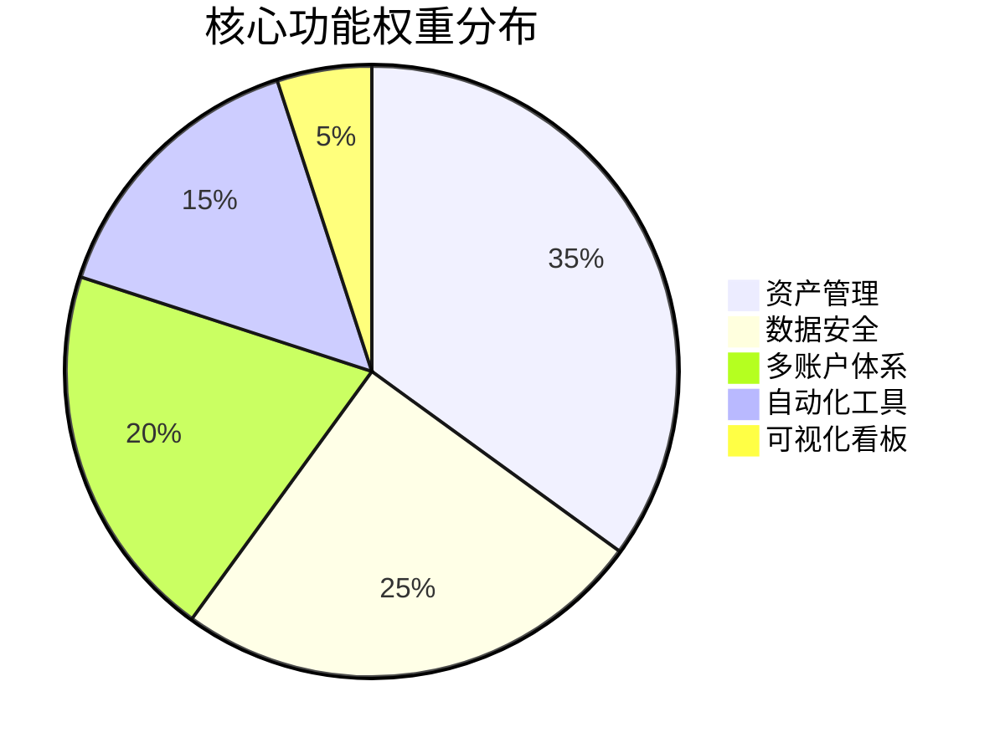
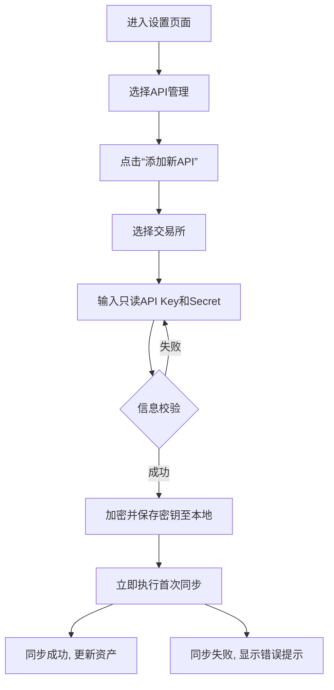
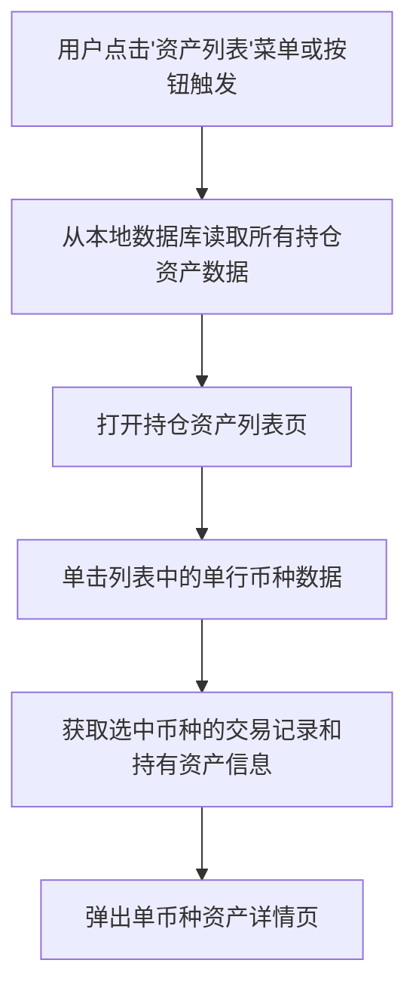
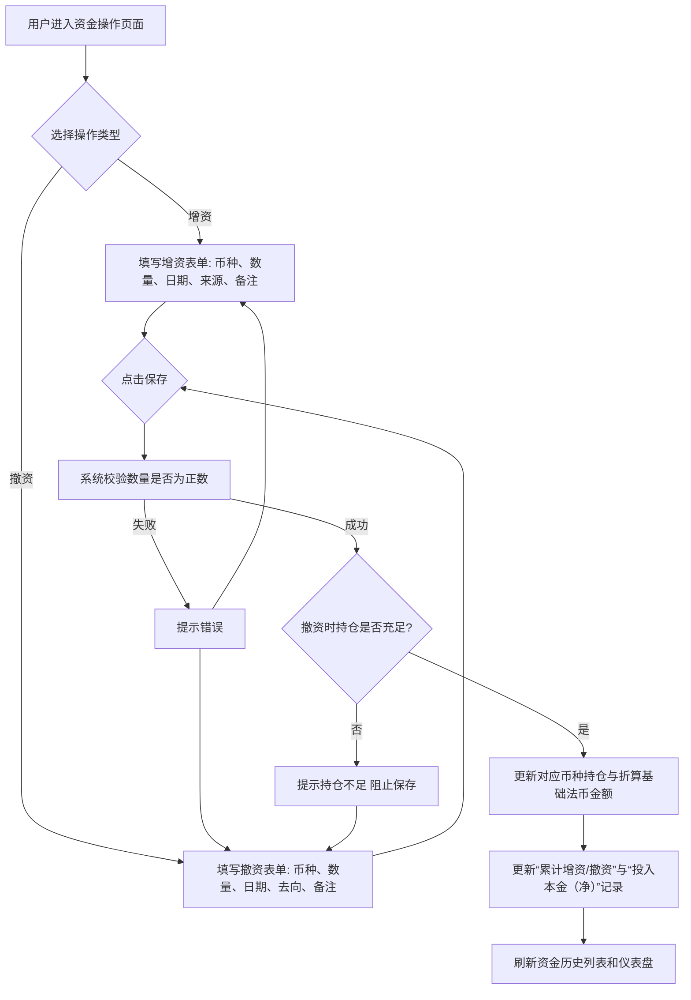

### **WuZhuFolio 产品需求文档**

**副标题：V1.9 (MVP) 定稿版本**
**编号：2026-08-26-07**

---

#### **文档版本历史**

| 文档版本 | 日期       | 修改人 | 状态 | 变更摘要                                                                           |
|:-------- |:---------- |:------ |:---- |:---------------------------------------------------------------------------------- |
| **V1.0** | 2025-08-20 | 产品部 | 草稿 | 初始版本创建，定义了MVP版本的产品愿景、目标、核心功能范围与需求。                  |
| **V1.1** | 2025-08-26 | 产品部 | 草稿 | 整合 V1.1 需求，新增账户管理、手续费自动计算、资金操作记录、增强数据备份恢复安全等 |
| **V1.2** | 2026-08-25 | 产品部 | 草稿 | 按《桌面端PRD评审报告》完成19项修订：①ROI改为总收益口径（总收益/累计增资，撤资不抵扣分母）；②现金余额改为单一持仓账本口径（增资/撤资支持任意币种、交易联动计价币种持仓、稳定币白名单、基础法币折算）；③24小时盈亏改为固定数量回算法并新增价格快照表；④密钥架构改为分层密钥+严格模式（DEK/KEK/GCM/KDF，会话令牌入OS钥匙串，切换账户需密码）；⑤API/CSV/手动三源按交易所+订单号去重、新增持仓校准；⑥版本统一V1.2；⑦转账归入增资/撤资、新增手续费币种字段与成本计算规范；⑧已实现盈亏纳入MVP；⑨备份语义统一为当前账户+账户标识校验；⑩新增忘记密码提示与改密连锁规则；⑪刷新/红绿/单击/时区规则统一；⑫资金记录支持编辑删除、删除交易补确认；⑬手续费设置砍掉交易对级（交易所>全局）；⑭数据模型主键统一Integer、新增fee_rules表与schema版本说明；⑮WAU/数据准确性/满意度指标重定并补过程指标；⑯需求优先级表与正文对齐；⑰初始化向导增加API快速通道；⑱新增桌面托盘体验与无遥测声明；⑲项目名称由 CryptoFolio Pro 更名为 WuZhuFolio |
| **V1.3** | 2026-08-26 | 产品部 | 草稿 | 按《桌面端PRD评审报告V2》完成无冲突项修订：①修正版本残留与修订计数；②CSV导入验收去除旧模型口径并补影响摘要；③流程图1补登录/记住我分支、流程图2简化手续费步骤；④交易管理页复制错误修正并增加行内编辑；⑤新增重放校验规则（手动操作阻止负持仓、导入路径标记持仓异常）；⑥持仓校准改为独立记录类型并新增 reconciliation_records、sync_logs 表；⑦accounts 表补 kdf_salt/kdf_params/wrapped_dek 字段、改密后会话令牌失效；⑧日志脱敏硬性要求；⑨默认稳定币白名单移除 BUSD、明确默认币种映射；⑩写死手续费自动计算公式、校验补 ≥0 与自定义币种非空；⑪API 同步间隔可配置；⑫其他一致性修正；⑬成功指标改为外部指标（下载量/社区反馈/内测人工统计），删除全部遥测类指标（N1）；⑭确立行情数据源与时间分辨率规则：CoinGecko 主源 + Binance 公共 K 线兜底、近 90 天小时级/更早日级、折算一律 API 回填、离线记录“待定价”联网自动补算、价格快照永久保存并降采样（N2）；⑮备份恢复重构：不含账户信息、独立备份文件密码（默认填账户密码）、默认增量合并（uuid/订单号/模糊三级去重）+ 可选全量覆盖（二次确认+自动临时备份）、.cpro 明文头部+加密 JSON 载荷、支持新设备/跨账户/未来移动端导入，各表新增 uuid 与 price_status 字段（N3） |
| **V1.4** | 2026-08-26 | 产品部 | 草稿 | 按《桌面端prd-法币方案决策分析》决策 D6（方案 A：纯稳定币账本）修订：①法币退出账本资产，仅作为基础法币计价单位（名词解释：资金操作/可用现金余额/增资/撤资/基础法币同步收窄）；②增资/撤资币种限定为稳定币与其他加密货币，法币入金直接记录兑换后实际到账的稳定币数量（只计入实际进入组合的数量）；③现金类币种收窄为稳定币白名单；④全局说明新增“法币角色与归一化规则”（法币计价交易对 1:1 映射同币种稳定币、手续费同映射、无映射按第三币种语义、交易所法币余额不入账）；⑤故事 2.2/2.3/6.1/6.2、第 7 章 CSV 导入、9.8 表单、Out of Scope 划转条目与 capital_flows.currency 同步收窄；⑥Out of Scope 新增“法币现金与交易所法币余额直接入账”声明；不纳入法币金额辅助输入与 OTC 实付注记（D6a） |
| **V1.5** | 2026-08-26 | 产品部 | 草稿 | 按《桌面端prd-币种标识与行情源决策分析》决策 D7（单一主源+故障兜底）修订：①新增全局说明“币种标识与主数据规则”（内部唯一标识=CoinGecko id、coins 目录本地缓存、exchange_coin_map 交易所资产映射、四级消歧规则、映射冻结原则、交易所专有资产与无行情处理）；②行情规则补兜底切换细则（触发条件、Binance 价×USDT/法币折算链、UI 数据源标注、主源恢复自动回落）与 24h 盈亏同源原则；③数据模型新增 coins、exchange_coin_map 两表，price_snapshots 升级（symbol 改内部币种 id、新增 price_source），transactions/capital_flows 新增币种 id 冻结字段，reconciliation_records.symbol 改为 coin_id；④故事 2.3/3.2/4.1 验收补消歧 UI、兜底标注；⑤9.7 交易对自动补全与自定义手续费币种、9.8 币种输入改为基于币种目录（修正 BTC/BUSD 示例为 BTC/USDC）；⑥CoinMarketCap 维持不集成，关于页增加行情数据源说明。评审联动：V3 报告 T9 关闭、T2 兜底部分闭环、T11 部分修复（BUSD 示例、price_source 落地） |
| **V1.6** | 2026-08-26 | 产品部 | 草稿 | 按 V3 报告 T2 剩余项与产品负责人方向修订（行情源兜底再调研）：①名词解释新增“交易数据同步”“行情数据刷新”两个术语，明确交易所 API（交易数据）与行情平台 API（价格数据）是两类相互独立的 API；②行情兜底由 Binance 公共 K 线改为 CoinMarketCap 免费档（quotes/latest 批量当前价、convert 直出多法币、无链式换算），Binance 完全退出行情角色仅保留交易所交易数据同步职能；兜底需用户在设置配置自己的 CMC API Key，未配置时保持上次价格+时间戳；③按 CoinGecko 免费档额度调整刷新策略：行情刷新频率改为 5/15/30 分钟（默认 5，移除 1 分钟档）、托盘驻留期间统一按 API 同步间隔降频（消除 6.1 与 9.2 表述冲突）、窗口恢复立即刷新、新增额度治理（月度计数、80% 自动降档、429 指数退避）；④coins 表新增 cmc_id 列（CMC /cryptocurrency/map 每日缓存）；⑤流程图 4 去除行情刷新尾巴、新增流程图 9“行情数据刷新流程”；⑥price_snapshots.price_source 枚举改为 COINGECKO/COINMARKETCAP；⑦设置章新增“行情刷新频率”“行情兜底（CoinMarketCap API Key）”两项。评审联动：T2 关闭（额度治理+托盘统一+兜底规则完整落地） |
| **V1.7** | 2026-08-26 | 产品部 | 草稿 | 按 V3 报告 T1 修复方案（产品负责人确认“方案甲 + 四点规则”）与 T2 Key 政策方向修订：①持仓校准语义重构：适用条件限定为单一数据来源币种（多来源隐藏入口并提示）；校准记录按时间戳作为推导序列第三类事件（锚点语义）参与全量重放，历史记录编辑不再回滚校准效果；非对称成本规则（正差额按校准时市价计入成本并计入累计增资、负差额按当时平均成本移出并计入累计撤资），差额视同系统生成的资金操作、恒等式保持、零凭空盈亏（推翻 V1.3“不影响投入本金与 ROI”表述）；②reconciliation_records 补 exchange、base_amount 字段，校准记录进入资金管理列表（类型标注“校准”）；③行情平台 Key 政策：CoinGecko 与 CoinMarketCap 均不使用内置共享 Key，统一由用户在设置中配置个人 Key（CoinGecko 必填启用行情功能、CoinMarketCap 可选启用兜底）；④同步更新名词解释（持仓校准、行情数据刷新）、成本计算规范、故事 3.2/4.1、9.5/9.8、6.1/6.4、行情规则与额度治理表述。评审联动：T1 关闭 |
| **V1.8** | 2026-08-26 | 产品部 | 草稿 | 行情主源接入模式优化（产品负责人方向）：CoinGecko 无 Key 公共 API 作为默认开箱即用模式（按 IP 共享限流约 30 次/分钟，NAT/共享出口场景可能遭遇非自身 429），填写个人 API Key 后自动切换为专属额度（约 30 次/分钟、1 万次/月）并启用月度额度治理，切换即时生效；无 Key 模式无月度专属额度，仅做 429 指数退避与降频保护、429 频发时提示注册个人 Key；设置项“行情数据源（CoinGecko API Key）”由必填改为可选（默认开箱即用）；同步更新名词解释、行情规则、额度治理、故事 3.2、6.1/6.4 与异常处理表述。评审联动：T2 注记补充（Keyless 默认 + Key 升级两级模式；CoinMarketCap 无 Keyless 模式、仍需个人 Key） |
| **V1.9** | 2026-08-26 | 产品部 | 定稿 | 按 V3 报告剩余 🟡 项全部闭环，冻结基线最后修订：①T5 备份合并/全量覆盖细则（api_keys 按 exchange+别名、fee_rules 按 account+exchange、settings 按 key 备份优先覆盖、全量覆盖不清空全局公共表）+ 恢复前建账步骤（流程图 1）；②T6 备份载荷加密语义（导出解密→备份密码加密、导入目标账户 DEK 重加密）+ 备份密码强度校验；③T7 存储与加密选型（SQLite 单库多账户 + 整库加密 + 凭证字段级 DEK 加密，全局公共表不按账户加密）；④T8 并发写模型（单写队列 + WAL + busy_timeout，无乐观锁）；⑤T10 24h 部分缺价聚合口径（剔除缺失 + 覆盖 N/M）+ 快照同小时取末条；⑥T11 清理残留（默认精度/用户名下拉枚举设置项、“或兑换”移除、流程图 8 补撤资持仓不足分支、9.8 校验规则补全、史诗故事 1 标题闭合）；⑦T12 无障碍基线（+/- 符号、色盲配色、键盘导航、读屏）；⑧T13 新增“发布与运行环境”章（OS 矩阵、签名公证、无检查更新、**D1 开源决策定稿：源码公开 + GitHub Releases 分发 + AGPL-3.0 许可证**）；⑨T14 MVP 交易所收敛 Binance + api_keys 补 passphrase/extra；⑩T15 附录 A 黄金用例 12 例；⑪T16 打磨包（备份提醒、明文 CSV 导出、诊断报告规范、微小价格精度自适应、日志轮转、剪贴板清理提示）；⑫T17 第 2 章竞品对比表。评审联动：V3 全部 17 项闭环（T3 待共享文档与移动端同步） |

---

#### **全局说明**

* **名词解释**

  * **API 密钥 (API Key):** 应用程序接口密钥，本文档中特指交易所提供的，允许第三方应用读取用户账户信息（如资产、交易历史）的凭证。本产品只使用“只读”权限的API密钥。
  * **交易数据同步 (Trade Data Sync):** 通过交易所只读 API（如 Binance）拉取新的成交记录（交易对、价格、数量、手续费、订单号）写入本地账本的过程；使用用户自己添加的交易所 API 密钥，与行情数据无关。
  * **行情数据刷新 (Market Data Refresh):** 通过行情平台 API（主源 CoinGecko，兜底 CoinMarketCap）获取当前价格、写入价格快照并更新界面估值的过程；CoinGecko 默认使用无 Key 公共 API、配置个人 Key 后切换专属额度，CoinMarketCap 兜底需配置个人 Key，均不使用交易所 API 密钥；与交易数据同步相互独立（各自的定时任务、各自的频率、各自的日志记录）。
  * **数据本地化:** 指所有用户数据，包括交易记录和API密钥，都存储在用户自己的电脑上，而不上传到任何云端服务器。
  * **投资组合 (Portfolio):** 用户持有的所有加密货币资产的集合。
  * **盈亏 (P&L):** Profit and Loss，指资产的盈利和亏损情况。
  * **浮动盈亏 (Unrealized P&L):** 指当前持仓资产的市值与持仓成本之间的差额，表示如果立即卖出可能获得的利润或亏损。
  * **持仓成本 (Cost Basis):** 建仓买入资产所花费的总成本（含手续费折算）。MVP 采用平均成本法，详细规则见全局说明“成本计算规范”。
  * **资产净值：** 用户全部币种持仓按现价折算基础法币后的总价值。
  * **CSV：** 逗号分隔值文件，交易所常用导出格式。
  * **账户 (Account)**: 指用户在本产品中创建的唯一身份标识，通过用户名和密码进行保护。用于隔离不同用户的数据，用户需要登录特定账户才能访问其数据。每个账户拥有独立的投资组合数据、API密钥和设置。
  * **资金操作 (Fund Movement):** 指投资者向投资组合转入资产（增资）或转出资产（撤资）的行为，币种限稳定币或其他加密货币（法币不入账本，仅作计价单位）。此类操作不产生盈亏，但会改变对应币种持仓数量与总投资基数。
  * **可用现金余额 (Available Cash Balance):** 账户内现金类币种（稳定币白名单）持仓按当前价折算基础法币后的合计，为派生展示值（不单独记账），便于快速查看可随时用于交易或提现的部分。
  * **增资 (Deposit)**: 用户向投资组合转入资产的行为（稳定币或其他加密货币均可，如转入 BTC、USDT；法币不入账本，法币入金请记录兑换后实际到账的稳定币数量），按转入时市价计入持仓成本与投入本金，不产生盈亏。
  * **撤资 (Withdrawal)**: 用户从投资组合转出资产的行为（任意加密货币或稳定币），按持仓平均成本移出对应数量，不产生盈亏；对应资产持仓不足时阻止保存。
  * **投入本金 (Invested Capital)**: 用户通过增资投入的总资金，减去撤资总额（即累计净投入），作为总览展示指标；不直接作为 ROI 计算的分母。
  * **ROI (Return on Investment):** 投资回报率，计算公式为 `总收益 / 累计增资 * 100%`，其中 `总收益 = 当前资产净值 + 累计撤资 - 累计增资`。当累计增资为 0 时，ROI 显示为“--”并提示用户先记录增资。本口径为简化资金加权口径，不含时间加权调整（MVP 局限，后续版本可升级）。
  * **累计增资 (Total Deposits):** 账户内所有增资记录金额之和（撤资不抵扣），作为 ROI 计算的分母。
  * **总收益 (Total Return):** 当前资产净值 + 累计撤资 - 累计增资，正值表示盈利、负值表示亏损。示例：增资 100、盈利后撤资 150、当前资产净值 0，则总收益 = 0 + 150 - 100 = 50。
  * **基础法币 (Base Fiat Currency):** 账户计价与折算展示的基准币种（默认 USD），在设置中可切换；仅作为计价单位使用，法币本身不作为账本资产入账（见全局说明“法币角色与归一化规则”）。
  * **稳定币白名单 (Stablecoin Whitelist):** 用于判定“现金类币种”，默认包含 USDT、USDC、DAI、TUSD，可在设置中扩展。
  * **24小时盈亏 (24h P&L):** 按固定数量回算法计算的最近 24 小时盈亏：Σ(当前持仓数量 × 当前价) − Σ(当前持仓数量 × 24小时前价格)，仅反映价格变动，不含资金操作与交易影响；“24小时前价格”取数顺序：本地价格快照 → 行情 API 回填（90 天内为小时级）；均无（如币种过新或超出 API 小时级回溯范围）时显示“--”。整体口径：部分币种缺失 24 小时前价格时，剔除缺失币种计算并在指标旁标注“覆盖 N/M 个币种”；全部币种缺失时显示“--”。
  * **待定价 (Pending Pricing):** 离线保存含价格折算的记录时，折算价格暂缺的状态标记；记录暂按最近可得价格估算并在相关指标旁标注“估算中”，联网后自动回填真实价格并重算。
  * **会话令牌 (Session Token):** 登录成功后生成的临时凭证，可选存入操作系统钥匙串用于“记住我”自动恢复会话；不含密码，登出即清除。
  * **持仓校准 (Position Reconciliation):** 用户在币种资产详情页手动触发的操作，用交易所 API 返回的余额修正本地持仓数量。仅限单一数据来源的币种（全部记录来自同一交易所 API 同步）；校准记录按锚点语义参与全量重放，差额视同系统生成的资金操作（正差额=增资语义、负差额=撤资语义），规则详见全局说明“成本计算规范”。
  * **已实现盈亏 (Realized P&L):** 卖出交易实现的盈亏：卖出净收入（总价 − 折算手续费）− 卖出数量 × 卖出时平均成本；逐笔计算，并在卖出记录行、币种详情与仪表盘累计展示。

* **统一异常处理**

  * **网络异常:**  当应用无法连接到公共数据源（获取币价）或交易所API时，应在界面右上角或底部状态栏显示一个明显的“网络断开”或“同步失败”的图标提示（如一个红色的叹号或断开的链条图标），并保留上一次成功获取的数据。用户点击该图标可尝试手动刷新。具体API同步失败应有更详细的提示。
  * **后台服务异常:** 如遇数据文件损坏或无法读取等内部错误，应弹出明确的错误提示框，引导用户从备份中恢复或联系技术支持。如果API接口返回错误（如API密钥失效、请求频率超限，含行情平台的 CoinGecko/CMC Key 失效与 429 限流），应向用户提供清晰的错误提示（例如：“Binance API密钥已失效，请检查或更新”“CoinGecko 额度已达本月上限，已自动降频”“CoinGecko 共享限流触发，已自动退避；建议注册免费个人 Key 获取专属额度”），而不是显示泛化的“请求失败”。
  * **账户操作异常**: 登录失败（“用户名或密码错误”）、密码错误（“原密码不正确”）、切换账户失败（“账户数据加载失败，请重试”）等，应提供明确的提示信息，且不暴露具体错误细节（如用户不存在）。
  * **数据校验异常**: 用户输入数据不符合规则时，在输入框下方或附近显示红色错误提示，并阻止提交。

* **列表默认数据规则**

  * **排序方式:** 资产列表默认按“市值”降序排列。所有交易记录列表默认按“交易时间”降序排列（最新的在前）。
  * **列表:** 列表支持滚动加载（如交易记录列表、资产列表）。
  * **缺省值:** 空列表展示占位图 + “暂无记录”文案。列表中所有无数据的字段（如成本价无法计算、数据无法获取或为空），统一显示为“--”。
  * **数据精度:** 金额、价格等数值默认保留8位小数，市值、盈亏等展示值保留2位小数，百分比保留2位小数。用户可在设置中调整默认精度。微小价格币种（单价有效数字不足 8 位）自动增加有效数字位显示，避免显示为 0。

* **成本计算规范（平均成本法）**
  * 平均成本按账户内合并计算（不分交易所）。
  * 买入后：新平均成本 =（旧持仓总成本 + 本次买入总成本）÷ 新总数量；买入总成本含手续费（手续费按记录时行情价折算为计价币种金额）。
  * 增资（转入）按转入时市价计入持仓成本；卖出不改变平均成本；撤资（转出）按当时平均成本移出数量，不产生盈亏。
  * 卖出逐笔计算已实现盈亏：已实现盈亏 = 卖出净收入（总价 − 折算手续费）− 卖出数量 × 当时平均成本。
  * 任何历史交易或资金记录的新增、编辑、删除，均触发该币种持仓按时间顺序全量重放重算。
  * **重放校验规则：** 手动新增/编辑/删除交易或资金记录时，若重放过程中任一时刻某币种持仓为负，则阻止该操作并提示冲突原因（如“该笔增资已被后续买入消耗，无法调小金额，请先调整后续交易”）。
  * **导入路径例外：** CSV 导入与 API 同步不做余额校验；导入后若某币种持仓为负，在资产列表该行标记“持仓异常”，并引导用户补录增资、补导入历史数据或执行持仓校准。
  * **持仓校准规则：**
    * 适用条件：仅限该币种为单一数据来源（全部记录来自同一交易所 API 同步，无手动录入/CSV/其他交易所记录）；多来源时校准入口隐藏并提示“该币种存在多来源记录，请先补齐或核对其他来源，或通过增资/撤资调整”。
    * 锚点语义：校准记录按时间戳作为推导序列的第三类事件参与全量重放（交易、资金流水、校准锚点）；锚点时刻起该币种持仓 = 校准时交易所余额，锚点后的记录在锚点值之上继续推导。校准前历史记录的编辑/删除不回滚校准效果（重放至锚点即强制对齐）；负持仓校验在锚点前的区段照常执行，锚点后以锚点值为基数。
    * 差额账务（视同系统生成的资金操作，不产生盈亏）：正差额按校准时市价计入持仓成本并计入累计增资；负差额按当时平均成本移出并计入累计撤资（撤资计值按校准时市价折算基础法币金额）。恒等式“总收益 = 净值 + 累计撤资 − 累计增资”保持成立，校准不制造凭空盈亏；正差额会增大 ROI 分母（保守口径）。
    * 执行前提：校准需校准时市价可得（价格快照或行情 API）；行情完全不可用时暂不允许执行校准并提示。
    * 可审计：校准记录（含依据交易所、前后数量、差额、折算金额）在币种资产详情页校准历史中可见，并以“校准”类型进入资金管理列表。
  * **折算价格解析：** “记录时行情价”的取数顺序为本地价格快照 → 行情 API 回填（近 90 天小时级、更早当日日线价）；离线无法获取时记录标记“待定价”，联网后自动回填并重算（见全局说明“行情数据与时间分辨率规则”）。
  * 示例：以 50,000 USDT 买入 1 BTC、手续费 50 USDT（quote 计费）→ 持仓 1 BTC，总成本 50,050，平均成本 50,050。

* **法币角色与归一化规则**
  * 法币仅作为计价单位（基础法币）用于计价、折算与展示，不作为账本资产：账本内全部资产均为行情源可定价的稳定币或加密货币。
  * 增资/撤资币种限于稳定币或其他加密货币；法币入金请记录兑换后实际到账的稳定币数量（只计入实际进入组合的数量）。
  * 法币计价交易对归一化：交易对以法币计价时（无论手动录入还是 CSV/API 导入，如 BTC/USD、ETH/EUR），计价币种按 1:1 映射为同币种稳定币（如 USD->USDT、EUR->EURC）进行持仓联动与余额校验；无同币种稳定币映射的法币按“第三币种”语义处理（仅计入基础币种持仓与成本，不联动计价侧持仓）。手续费币种为法币时按同一映射处理。
  * 交易所法币余额（如 Coinbase 的 USD 余额、Binance 的 EUR 钱包）不入账本；用户如需近似跟踪，可按 1:1 记录为对应稳定币（误差为稳定币脱锚幅度）。

* **币种标识与主数据规则**
  * 内部唯一标识：账本内全部币种使用 CoinGecko id 作为内部唯一标识（如 bitcoin、render-token）；ticker/symbol 仅作展示用途、不作为标识依据（三家平台的 symbol 均不唯一，且币种更名时 CoinGecko id 保持不变、交易所 ticker 会变）。
  * 币种主数据（coins 目录）：本地缓存 CoinGecko /coins/list 全量目录（含 id/symbol/name/各链合约地址），每日刷新一次；目录数据为全局公共数据（各账户共享），不随账户备份导出。
  * 交易所资产映射：维护 exchange_coin_map（交易所资产 -> 内部币种 id），用于 CSV 导入与 API 同步的 ticker 解析；交易对切分依赖交易所 pair 注册表（exchangeInfo 中的 baseAsset/quoteAsset，定期拉取缓存），拼接对字符串（如 ETHBTC）不得凭字符串猜测切分。
  * 消歧规则（按优先级）：① 交易对上下文约束（quote 侧已知时排除冲突项）-> ② 合约地址精确匹配 -> ③ 市值排名最高（预缓存前 1000 名）-> ④ 仍歧义时 UI 列出候选（名称/市值/图标）由用户选择，选择结果固化到映射表（source=MANUAL，一次性决策、后续相同资产自动复用）。
  * 映射冻结原则：交易/资金记录保存时将解析出的币种 id 写入记录（base_coin_id/quote_coin_id/coin_id）；后续目录或映射变化不回溯改写历史记录。
  * 输入归一化：增资/撤资币种输入、手续费币种、交易对自动补全均基于 coins 目录做大小写与别名归一（如 "usdt" 自动归一为 USDT）。
  * 交易所专有资产（如 BTCB、BETH）映射为其自身的 CoinGecko 资产，不与 BTC/ETH 合并；交易所存在但 CoinGecko 未收录的资产标记“无行情”，不计入总资产市值并在列表显示“无行情”。
  * 目录刷新成本：/coins/list 每日 1 次 + /coins/markets 前 1000 名预缓存（4 页），合计每月 < 200 次调用，占免费额度 < 2%。

* **密码与数据恢复策略**
  * 忘记密码无法找回：本产品本地加密、不上传不存储密码，忘记密码即无法解密数据。
  * 创建账户时必须告知上述风险并要求用户确认。
  * 修改密码 = 用新密码重新包裹账户密钥（数据不整体重加密），需验证原密码；不影响其他账户。
  * 备份文件使用导出时设置的备份文件密码加密（默认填当前账户密码，可修改），恢复时输入该文件密码；与当前账户密码是否变更无关。

* **时间与时区规则**
  * 所有时间戳（交易时间、资金流水时间、快照时间等）统一以 UTC 存储。
  * 界面显示统一转换为系统本地时区；日期时间格式随 I18N 语言设置。
  * 交易所 CSV 导入（如 Binance）按 UTC 解析；手动录入按本地时区输入，保存时转换为 UTC。

* **行情数据与时间分辨率规则**
  * 主行情源为 CoinGecko：未配置 Key 时默认使用无 Key 公共 API（开箱即用，按 IP 共享限流约 30 次/分钟，NAT/共享出口场景可能遭遇非自身原因的 429）；在设置中填写个人 API Key（免费 Demo 计划注册）后自动切换为专属额度（约 30 次/分钟、1 万次/月），切换即时生效、无需重启。行情数据刷新只调用行情平台 API，与交易所 API（交易数据同步）无关；应用不内置任何 API Key。
  * 兜底切换规则：仅当 CoinGecko 主源失败（网络错误/超时、429 限流或额度耗尽、币种未收录）时，启用 CoinMarketCap 免费档（/cryptocurrency/quotes/latest）兜底：按内部币种 id 映射的 CMC id 批量查询（单次最多 100 币种），经 convert 直出多法币报价（无链式换算）；兜底期间价格旁标注“数据源：CoinMarketCap”并在状态栏可见；主源恢复后自动回落，不产生持久状态。兜底需用户在设置中配置自己的 CoinMarketCap API Key（免费注册）；未配置时无兜底，保持上次价格并显示上次成功获取的时间戳。历史价格回填不做兜底（CMC 免费档无历史数据），失败时按“待定价”机制延后重试。
  * 24h 盈亏同源原则：价格快照记录数据来源（price_source）；24h 计算优先取同源快照配对，异源配对时结果标注“混合数据源”。
  * 额度治理：配置个人 Key 后按专属额度治理（约 30 次/分钟、1 万次/月）--应用内置月度调用计数（含当前价刷新、历史回填与目录刷新），达到月度额度 80% 时自动将行情刷新频率降一档并在状态栏提示；无 Key 模式（公共 API）无月度专属额度，仅做 429 指数退避与降频保护，并在 429 频发时提示“注册免费个人 Key 可获专属额度”。托盘驻留期间行情刷新按 API 同步间隔降频执行，窗口恢复可见时立即刷新一次（两种模式相同）。
  * 时间分辨率边界：近 90 天可获得小时级价格，90 天以前仅日级（当日 00:00 UTC 价格）；90 天以前的历史记录按当日日线价折算，存在日内误差（MVP 局限，在关于页说明）。
  * 所有“记录时行情价/汇率”一律从行情 API 获取（本地快照命中优先，未命中则 API 回填），不支持用户手填价格。
  * 离线保存含价格折算的记录时，记录标记为“待定价”（PENDING），暂按最近可得价格估算并在相关指标旁标注“估算中”；联网后自动回填真实价格并重算持仓成本与相关指标。
  * 历史价格回填任务：初始化导入、补录历史记录或检测到快照空洞时按需触发，按区间批量合并请求以节约 API 额度（CoinGecko 免费档约 30 次/分钟、1 万次/月）。

---

#### **目录**

1. 引言与产品愿景
2. 问题陈述
3. 目标用户与画像
4. 产品目标与成功指标
5. 功能范围与用户故事 (MVP v1.9)
6. 设计与用户体验原则
7. 功能需求
8. 功能流程图
9. 页面描述及交互细节
10. 数据结构
11. 超出范围的功能 (MVP v1.9)
12. 发布与运行环境
附录 A：计算口径黄金用例

---

### **1. 引言与产品愿景 (Introduction & Vision)**

* **产品简介:** WuZhuFolio 是一款以隐私和安全为核心、数据完全本地化的桌面应用程序，旨在帮助加密货币投资者在一个统一的界面中清晰地跟踪和分析其分散在多个平台的资产。它支持多账户管理，并提供精确的资金流动记录和投资回报率计算。本产品不包含任何遥测、统计上报或第三方分析 SDK，所有网络请求仅用于行情数据与交易所 API。
* **产品愿景:** 我们致力于成为注重数据主权和隐私保护的加密货币投资者的首选投资组合管理工具，让每一位用户都能在完全掌控自己数据的前提下，通过多账户管理和精细化资金追踪，做出更明智的投资决策。
* **产品定位：** 本产品定位于为注重隐私安全的加密货币投资者提供一款**数据完全本地化**的投资组合管理工具。与市场上现有的在线工具不同，本产品不依赖云端服务器，所有用户数据（包括交易记录、API密钥）均存储在用户本地设备上，确保用户数据的绝对安全与隐私。
* **产品价值主张：** 
  1. **数据主权保障**：所有数据100%本地存储，绝不上传至任何服务器
  2. **多平台资产整合**：统一管理分散在多个交易所和钱包的资产
  3. **精细化资金追踪**：清晰记录资金流入流出，准确计算投资回报率
  4. **多账户隔离管理**：支持在同一设备管理不同投资策略或家庭成员的独立账户
  5. **自动化数据同步**：通过API自动获取最新资产与交易数据，减少手动录入
  6. **隐私优先设计**：仅需"只读"API权限，最大限度降低安全风险

### **2. 问题陈述 (Problem Statement)**

当前加密货币投资者在管理其资产时面临诸多挑战，这些痛点构成了我们产品的核心价值主张：

* **资产分散:** 用户的加密资产往往分布在多个交易所（如 Binance, Coinbase）和不同的钱包中，导致他们无法快速、准确地获得统一、实时的资产全局视图，难以评估整体投资表现。
* **隐私担忧:** 现有的在线投资组合跟踪工具普遍要求用户上传 API 密钥或交易数据到云端服务器。这种模式使用户的核心财务数据面临潜在的数据泄露、滥用和隐私风险，让许多注重安全的用户望而却步。
* **网络限制:** 在某些特殊的网络环境下，用户可能无法直接访问行情数据网站和交易所 API，导致无法获取实时资产价格和同步交易，影响投资决策。
* **手动跟踪繁琐:** 许多投资者依赖电子表格（如 Excel）手动记录交易、计算盈亏。这种方式不仅效率低下、耗时耗力，而且极易因手动输入错误或复杂的公式计算而出错。
* **多用户/多策略管理不便**: 单个用户可能希望隔离管理不同策略的投资组合（如长期持有 vs. 短期交易），或家庭成员多用户共享一台设备。缺少账户概念导致数据混乱。
* **资金流动记录缺失:** 现有工具难以清晰记录和分析投资者向投资组合注资或撤资的历史，导致无法准确计算“总投入资金”和“总体收益率”等关键指标。
* **无法准确衡量投资回报**: 仅跟踪资产价值变化，忽略了资金的净流入（增资）和净流出（撤资），难以准确计算整体投资回报率。
* **手动计算易出错:** 手动输入交易时，手续费和总价的计算繁琐且容易出错。

**竞品基准与差异化：** 下表对照本地优先与云端两类竞品，支撑本产品差异化定位（调研详见《桌面端prd-三大决策分析》）：

| 维度 | WuZhuFolio | Rotki | Ghostfolio | CoinTracker | Delta |
| --- | --- | --- | --- | --- | --- |
| 数据本地化 | ✅ 完全本地、零遥测 | ✅ 本地优先 | ⚠️ 自托管 Web | ❌ 云端 | ❌ 云端 |
| 多账户隔离 | ✅ 单库多账户 | ⚠️ 单用户 | ⚠️ 单账户 | ✅ 多账户 | ⚠️ |
| 资金流水口径 | 增资/撤资/校准差额（恒等式） | 资产/负债口径 | 活动口径 | 交易口径 | 交易口径 |
| 免费能力 | MVP 全功能免费 | 本地功能免费 | 开源自托管免费 | 免费档限交易 | 免费档限功能 |
| 商业/开源 | AGPL-3.0 开源 | AGPL-3.0 + 订阅 | AGPL-3.0 + 订阅 | 闭源订阅 | 闭源订阅 |

差异化结论：现有工具要么云端托管（牺牲隐私）、要么本地但缺多账户隔离或资金流水口径不完整；WuZhuFolio 以“完全本地 + 多账户隔离 + 增资/撤资/校准恒等式 + 零遥测”为核心差异。

### **3. 目标用户与画像 (Target Audience & Personas)**

我们的核心目标用户是那些对数据隐私有较高要求，并具备一定技术理解能力的加密货币投资者。

#### **3.1 核心用户画像 (Persona):**

* **姓名:** Alex
* **身份:** 一位有2-5年经验的加密货币投资者，同时也是一名技术爱好者或软件工程师。
* **行为与特点:**
  * 资产分布在2-3个主流中心化交易所，并可能有一些资产在硬件钱包中。
  * 高度重视个人数据隐私和资产安全，对将敏感财务数据上传到第三方云服务持怀疑态度。
  * 熟悉 API 密钥的基本概念，并知道如何为应用程序创建只读权限的密钥。
  * 追求效率，希望有一个自动化的工具来替代手动维护的电子表格。
  * 希望自己能够完全掌控所有数据，包括能够方便地备份和迁移数据。
  * 可能为家人管理独立的投资账户，或希望将个人资金与实验性交易资金分开管理。需要在同一台电脑上管理自己和家庭成员的独立投资组合，或者管理不同策略的独立账户。
  * 需要清晰追踪自己的总投入成本，而不仅仅是单个币种的持仓成本，以便准确衡量整体投资回报。
  * 希望软件能处理复杂的交易计算，如手续费的自动计算。
  * 用户不是时时运行桌面端软件，而是间隔式的打开使用。

#### **3.2 用户需求优先级**

| 需求类别     | 具体需求       | 优先级 | 验证方式 |
| ------------ | -------------- | ------ | -------- |
| **基础需求** | 资产统一视图   | P0     | 用户访谈 |
|              | 实时价格更新   | P0     | 用户访谈 |
|              | 数据本地化存储 | P0     | 用户调研 |
|              | 代理网络支持   | P0     | 用户调研 |
| **期望需求** | 多账户隔离管理 | P1     | 用户调研 |
|              | 资金流动记录   | P1     | 用户调研 |
|              | API自动同步    | P1     | 用户调研 |
|              | ROI精确计算    | P1     | 用户访谈 |
| **兴奋需求** | 手续费自动计算 | P2     | 用户调研 |

> 说明：代理网络支持（P0）对应故事 4.2；ROI 精确计算（P1）对应故事 6.4 与第 7 章第 8 节。

### **4. 产品目标与成功指标 (Goals & Success Metrics)**

* **用户目标:** 让用户能够安全、私密、便捷地管理**多个独立的投资账户**，并清晰了解自己每个投资组合的真实表现、历史盈亏、**总投入成本和真实投资回报率（ROI）**。通过自动化和精细化管理，显著降低用户手动操作的负担和出错率。
* **业务目标:** 打造一款在注重隐私的加密投资者细分市场中具有良好口碑和高用户粘性的产品，并在未来探索基于高级功能或专业服务的付费模式。
* **成功指标 (Metrics) for MVP:**
  * **无遥测原则:** 本产品不采集任何使用数据（见第 1 章），因此不设遥测类指标（激活率、留存率、功能使用率等）；全部指标来自产品外部渠道与用户主动反馈。开源与否暂未定，以下指标两种路线均适用。
  * **分发指标:** 各发布渠道下载量（官网、应用商店、GitHub Releases），目标：正式发布 3 个月内累计下载 ≥ 1,000。
  * **社区指标:** 公开社区（GitHub、Reddit、V2EX 等）的反馈主题数与评价，每月人工汇总；若项目开源，GitHub 星数、Fork 数与 Release 下载量作为核心关注指标。
  * **质量指标（内测期人工统计）:** 发布前招募 20–50 名种子用户内测，通过自愿导出的匿名诊断报告与问卷统计：CSV 导入成功率 ≥ 90%；API 首次连通率 ≥ 80%；内测期间发生手动修正的用户占比 < 10%；5 星评分中 4–5 星占比 > 80%。

### **5. 功能范围与用户故事 (Features & User Stories - for MVP v1.9)**

#### **史诗故事 1: 账户管理**

* **用户故事 1.1 (账户创建与登录):**  
  * **描述**: 作为一名新用户，我希望在首次启动应用时能够创建一个账户并设置密码，或者登录一个已有的账户，以便访问我的投资数据，并确保我的数据被隔离和保护。
  * **验收标准**:
    * 首次启动应用时，若无账户存在，应引导用户创建账户并设置密码（二次确认）。
    * 若已有账户存在，应提供登录界面，用户需输入正确的用户名和密码才能进入应用。
    * 密码应进行强度校验（如最小长度、包含数字/字母等）。
    * 账户信息（包括密码哈希）加密后存储在本地。
    * 提供“记住我”选项：勾选后，仅将当前账户的会话令牌安全存入操作系统钥匙串，用于下次启动自动恢复会话（密码本身永不落盘）；不勾选则每次启动需重新输入密码。
    * 创建账户时，界面必须明确提示“密码是数据的唯一钥匙，本产品不上传也不存储密码，忘记密码将无法恢复任何数据；请妥善保管密码并定期备份”，用户勾选“我已了解上述风险”后方可完成创建。
    * 登录页提供“忘记密码”入口，点击后提示“本产品无法找回密码。若记得某次备份使用的密码，可通过该备份恢复数据；否则数据不可恢复。”
* **用户故事 1.2 (账户登出):** 
  * **描述**: 作为一名用户，我希望能够安全地登出当前账户，以便在共享设备上保护我的数据。
  * **验收标准**:
    * 提供明确的“登出”或“切换账户”入口（如在用户头像或设置菜单下）。
    * 登出后，清除当前账户的会话信息，返回到登录或账户选择界面。
* **用户故事 1.3 (账户切换):** 
  * **描述**: 作为一名管理多个投资组合的用户，我希望能够在已登录的账户之间切换，且切换时需重新输入目标账户密码，以保证各账户数据在共享设备上的隔离安全。
  * **验收标准**:
    * 在主界面（如侧边栏或设置菜单）提供“切换账户”或“账户管理”入口，
    * 提供“切换账户”功能，列出已创建的账户列表。
    * 用户选择列表中的账户后，必须输入该账户密码并验证通过，才能切换到该账户（严格模式：无密码无法解密）。
    * 选择另一个账户后，应用应锁定当前账户数据，加载并解密新账户的数据。
    * 切换过程应流畅，无需重启应用。
    * 应有清晰的当前账户标识。

#### **史诗故事 2: 投资组合初始化**

* **用户故事 2.1 (手动添加交易):** 
  * **描述：** 作为一名新用户，我希望能逐条手动添加我的买入/卖出交易记录（包括币种、数量、价格、日期），以便构建我的初始持仓。（外部资产转入/转出请使用“资金操作”中的增资/撤资记录，见史诗故事 6。）
  * **验收标准:**
    1. 提供一个清晰的表单用于添加交易。
    2. 表单字段必须包括：交易平台（可自定义输入）、交易对（如 BTC/USDT）、交易类型（买入/卖出）、成交价格、成交数量、手续费（可选）、手续费币种（默认计价币种，可选基础币种或自定义）、交易日期与时间。
    3. 价格和数量字段只接受正数输入。
    4. 保存后，该条记录立即出现在交易历史列表中。
* **用户故事 2.2 (手动添加初始增资):**
  * **描述：** 作为一名新用户，我希望能够记录初始的资产转入（增资）操作（稳定币或其他加密货币，如转入 BTC、USDT），以便构建我的起始持仓、资金记录和投入本金。
  * **验收标准:**
    1. 提供“记录增资”功能（参考“增资/撤资记录管理页”描述）。
    2. 增资需输入币种（限稳定币或其他加密货币；输入法币代码时提示改为记录兑换后到账的稳定币；默认取基础法币对应的稳定币：基础法币为 USD 时默认 USDT，其余法币默认 USDC）、数量（需为正数）、日期、来源（可选）和备注（可选）。
    3. 记录成功后，对应币种持仓数量增加（成本 = 转入时市价），并按记录时行情汇率折算基础法币金额计入“累计增资”与“投入本金”。
* **用户故事 2.3 (CSV导入):** 
  * **描述：** 作为一名拥有大量历史记录的用户，我希望能从主流交易所（如Binance）导出的标准 CSV 文件批量导入我的历史交易记录，以便快速完成初始化，节省时间。
  * **验收标准:**
    1.  软件提供一个标准的 CSV 模板文件供用户下载。
    2.  提供一个导入接口，允许用户上传 CSV 文件。
    3.  软件能智能解析文件内容（交易所 CSV 的日期时间按 UTC 解析），并向用户预览将要导入的数据，预览包含影响摘要（新增 N 条、疑似重复 M 条、涉及币种及导入后持仓变化概览）。
    4.  导入过程中能识别并提示格式错误或重复的交易记录：有订单号的文件按“交易所 + 订单号”精确去重；无订单号的模板文件按“交易时间 + 交易对 + 类型 + 数量 + 价格”模糊匹配，疑似重复时提示用户逐条确认。
    5.  用户确认后，数据被成功批量导入，并正确更新持仓与持仓成本（CSV 导入不做余额校验；若导入后持仓为负，按“持仓异常”标记处理，见全局说明“成本计算规范”）。
    6.  交易对以法币计价时（如 BTC/USD、ETH/EUR），按全局说明“法币角色与归一化规则”归一化处理计价币种。
    7.  导入遇到歧义 ticker（同一 symbol 对应多个候选币种）时，按全局说明“币种标识与主数据规则”的消歧规则处理：自动消歧（上下文/合约地址/市值）优先，仍歧义时弹出候选列表（名称/市值/图标）由用户选择，选择结果固化到映射表、后续相同资产自动复用。

#### **史诗故事 3: 日常投资组合跟踪**

* **用户故事 3.1 (仪表盘):**
  * **描述:**  作为一名用户，我希望在打开软件时能立刻看到一个仪表盘（Dashboard），上面清晰地汇总了我的总资产净值、24小时盈亏变化（金额和百分比）以及一个显示各类资产占比的饼图。
  * **验收标准:**
    1. 仪表盘是软件登录后的默认页面或首个Tab。
    2. 显著位置显示以基础法币（默认为USD）计价的总资产净值（全部币种持仓市值之和；其中现金类币种持仓合计即“可用现金余额”）。
    3. 总资产净值旁边，显示过去24小时的盈亏金额和百分比（精确到小数点后两位，正数为绿色，负数为红色）。计算口径：24h盈亏 = Σ(当前持仓数量 × 当前价) − Σ(当前持仓数量 × 24小时前价格)；24h百分比 = 盈亏 ÷ Σ(当前持仓数量 × 24小时前价格)；“24小时前价格”取数顺序：本地价格快照 → 行情 API 回填（90 天内小时级），均无（如币种过新或超出 API 小时级回溯范围）时显示“--”。
    4. 显示当前账户的“投入本金”和基于此计算的“总投资回报率 (ROI)”。
    5. 仪表盘包含一个交互式的饼图，直观展示不同加密货币在总资产中的市值占比，并能将低于特定阈值的小额币种合计归为“其他”。
* **用户故事 3.2 (实时价格同步):** 
  * **描述:** 作为一名用户，我希望软件能自动从公开、可靠的数据源（主源 CoinGecko，主源故障时以 CoinMarketCap 免费档兜底）获取我所持币种的实时价格，以便准确计算我的资产实时价值。
  * **验收标准:**
    1. 软件默认集成 CoinGecko 作为主行情源：未配置 Key 时使用无 Key 公共 API（按 IP 共享限流），配置个人 API Key（免费 Demo 计划）后自动切换为专属额度；提供当前价、多法币报价（USD、EUR、CNY 等）与历史价格回填；主源失败时按全局说明“行情数据与时间分辨率规则”的兜底切换规则使用 CoinMarketCap 免费档兜底（价格旁标注数据源，主源恢复后自动回落；未配置 CMC API Key 时保持上次价格并显示上次成功时间戳）。
    2. 价格数据能自动刷新，用户可在设置中调整行情刷新频率（5/15/30 分钟，默认 5 分钟；托盘驻留期间按 API 同步间隔降频）或手动刷新。
    3. 当公共行情API请求失败或网络断开时，价格数据旁或状态栏应有明显提示，并显示上一次成功获取的价格时间戳。
    4. 每次成功获取价格后，将相关币种（账户持仓涉及币种、现金类币种）按使用中的法币计价写入价格快照表（每币种每法币每小时最多一条；永久保存并降采样：近 90 天保留小时级，更早自动压缩为日级），用于 24 小时盈亏计算与历史折算兜底。
    5. 提供历史价格回填：初始化导入、补录历史记录或检测到快照空洞时，按区间批量回填（近 90 天小时级、更早当日日线级）；离线产生的“待定价”记录在联网后自动补算并重算相关指标。
    6. 行情功能开箱即用：未配置 CoinGecko Key 时使用无 Key 公共 API（共享限流，429 频发时提示注册个人 Key）；配置个人 Key（免费 Demo 计划）后切换为专属额度并启用月度额度治理；Key 配置入口与注册链接在设置页和 429 提示中可达。
* **用户故事 3.3 (持仓详情):** 
  * **描述:** 作为一名用户，我希望能在一个专门的页面查看我的每一个持仓的详细信息，包括币种、持有数量、平均买入成本、当前市值和总的浮动盈亏。
  * **验收标准:**
    1. 提供一个“持仓情况”页面，以列表形式展示所有持有的币种。
    2. 列表的每一行至少包含：币种名称、持有数量、平均持仓成本、当前价格、当前总市值、浮动盈亏（金额和百分比）、累计已实现盈亏。
    3. 列表支持按不同列进行排序。
* **用户故事 3.4 (单币种资产详情):**
  * **描述:** 作为一名用户，我希望点击资产列表中的任一币种，能查看该币种的详细持有情况和所有相关的历史交易记录。
  * **验收标准:**
    1. 点击资产列表中的币种后，弹出或跳转到该币种的详情页。
    2. 详情页顶部显示该币种的汇总信息：持有数量、当前持有价值、在总资产中的占比、平均成本价、总浮动盈亏（金额和百分比）、累计已实现盈亏。
    3. 详情页下方以列表形式展示该币种的所有交易记录。
    4. 交易记录列表支持按交易所、交易类型、时间进行筛选和搜索。
    5. 交易记录列表字段包括：交易对、交易类型、价格、数量、手续费、总价、交易所、交易时间、备注；卖出记录行额外显示该笔已实现盈亏。

#### **史诗故事 4: 网络与自动化功能**

* **用户故事 4.1 (API 同步):**
  * **描述:** 作为一名注重效率的用户，我希望能添加交易所的只读 API 密钥，让软件自动同步我的最新资产和交易，避免手动录入。
  * **验收标准:**
    1. 在设置中提供添加 API 密钥的入口。
    2. 明确提示用户必须使用“只读”权限的密钥，并提供相关交易所的创建教程链接。
    3. API 密钥在本地被高强度加密存储。
    4. 添加成功后，软件能定期自动从交易所同步资产余额和新的交易记录。同步采用增量策略：仅按“交易所 + 订单号”去重后导入本地不存在的新交易，不自动覆盖本地持仓余额。
    5. 用户可在币种资产详情页手动触发“以交易所余额校准持仓”（仅限单一数据来源的币种，多来源时入口隐藏并提示）；校准生成独立的校准记录（reconciliation_records，含依据交易所），按锚点语义参与全量重放；差额视同系统生成的资金操作：正差额按校准时市价计入成本并计入累计增资，负差额按当时平均成本移出并计入累计撤资，不产生盈亏；在同步日志留痕。
    6. 文档需明确：Binance 等交易所的 API 仅返回最近 500 条成交记录，更早的历史交易必须通过 CSV 导入补录。
    7. 同步交易的币种解析基于交易所资产映射表（exchange_coin_map）：歧义资产按全局说明“币种标识与主数据规则”消歧（自动优先、必要时用户确认并固化）；解析结果冻结写入交易记录，后续目录变化不回溯。
* **用户故事 4.2 (系统代理):** 
  * **描述:** 作为一名在特殊网络环境下的用户，我希望软件能够自动识别并使用我操作系统的系统代理设置来连接互联网，而无需我在软件里进行复杂的单独网络配置。
  * **验收标准:**
    1. 软件启动时会自动检测操作系统的代理设置。
    2. 所有对外网络请求（行情、交易所API）都必须通过检测到的代理进行。
    3. 界面状态栏需有图标或文字，清晰地指示当前网络是通过代理连接的。

#### **史诗故事 5: 数据安全与管理**

* **用户故事 5.1 (本地加密存储):**  
  * **描述:** 作为一名注重安全的用户，我希望我的所有数据（特别是交易记录、资金流动记录和API密钥）都经过强加密（如 AES-256）后，存储在我自己的电脑本地文件中，确保即使电脑失窃，数据也无法被轻易破解。
  * **验收标准:**
    1. 采用分层存储与加密模型（选型见第 10 章注）：SQLite 单库多账户（账户业务数据按 account_id 隔离）+ 整库加密（如 SQLCipher，数据库密钥随机生成、由操作系统安全存储保护）；凭证字段（api_keys 的 api_key/secret_key/passphrase/extra）额外按账户 DEK 字段级加密；全局公共表与业务表受整库加密保护、不按账户 DEK 字段级加密（保证跨账户共享快照与全量重放查询可行）。敏感字段加密仅限凭证列，不做筛选/排序/索引。
    2. 采用分层密钥架构：每个账户使用独立随机数据密钥（DEK，AES-256-GCM）加密数据；DEK 由账户密钥（KEK）包裹后存储，KEK 由账户密码经 KDF（Argon2id 或 PBKDF2 ≥600,000 次迭代）派生，确保无密码无法解密。
    3. 数据防篡改采用认证加密（GCM）或 HMAC，而非普通校验和。
    4. 密码本身与登录凭据一律不落盘；仅“记住我”时将会话令牌存入操作系统钥匙串（Windows 凭据管理器 / macOS Keychain / Linux Secret Service）。
    5. 切换账户必须重新输入目标账户密码；登出即清除会话令牌。
    6. 修改账户密码时需先验证原密码；改密仅用新密码重新包裹 KEK（DEK 与已加密数据不变）；历史备份文件仍按导出时设置的备份文件密码解密；改密后原“记住我”会话令牌立即失效，需重新登录并可重新勾选。
* **用户故事 5.2 (数据备份恢复):** 
  * **描述:** 作为一名用户，我希望能一键将当前账户的全部业务数据备份成一个加密的本地文件，并能在新设备、重装软件后或任意账户（包括未来的移动端 App）中方便地导入恢复。
  * **验收标准:**
    1. 提供“备份数据”功能，将当前账户的全部业务数据（交易、资金流水、持仓校准记录、手续费规则、API 密钥、账户级设置，以及本账户涉及币种与法币的价格快照）打包为 `.cpro` 单一文件；**不包含任何账户信息**（用户名、密码哈希、KDF 参数等）。用户可选择保存路径。
    2. 文件结构：明文头部（格式版本、应用版本、导出时间、各表记录条数、数据时间范围）+ AES-256-GCM 加密载荷（JSON 格式，保证跨平台与跨版本可读）。
    3. 备份文件使用**独立的备份文件密码**加密：导出时由用户设置（界面默认填入当前账户密码，可修改）；备份文件密码须满足与账户密码相同的最低强度要求（默认填入的账户密码已满足），避免把 API 密钥放进弱保险箱。任何设备导入均只需该文件密码。
    4. 导出前明确提示“备份文件包含 API 密钥等敏感数据，请妥善保管”。
    5. 提供“恢复数据”功能：选择 `.cpro` 文件后先显示明文头部的备份摘要供用户确认，再要求输入备份文件密码验证。
    6. 导入方式默认为**增量合并**：业务记录按去重优先级 记录 uuid → 交易所+订单号 → 无标识记录模糊匹配并逐条确认；api_keys 按 (exchange_name + 别名) 去重；fee_rules 按 (account_id + exchange) 去重（备份优先覆盖）；账户级 settings 按 key 逐项覆盖（备份优先）；价格快照按 币种+法币+时间 幂等合并。用户可显式选择**全量覆盖**（二次确认，且覆盖前自动为当前数据生成临时备份）：仅作用于当前账户的账户级业务数据，**全局公共表（price_snapshots、coins、exchange_coin_map）不清空**（行情缓存保留）。
    7. 导入完成后触发持仓与指标的全量重放重算，并重新加载数据或提示重启。
    8. 全新安装（无账户）时，初始化向导/登录页提供“从备份恢复”入口；恢复前先创建（或选定）目标账户，导入数据归入该账户（见流程图 1）。
    9. 加密语义：导出时将 api_keys 等 DEK 加密字段**先解密**，再与业务数据一同放入由备份文件密码加密的 AES-256-GCM 载荷；导入时用备份文件密码解密载荷后，凭证字段以**目标账户 DEK 重新加密**落库。因此跨设备/跨账户恢复只依赖备份文件密码，与原账户密码无关。

#### **史诗故事 6: 资金管理**

- **用户故事 6.1 (增资记录)**:
  - **描述**: 作为一名用户，当我向我的投资组合转入资产时（稳定币入金，或其他加密货币转入如 BTC），我希望能在软件中记录这笔“增资”操作，以便准确追踪我的总投入成本。
  - **验收标准**:
    - 提供一个“资金操作”或“资金管理”页面。
    - 提供记录增资的功能，需要输入币种（限稳定币或其他加密货币，默认基础法币对应稳定币；输入法币代码时提示改为记录兑换后到账的稳定币）、数量、日期、来源（可选）和备注（可选）。
    - 增资记录应单独列表展示，并能与交易记录区分。
    - 增资会增加“累计增资”与“投入本金”的统计值（按折算基础法币金额）。
    - 记录成功后，对应币种持仓数量增加（成本 = 转入时市价）；现金类币种同时反映在“可用现金余额”中。
- **用户故事 6.2 (撤资记录)**:
  - **描述**: 作为一名用户，当我从我的投资组合中转出资产时（任意加密货币或稳定币，如提现稳定币或转出 BTC），我希望能在软件中记录这笔“撤资”操作，以便准确追踪我的总投入成本。
  - **验收标准**:
    - 在同一“资金操作”页面。
    - 提供记录撤资的功能，需要输入币种（限稳定币或其他加密货币）、数量、日期、去向（可选）和备注（可选）。
    - 撤资记录应单独列表展示，并能与交易记录区分。
    - 撤资会减少“投入本金”的统计值（按折算基础法币金额）。
    - 记录成功后，对应币种持仓数量减少（按平均成本移出）；持仓数量不足时阻止保存并提示。
    - 现金类币种撤资同时反映在“可用现金余额”中。
- **用户故事 6.3 (查看资金历史)**:
  - **描述**: 作为一名用户，我希望在一个列表中查看所有历史资金操作记录（增资和撤资），以便审计和分析我的资金流向。
  - **验收标准**:
    - 在“资金操作”页面显示所有资金操作记录列表。
    - 列表按时间倒序排列。
    - 列表字段包括：操作类型、金额、日期时间、来源/去向、备注。
    - 资金记录支持编辑与删除：删除需二次确认，并提示将重算投入本金与 ROI；新增、编辑、删除后均触发持仓与指标的全量重放重算。
- **用户故事 6.4 (投资回报率计算与展示)**:
  - **描述**: 作为一名用户，我希望在仪表盘和资产列表中能看到基于累计增资计算的总收益和投资回报率（ROI），以便更全面地评估我的投资表现。
  - **验收标准**:
    - 总收益 = 当前资产净值 + 累计撤资 - 累计增资；ROI = 总收益 / 累计增资 * 100%。
    - 累计增资为 0 时，总收益与 ROI 显示为“--”，并提示用户先记录增资。
    - 在仪表盘总览卡片和资产列表页面顶部的总览区域，显示投入本金（净）、总收益和基于此计算的ROI。
    - ROI 数值应清晰展示，正数为绿色，负数为红色。
    - ROI 计算应考虑所有增资和撤资操作（撤资计入总收益，不抵扣累计增资分母）。

#### **史诗故事 7: 交易管理**

- **用户故事 7.1 (交易手续费与总价自动计算)**:
  - **描述**: 作为一名用户，在手动添加交易时，我希望系统能根据我输入的价格和数量，自动计算出交易的总价，并根据我选择的手续费币种和交易所预设的费率（或我自定义的费率），自动计算或建议手续费，以减少手动计算错误。
  - **验收标准**:
    - 在“设置”中新增“手续费设置”。
    - 允许用户为不同的交易所（或全局）预设一个默认的手续费费率（百分比），可区分买入/卖出。
    - 在“添加/编辑交易”页面，输入价格和数量后，系统自动计算并显示“总价”。
    - 提供“手续费”输入框，用户可以手动输入。
    - 提供“自动计算手续费”选项或按钮，点击后系统根据当前交易的交易所和币种，按“交易所 > 全局”优先级查找并应用最匹配的预设费率进行计算，并填充到“手续费”字段。自动计算规则：手续费 = 费率 × 计费基数；手续费币种为计价币种时基数 = 总价，为基础币种时基数 = 成交数量，为第三币种时基数 = 总价并按记录时行情折算为该币种数量。
    - 手续费计算逻辑应考虑手续费币种（可能是计价币种、基础币种或特定币种）。
    - 手续费和总价的计算应实时更新。
    - 保存交易时按统一规则联动持仓：买入增加基础币种数量（成本含手续费）、扣减计价币种数量（总价 + 以计价币种计的手续费）；卖出相反（总价 - 手续费）。
    - 买入时计价币种持仓不足（< 总价 + 以计价币种计的手续费）应阻止保存，提示“XX 余额不足，请先记录转入（增资）”。
    - 手续费币种为计价币种（quote）时从 quote 持仓扣减；为基础币种（base）时，买入的实际到账 base 数量减少、卖出时从转出 base 数量中扣除；为第三币种时仅影响持仓成本计算，不联动该币种持仓（MVP 简化）。
    - 手续费以非 quote 币种计费时，按记录时行情价折算为 quote 金额计入交易成本：买入成本 = 总价 + 折算手续费；卖出净收入 = 总价 − 折算手续费。
- **用户故事 7.2 (手续费设置)**:
  - **描述**: 作为一名用户，我希望能够设置不同交易所的默认手续费率，以便在自动计算手续费时使用更准确的数值。
  - **验收标准**:
    - 在设置页面增加“手续费设置”或类似选项。
    - 允许用户添加、编辑、删除“交易所特定手续费率”规则（例如：Binance 买入 0.1%, 卖出 0.1%）。
    - 允许用户设置一个“全局默认手续费率”（买入、卖出分别设置）。
    - 在自动计算手续费时，应按“交易所 > 全局”的优先级匹配费率。
    - 在“添加/编辑交易”页面，自动计算手续费时优先使用匹配度最高的预设费率。
    - 注：交易对级手续费率不在 MVP 范围，后续版本提供。

### **6. 设计与用户体验原则 (Design & UX Principles)**

* **数据优先与清晰呈现:** 界面设计应以清晰、准确、高效地展示数据为第一要务。避免不必要的视觉干扰，使用图表和数字直观反映投资组合状况。关键数据（如总资产、盈亏、ROI）应在显眼位置，且易于理解。
* **简洁直观与易用性:** 整体交互流程应简单明了，用户无需阅读冗长的教程即可完成核心操作，如添加交易、关联API等。减少不必要的干扰，让用户能快速找到核心功能和信息。功能入口清晰，操作路径不超过三层。
* **安全感与信任建立：** 在界面和文案上必须明确、反复地传达“您的数据永远只属于您，存储在本地，我们绝不上传”的核心理念，在API密钥输入等敏感操作区域提供清晰的安全提示，以建立和维护用户信任。
* **主题定制与个性化:** 提供明亮（Light）和黑暗（Dark）两种主题模式，以适应不同用户的工作环境和视觉偏好，并可在设置中一键切换。
* **响应时间与流畅体验:** 核心数据（如仪表盘、持仓列表）的加载和刷新时间应在2秒以内。价格更新、API同步等后台任务应在不影响前台UI流畅性的情况下异步执行。API同步等耗时操作需提供明确的进度反馈。
* **日志管理与可追溯性:** 应用应在本地记录关键操作日志和错误日志。提供一个用户可访问的日志文件，当用户遇到问题时，可以方便地导出日志以协助排查问题。日志应包含时间戳、操作类型、结果等信息。**日志中禁止记录 API 密钥明文或哈希、完整 API 响应体；账户名与金额默认脱敏（部分遮蔽）；导出日志前提示用户检查敏感信息。** 本地日志与 sync_logs 按上限轮转（各保留最近 1 万条或 90 天，先到为准），超出自动清理。诊断报告（用户遇问题时导出）复用日志脱敏规则，内容限于：应用/OS 版本、数据库 schema 版本、最近日志片段（已脱敏）、同步与行情调用计数（不含密钥与完整响应体）。
* **账户清晰性与隔离:** 界面必须清晰地展示当前登录的账户名称，并提供便捷的账户切换入口。用户应能随时知道当前操作的是哪个账户的数据。不同账户间的数据必须完全隔离，切换账户时用户体验清晰无干扰。
* **资金透明与可审计性:** 清晰展示资金流动对投资组合的影响，帮助用户理解总投入与当前市值的关系。所有资金操作记录应可查、可追溯，确保数据的可审计性。
* **国际化 (I18N):** 支持多语言（初期支持英文、中文）和多法币单位显示。
* **无障碍基线:** 所有盈亏/涨跌数值强制显示 +/- 符号（红绿/蓝橙颜色仅作辅助语义，不作为唯一信息载体）；提供“色盲友好（蓝涨橙跌）”配色选项；桌面端支持全键盘导航（Tab 焦点顺序合理、核心操作可达）与读屏兼容（关键数据提供可读文本标签，兼容 NVDA/JAWS）；文本与背景对比度满足 WCAG AA。

### **7. 功能需求 (Features)**

#### **7.1 功能全景图**

#### **7.2 核心功能模块及详细需求**

* **1. 仪表盘 (Dashboard)**
  * **总览卡片:** 显示总资产净值（以基础法币计价，可切换，= 全部币种持仓市值之和）、24小时盈亏（金额与百分比，按固定数量回算法计算）、投入本金（净）、总收益、累计已实现盈亏和投资回报率 (ROI)。
  * **资产分布图:** 以饼图或环形图形式展示资产分布，展示不同币种在总资产中的市值占比；当前持有的各币种，持仓市值低于小额币种设置阈值时，在饼图或环形图中将此类币种合计归为“其他”。
* **2. 资产列表 (Portfolio)**
  * 2.1 持仓资产列表页
    * 页面上部显示总资产净值（以基础法币计价，可切换，= 全部币种持仓市值之和）；24小时盈亏（金额与百分比，按固定数量回算法：Σ(当前持仓数量 × 当前价) − Σ(当前持仓数量 × 24小时前价)，无24小时前价格时显示“--”）。
    * 页面下部以列表形式展示所有持仓资产。
    * 列表字段包括：币种名称/代码、持有数量、平均成本价、当前价、总市值、总浮动盈亏（金额及百分比）、累计已实现盈亏。
    * 支持按市值、名称、盈亏等字段排序。
  * 2.2 币种资产详情页  
    * 显示单币种持有数量、当前持有价值、在总资产中的占比、总浮动盈亏、累计已实现盈亏等信息。
    * 列表显示单币种所有交易记录，支持按交易所、交易类型进行筛选和搜索。
    * 列表字段包括：交易对（如 BTC/USDT）、交易类型（买入/卖出）、价格、数量、手续费、交易所、交易时间、备注；卖出记录行额外显示该笔已实现盈亏。
* **3. 交易管理 (Transactions)**
  * **手动添加:** 提供表单，输入字段包括：交易对（如 BTC/USDT）、交易类型（买入/卖出）、价格、数量、手续费、手续费币种（默认计价币种）、交易所、交易时间、备注。系统根据输入自动计算交易总额和手续费（可选自动计算）并更新持仓成本。保存时按统一规则联动持仓：买入扣减计价币种、增加基础币种，卖出相反；买入时计价币种持仓不足阻止保存并提示“XX 余额不足，请先记录转入（增资）”；手续费币种为第三币种时仅影响成本计算。
  * **CSV导入:** 支持主流交易所（初期支持Binance）的交易历史CSV文件。应用能自动解析文件格式并导入数据。导入前提供数据预览，允许用户确认。支持导入包含手续费字段的CSV。导入逻辑需正确处理手续费对成本计算的影响。交易对以法币计价时（如 BTC/USD、ETH/EUR），按全局说明“法币角色与归一化规则”归一化处理计价币种。
  * **交易列表:** 显示所有交易记录，支持按币种、交易所、交易类型进行筛选和搜索。列表字段包括：交易对、交易类型、价格、数量、手续费、总价、交易所、交易时间、备注；卖出记录行额外显示该笔已实现盈亏。
* **4. API 同步管理**
  * **4.1 管理API密钥:** 提供添加、编辑、删除交易所API密钥的功能。**MVP 仅支持 Binance**（凭证模型：API Key + Secret Key，只读权限），提供跳转到交易所创建API密钥页面的帮助链接；后续交易所（如 Coinbase，凭证模型为 apiKey + Ed25519 私钥或 JWT）按 api_keys 表的 passphrase/extra 扩展字段逐个评审接入。输入字段包括别名、交易所、API Key、Secret Key。系统对密钥进行加密后保存在本地。输入API密钥时明确提示用户“仅需要只读权限”。
  * **4.2 自动同步:** 应用启动时和固定时间间隔（默认 30 分钟，可在设置中调整为 15/30/60 分钟）自动通过交易所 API 执行交易数据同步（拉取新成交记录，与行情数据刷新无关）。同步为增量式：按“交易所 + 订单号”去重，仅导入本地不存在的新交易，不自动覆盖本地持仓；交易所 API 仅返回最近 500 条成交，历史数据需 CSV 导入。
  * **4.3 手动同步：** 提供手动同步按钮，用户可以手动点击按钮同步用户的最新资产持仓和交易历史。
  * **4.4 API 状态管理:** 显示每个API的最后同步时间和同步状态（成功/失败）。用户可以手动触发同步、编辑或删除API密钥。
  * **4.5 API存储要求:** API密钥在本地加密存储。
* **5. 数据管理**
  * **备份:** 提供“备份数据”按钮，将当前账户的全部业务数据（含交易、资金流水、校准记录、API密钥、账户级设置、相关价格快照；不含账户信息）导出为 `.cpro` 文件（明文头部含格式版本与摘要 + AES-256-GCM 加密 JSON 载荷）；备份文件密码导出时独立设置（默认填当前账户密码）；允许用户选择保存位置。
  * **恢复:** 提供“恢复数据”功能：选择备份文件 → 显示备份摘要 → 输入备份文件密码验证 → 选择导入方式（默认增量合并：按 uuid / 交易所+订单号 / 模糊匹配三级去重；可选全量覆盖：二次确认并自动生成临时备份）；导入后触发全量重放重算。全新安装时可在初始化向导使用“从备份恢复”。
* **6. 设置 (Settings)**
  * **6.1 通用设置:** 
    * **本地货币（基础法币）:** 允许用户选择默认的基础法币（如 USD, EUR, CNY），用于计价与增资/撤资折算；汇率来自行情 API 的多法币报价（主源 CoinGecko，见全局说明“行情数据与时间分辨率规则”），切换本地货币即切换计价与折算基准。
    * **稳定币白名单:** 允许用户查看并扩展稳定币白名单（默认 USDT、USDC、DAI、TUSD），白名单内币种视为“现金类币种”，合计计入“可用现金余额”。
    * **主题切换:** 提供明亮/黑暗主题切换选项。
    * **盈亏颜色方案:** 默认“绿涨红跌”（国际惯例），提供“红涨绿跌”选项（适配中文用户习惯）与“色盲友好（蓝涨橙跌）”选项；所有盈亏数值强制显示 +/- 符号（红绿/蓝橙仅作辅助语义，见第 6 章无障碍基线）。
    * **默认精度:** 金额/价格默认保留 8 位小数，市值/盈亏/百分比默认保留 2 位小数，可在设置中调整。
    * **登录页用户名枚举:** 开关（默认开启）；关闭后登录页用户名改为纯手动输入，降低共享设备上的账户信息暴露。
    * **托盘与后台:** 提供“关闭窗口最小化到托盘”“开机自动启动（默认关闭）”“同步完成/失败桌面通知”开关。
    * **备份提醒:** 开关（默认开启），距上次备份超过 30 天时在状态栏/通知提示“建议备份”。
    * **API 同步间隔（交易数据同步）:** 提供 15/30/60 分钟选项（默认 30 分钟）。
    * **行情刷新频率:** 提供 5/15/30 分钟选项（默认 5 分钟），仅窗口可见时生效；托盘驻留期间行情刷新统一按 API 同步间隔降频执行；配置个人 CoinGecko Key 后月度额度达到 80% 时自动降一档并在状态栏提示（见全局说明“行情数据与时间分辨率规则”）。
    * **行情数据源（CoinGecko API Key）:** 可选项。默认（未配置 Key）使用 CoinGecko 无 Key 公共 API，行情功能开箱即用；填写用户自己的 CoinGecko API Key（免费 Demo 计划注册，提供注册教程链接）后自动切换为专属额度（约 30 次/分钟、1 万次/月）并启用月度额度治理，切换即时生效。无 Key 模式按 IP 共享限流（约 30 次/分钟），429 频发时提示注册个人 Key。
    * **行情兜底（CoinMarketCap API Key）:** 可选项。填写用户自己的 CoinMarketCap 免费 API Key，用于主源失败时的行情兜底（见全局说明“行情数据与时间分辨率规则”）；未配置时无兜底，保持上次价格并显示上次成功时间戳。
    * **小额币种：** 设置小额阈值，低于阈值的币种，在仪表盘页面的统计数据中属于小额，该币种的总资产占比计入小额范围、合计归于“其他”。
  * **6.2 网络设置:** 默认自动检测并使用系统代理。
  * 6.3 **手续费设置：**
    * 允许用户设置全局默认手续费率。
    * 允许用户为特定交易所设置默认手续费率。
    * 设置项应包括买入费率和卖出费率。
  * **6.4 关于:** 显示应用版本号、开发者信息、隐私政策链接、行情数据源说明（主源 CoinGecko：默认无 Key 公共 API 开箱即用、可配置个人 Key 获专属额度；故障兜底 CoinMarketCap 免费档，需配置个人 Key；应用不内置任何 API Key；时间分辨率边界见全局说明），并注明“无遥测：本应用不收集、不上传任何使用数据”。
* **7: 账户管理**
  * **7.1 账户创建**: 首次启动时，若无账户，引导用户创建账户（用户名、密码）。
  * **7.2 账户登录**: 提供登录界面，验证用户名和密码。
  * **7.3 账户登出**: 提供登出功能，清除会话。
  * **7.4 账户切换**: 提供账户列表，允许用户在已登录账户间切换；切换时必须重新输入目标账户密码（严格模式）。
  * **7.5 账户存储**: 账户信息（用户名、密码哈希、KDF 参数、包裹后的数据密钥）存储在本地；密码本身不落盘。
* **8: 资金管理**
  * **8.1 增资记录**: 提供表单记录增资（金额、日期、来源、备注）。
  * **8.2 撤资记录**: 提供表单记录撤资（金额、日期、去向、备注）。
  * **8.3 增资/撤资列表**: 显示所有增资和撤资记录，支持筛选和搜索。
  * **8.4 投入本金计算**: 实时计算并维护「投入本金（净） = 累计增资 - 累计撤资」与「累计增资总额」两个指标。
  * **8.5 总收益与ROI计算展示**: 在仪表盘和资产列表页展示总收益（当前资产净值 + 累计撤资 - 累计增资）与基于累计增资的 ROI（总收益 / 累计增资 * 100%；累计增资为 0 时显示“--”）。
* **9: 桌面体验 (Tray & Background)**
  * **9.1 系统托盘驻留:** 关闭主窗口时默认最小化到系统托盘（可在设置中改为直接退出）；托盘图标菜单提供“打开主界面 / 立即同步 / 退出”。
  * **9.2 后台同步:** 托盘驻留期间，按设置中的同步间隔自动执行交易数据同步（交易所 API）；行情刷新统一按同一间隔降频执行（窗口可见时按行情刷新频率），不影响前台 UI 流畅性。
  * **9.3 开机自启:** 提供“开机自动启动（驻留托盘）”选项，默认关闭。
  * **9.4 同步通知:** 后台同步完成或失败时发送桌面通知（可在设置中关闭）。

### **8. 功能流程图**

使用 Mermaid 语法绘制核心功能流程图。

**1. 新用户初始化流程**

```mermaid
graph TD
    A[启动应用] --> B{检测到账户存在?};
    B -- 否 --> C1[创建新账户&#40;用户名/密码，含风险确认&#41;];
    C1 --> C[显示欢迎与初始化向导];
    C --> D{选择初始化方式};
    D -- 手动添加 --> E[进入'添加交易'页面];
    D -- CSV导入 --> F[打开文件选择器选择CSV];
    F --> G[预览CSV数据];
    G --> H[确认导入];
    D -- 关联交易所API&#40;推荐&#41; --> F2[进入API密钥添加向导];
    F2 --> G2[验证并保存密钥];
    G2 --> H2[立即执行首次同步];
    D -- 从备份恢复 --> F3[选择备份文件并导入&#40;见数据备份与恢复流程&#41;];
    F3 --> I;
    E --> I[初始化数据就绪];
    H --> I;
    H2 --> I;
    I --> J[跳转到仪表盘];
    B -- 是 --> L1[显示登录界面];
    L1 --> L2{存在有效“记住我”会话?};
    L2 -- 是 --> J;
    L2 -- 否 --> L3[输入账户密码并验证];
    L3 --> J;
```

**2. 手动添加交易流程**

```mermaid
graph TD
    A[用户进入交易管理页面] --> B{点击添加交易按钮};
    B --> C[弹出交易信息录入表单];
    C --> D[用户填写交易信息];
    D --> E[系统实时计算总价];
    D --> F{手续费方式};
    F -- 自动计算 --> H[按预设费率计算并填充手续费];
    F -- 手动输入 --> I[用户输入手续费];
    H --> J[更新手续费显示];
    I --> J;
    J --> K{点击保存};
    K --> L[系统校验数据格式];
    L -- 格式正确 --> M[保存交易记录到本地数据库&#40;含手续费&#41;];
    M --> N[更新仪表盘和资产列表&#40;含手续费&#41;];
    N --> O[提示添加成功];
    L -- 格式错误 --> P[提示错误信息];
    P --> C;
    O --> Q[结束];
```

**3. API 设置流程**

**4. API 数据同步流程**

```mermaid
graph TD
    A[用户点击'同步'或定时任务触发] --> B[从本地数据库读取所有API密钥];
    B --> C{遍历每个API密钥};
    C -- 有下一个 --> D[使用密钥请求交易所API];
    D --> E{请求成功?};
    E -- 是 --> F[获取最新资产和交易数据];
    F --> G[按 交易所+订单号 去重，仅写入新交易];
    G --> C;
    E -- 否 --> H[记录错误日志，UI提示同步失败];
    H --> C;
    C -- 遍历完成 --> I[写入同步日志&#40;sync_logs&#41;];
    I --> J[刷新交易列表与持仓数据];
```

**5. 资产列表操作流程**

**6. 数据备份与恢复流程**

```mermaid
graph TD
    subgraph 备份
        A[进入设置页面] --> B[选择数据管理];
        B --> C[点击“备份数据”];
        C --> D[设置备份文件密码&#40;默认填当前账户密码&#41;];
        D --> D2[提示: 备份包含 API 密钥等敏感数据];
        D2 --> F[选择文件保存路径];
        F --> G[生成 .cpro &#40;明文头部 + AES-256-GCM 加密载荷&#41;];
    end
    subgraph 恢复
        I[进入设置页面] --> J[选择数据管理];
        J --> K[点击“恢复数据”];
        K --> N[选择备份文件 .cpro];
        N --> O2[显示备份摘要&#40;明文头部&#41;];
        O2 --> O[输入备份文件密码];
        O --> P{密码验证};
        P -- 正确 --> Q[解密并校验文件格式与版本];
        Q -- 格式错误 --> T[提示“无效的备份文件或密码错误”];
        Q -- 格式正确 --> M{选择导入方式};
        M -- 增量合并&#40;默认&#41; --> R[按 uuid/订单号去重合并];
        M -- 全量覆盖 --> M2[二次确认并自动生成临时备份];
        M2 --> R2[清空当前账户业务数据并导入];
        R --> S[全量重放重算并刷新所有页面];
        R2 --> S;
        P -- 错误 --> U[提示密码错误，返回O];
    end
```

**7. 账户登录与切换流程**

```mermaid
graph TD
    A[启动应用] --> B{检测到账户存在?};
    B -- 是 --> C[显示账户登录界面];
    C --> D[用户输入用户名和密码];
    D --> E{验证密码};
    E -- 正确 --> F[进入主界面 &#40;仪表盘&#41;];
    E -- 错误 --> G[提示密码错误, 返回登录界面];
    G --> C;
    B -- 否 --> H[显示账户创建向导];
    H --> I[用户输入用户名和密码];
    I --> J[创建账户并加密存储];
    J --> F;
    F --> K{用户点击账户/头像};
    K -- 点击 --> L[显示账户菜单];
    L --> M[选择'切换账户'];
    M --> N[显示账户列表];
    N --> O[用户选择目标账户];
    O --> T[输入目标账户密码];
    T --> U{验证密码};
    U -- 正确 --> F;
    U -- 错误 --> V[提示密码错误];
    V --> T;
    L --> P[选择'登出'];
    P --> Q[清空会话信息];
    Q --> C;
    F --> R[用户正常使用应用];
    R --> S[应用结束];
```

**8. 资金操作流程**

**9. 行情数据刷新流程**

```mermaid
graph TD
    A[定时器或手动刷新触发] --> B[批量请求 CoinGecko 当前价&#40;持仓币种×使用中法币&#41;];
    B --> C{请求成功?};
    C -- 是 --> D[写入价格快照 price_source=COINGECKO];
    C -- 否 --> E{已配置 CMC Key 且失败原因非币种未收录?};
    E -- 是 --> F[批量请求 CMC quotes/latest&#40;CMC id×法币&#41;];
    F --> G{请求成功?};
    G -- 是 --> H[写入价格快照 price_source=COINMARKETCAP 标注数据源];
    G -- 否 --> I[保持上次价格 显示上次成功时间戳];
    E -- 否 --> I;
    D --> J[更新持仓市值与盈亏 刷新UI];
    H --> J;
    I --> J;
```

### **9. 页面描述及交互细节**

#### **9.1 登录/创建账户页面**

* **入口:** 
  * 应用首次启动且无账户时自动进入。
  * 用户主动登出后进入。
* **页面说明:**
  * **创建账户表单**: 用户名输入框、密码输入框（带强度指示）、确认密码输入框、“记住我”复选框、创建账户按钮。
  * **登录表单**: 用户名下拉选择（或输入框，若有多个账户）、密码输入框、登录按钮；设置中可关闭用户名下拉枚举、改为纯手动输入，以降低共享设备上的账户信息暴露。
  * **切换按钮:** 提供“创建新账户”和“已有账户登录”的链接，用于在两个表单间切换。
  * **切换/登出区域**: 若已登录，显示当前账户名，并提供“切换账户”和“登出”链接。
* **校验规则:**
  * 创建账户时，用户名不能为空且唯一，密码需满足强度要求，两次密码输入需一致。
  * 登录时，用户名和密码不能为空，密码需与存储的加密密码匹配。
* **交互逻辑:**
  * 输入信息后，点击相应按钮执行操作。
  * 创建或登录成功后，跳转至主界面（仪表盘）。
  * 创建或登录失败，显示明确的错误提示。

#### **9.2 账户切换页面 (Modal/Popup)**

* **入口:** 
  * 主界面顶部的账户头像或名称、主界面侧边栏或顶部导航栏的“账户”或“个人中心”菜单。
* **页面说明:**
  * 显示当前登录账户的用户名。
  * 提供“切换账户”、“登出”、“管理账户”（可选，如修改密码）选项。
  * 管理账户提供“修改密码”功能：需验证原密码，新密码满足强度要求并二次确认；改密后仅用新密码重新包裹该账户 KEK（数据不整体重加密）；历史备份文件仍使用导出时设置的备份文件密码解密，不受当前密码变更影响；改密不影响其他账户。
  * 显示当前已创建的账户列表。
  * 列表项包含账户名。
* **校验规则:**
  * 无
* **交互逻辑:**
  * 点击列表中的账户名，弹出密码输入框，验证目标账户密码通过后切换到该账户（严格模式），弹窗关闭。
  * 点击“登出”按钮，执行登出操作，跳转至登录页面。

#### **9.3 仪表盘页面 (Dashboard)**

* **入口:** 
  * 应用启动后的默认主页面。
  * 通过顶部导航或侧边栏，点击“首页”或“仪表盘”进入。
* **页面说明:**
  * **总览卡片:** 显示总资产净值（以基础法币计价，可切换），全部币种持仓按当前价计算的总市值；24小时盈亏金额与百分比（按固定数量回算法，无24小时前价格时显示“--”）；显示“投入本金（净）”、“总收益”、“累计已实现盈亏”和“总投资回报率 (ROI)”。
  * **资产分布图:** 以饼图或环形图形式展示资产分布，展示不同币种在总资产中的市值占比；当前持有的各币种，持仓市值低于设置数值时，在饼图或环形图中将此类币种合计归为“其他”。
* **校验规则:** 数值保留2位小数；盈亏数值强制显示 +/- 符号；盈亏颜色默认盈利/上涨为绿色、亏损/下跌为红色，可在设置中切换为“红涨绿跌”或“色盲友好（蓝涨橙跌）”。
* **交互逻辑:**
  * 行情数据按设置中的行情刷新频率自动更新（可选 5/15/30 分钟，默认 5 分钟；托盘驻留期间按 API 同步间隔降频）。
  * 提供手动刷新按钮。
  * CoinMarketCap 兜底期间，价格旁标注“数据源：CoinMarketCap”；24h 盈亏为异源快照配对时标注“混合数据源”（见全局说明“行情数据与时间分辨率规则”）。
  * 点击饼图或环形图的某个部分，可以高亮显示，并浮窗显示该币种的名称、数量、总资产占比和持有量市值。

#### **9.4 资产列表页面**

* **入口:** 通过顶部导航或侧边栏，点击“资产列表”菜单进入。
* **页面说明:**
  * **页面上部分-总览卡片:** 显示总资产净值（以基础法币计价，可切换），全部币种持仓按当前价计算的总市值；24小时盈亏金额与百分比（按固定数量回算法，无24小时前价格时显示“--”）；显示“投入本金（净）”、“总收益”、“累计已实现盈亏”和“总投资回报率 (ROI)”。
  * **页面下部-列表：** 以列表形式展示所有持仓资产。
  * **列表字段包括：** 币种名称/代码、持有数量、平均成本价、当前价、总市值、总浮动盈亏（金额及百分比）、累计已实现盈亏。
  * 列表支持按市值、名称、盈亏等字段排序。
* **校验规则:** 无。
* **交互逻辑:**
  * 行情数据按设置中的行情刷新频率自动更新（可选 5/15/30 分钟，默认 5 分钟；托盘驻留期间按 API 同步间隔降频）。
  * 提供手动刷新按钮。
  * 列表支持滚动加载
  * 单击列表中的单行币种数据，打开该币种的币种资产详情页。

#### **9.5 币种资产详情页**

* **入口:** 点击“资产列表”页面的列表中的单行币种数据，弹出选中币种的币种资产详情页。
* **页面说明:**   
  * 页面上部显示单币种持有数量、当前持有价值、在总资产中的占比、总浮动盈亏、累计已实现盈亏等信息。
  * 页面下部显示列表，列表显示单币种所有交易记录，支持按交易所、交易类型进行筛选和搜索。
  * 列表字段包括：交易对（如 BTC/USDT）、交易类型（买入/卖出）、价格、数量、手续费、交易所、交易时间、备注；卖出记录行额外显示该笔已实现盈亏。
* **校验规则:** 无。
* **交互逻辑:**
  * 点击“关闭”按钮，关闭弹出页面。
  * 若该币种为单一数据来源且在关联交易所 API 中有余额，提供“以交易所余额校准持仓”按钮（规则见全局说明“成本计算规范”的持仓校准规则）；多来源或无行情时按钮隐藏并显示相应提示。
  * 页面提供该币种的校准历史列表（时间、校准前数量、交易所余额、差额、依据交易所）。
  * 列表支持滚动加载

#### **9.6 交易管理页**

* **入口:** 通过顶部导航或侧边栏，点击“交易管理”菜单进入。
* **页面说明:**
  * 页面上部显示命令按钮区，分别有“添加交易”、“修改交易”、“删除交易”、“导入交易”按钮。
  * 页面下部显示交易列表，交易列表字段包括：交易对（如 BTC/USDT）、交易类型（买入/卖出）、价格、数量、手续费、总价、交易所、交易时间、备注；卖出记录行额外显示该笔已实现盈亏。
  * 交易列表每列中还应该包含选择框字段，选择框字段配合“修改交易”和“删除交易”按钮实现修改和删除选择的数据行，也就是交易记录。
  * 列表显示所有交易记录，支持按币种、交易所、交易类型进行筛选和搜索。
* **校验规则:**  
  * 修改交易时，列表选择框只能选择一条交易记录进行修改。
  * 删除交易时，列表选择框可以选择多条交易记录。
* **交互逻辑:**
  * 列表支持滚动加载。
  * 每行提供行内“编辑”“删除”快捷入口（单击直达）；顶部的“修改交易”“删除交易”按钮配合选择框，保留用于批量操作。
  * 点击“添加交易”按钮，弹出交易表单页面。
  * 在交易列表中点击一条数据的选择框来选中这行数据，然后点击“修改交易按钮”（或使用行内“编辑”），打开交易表单页面，并在表单页面加载选中记录行的数据。
  * 在交易列表中点击N条数据的选择框来选中多行数据，然后点击“删除交易”按钮来删除多行数据；点击后弹出确认框“将删除 N 条交易记录并重算持仓成本与盈亏，是否继续？”，确认后执行且不可撤销。
  * 点击“导入交易”按钮，打开文件选择窗口，选择要导入的文件后，执行数据校验和导入。

#### **9.7 添加/编辑交易页面 (Modal/Popup)**

* **入口:** 在“交易管理”页面点击“添加交易”按钮；或点击某条已有交易的“编辑”按钮。
* **页面说明:**
  * `交易所` (下拉选择/手动输入)
  * `交易对` (文本输入，基于币种目录自动补全，如输入 "BTC" 提示 "BTC/USDT"、"BTC/USDC"；目录未收录的币种可手动输入并标记“无行情”)
  * `类型` (单选：买入 / 卖出)
  * `价格` (数字输入)
  * `数量` (数字输入)
  * `手续费` (可手工数字输入，或点击按钮自动计算)
  * `手续费币种` (下拉选择：计价币种/基础币种/自定义币种（候选来自币种目录），默认计价币种)
  * `总价`   (实时计算，价格 × 数量)
  * `交易时间` (日期时间选择器，按本地时区输入，保存时转换为 UTC)
  * `备注` (文本输入，可选)
* **校验规则:**
  * 价格和数量必须是大于0的数字。
  * 交易时间不能为空；
  * 所有必填项不能为空；
  * 手续费若非空，必须为 ≥ 0 的数字；手续费币种选择“自定义币种”时必须填写币种代码。
  * 实时计算手续费（可选，基于预设或手动输入）；
  * 实时计算总成本（数量 × 单价）
  * 交易对必填；
  * 保存买入交易时，计价币种持仓余额须 ≥ 总价 + 以计价币种计的手续费，否则阻止保存并在表单下方提示“XX 余额不足，请先记录转入（增资）”。
* **交互逻辑:**
  * 输入交易对、价格、数量后，自动计算出“总额”。
  * 提供“自动计算手续费”按钮或选项，点击后根据交易所预设费率或全局默认费率（按“交易所 > 全局”优先级）计算手续费并填充到“手续费”字段。
  * 点击“保存”后，弹窗关闭，交易列表自动刷新并显示新记录。
  * 若校验失败，在对应输入框下方显示红色错误提示。

#### **9.8 增资/撤资记录管理页**

* **入口:** 
  * 通过顶部导航或侧边栏，点击“资金管理”或类似菜单进入。
* **页面说明:**
  * **页面上部-总览卡片:** 显示当前账户的“可用现金余额”（现金类币种持仓合计）和“投入本金（净）”。
  * 页面中部-操作区：命令按钮区，分别有“记录增资”、“记录撤资”、“编辑”、“删除”按钮（单条编辑、多选删除）。
  * 页面下部显示混合列表，包含所有增资、撤资与校准记录（校准差额视同系统生成的资金操作，类型标注“校准”）。
  * 列表字段包括：类型（增资/撤资/校准）、币种、数量、折算基础法币金额、日期、来源/去向（校准记录显示依据交易所）、备注。
  * 列表支持按类型、日期进行筛选和搜索。
* **校验规则:**
  * 增资/撤资数量必须为正数。
  * 撤资时对应币种持仓须 ≥ 撤资数量，否则阻止保存并提示“XX 持仓不足，无法撤资”。
  * 币种必填，日期必填。
* **交互逻辑:**
  * 列表支持滚动加载。
  * 点击“记录增资”或“记录撤资”按钮，弹出相应表单页面。
  * 选中一条记录后点击“编辑”，弹出表单并加载该记录数据；多选记录后点击“删除”，弹出确认框“将删除 N 条资金记录并重算投入本金与 ROI，是否继续？”，确认后删除并触发持仓与指标的全量重放重算。
  * 表单包含：币种（基于币种目录自动补全与归一；限稳定币或其他加密货币，输入法币代码时提示改为记录兑换后到账的稳定币；默认取基础法币对应的稳定币：基础法币为 USD 时默认 USDT，其余法币默认 USDC）、数量（必填，正数）、日期（默认当前时间，可修改）、来源/去向（可选）、备注（可选）。
  * 点击表单“保存”后，记录保存至本地数据库，并刷新列表。

#### **9.9 数据备份与恢复页面 (Data Backup & Restore - Enhanced)**

- **入口:** 通过顶部导航或侧边栏进入“设置”，再选择“数据管理”。
- **页面说明:**
  - **备份区域:** 显示“备份数据”按钮和上次备份时间（可选）。
  - **恢复区域:** 显示“恢复数据”按钮和上次恢复时间（可选）。
  - **明文导出区域（数据主权）:** 提供 CSV 导出（交易记录、资金流水、持仓汇总），不含 API 密钥；JSON 明文导出与外部工具导入模板延后版本提供。
- **交互逻辑:**
  - 点击“备份数据”：弹出备份文件密码设置框（默认填入当前账户密码，可修改）-> 提示“备份文件包含 API 密钥等敏感数据” -> 选择保存路径 -> 生成 `.cpro` 文件（明文头部 + 加密载荷）。
  - 点击“恢复数据”：选择 `.cpro` 文件 -> 显示明文头部的备份摘要（格式版本、导出时间、记录条数、时间范围）-> 输入备份文件密码验证 -> 选择导入方式：增量合并（默认）或全量覆盖（二次确认，覆盖前自动生成临时备份）。
  - 整个备份/恢复过程应有明确的进度提示（如进度条）；导入完成后触发全量重放重算并刷新所有页面。

#### **9.10 添加/管理 API 页面 (Settings -> API Management)**

* **入口:** 通过顶部导航或侧边栏进入“设置”，再选择“API 管理”。
* **页面说明:**
  * 页面上部是命令区，有添加按钮、修改按钮和删除按钮。
  * 页面下部是列表区，显示API列表。
  * API列表: 选择框、api别名、交易所名称、API Key (部分隐藏)、最后同步时间、状态（正常/失败）。
  * 添加和修改API弹窗: api别名、交易所选择 (下拉框)、API Key (输入框)、Secret Key (密码输入框)。
* **校验规则:**
  * API Key 和 Secret Key 不能为空。
  * 点击保存时，需通过向交易所API发送一个测试请求（如获取账户信息）来验证密钥的有效性。无效则提示用户。
* **交互逻辑:**
  * 用户可以对已添加的 API 进行“编辑”（重新输入密钥）或“删除”操作。
  * 保存 API 密钥后提示用户清理系统剪贴板（剪贴板历史云同步是真实泄露面）。
  * 编辑或添加API时，应明确提示该API关联的是当前登录的账户。

#### **9.11 设置页面 - 手续费设置 (Settings - Fee Configuration)**

- **入口:** 通过顶部导航或侧边栏进入“设置”，选择“交易设置”或“手续费设置”。
- **页面说明:**
  - 允许用户设置一个“全局默认手续费费率”（买入、卖出分别设置）。
  - 提供一个列表，允许用户为特定交易所（如 Binance, Coinbase）设置自定义的买/卖手续费费率。
  - 每个交易所的费率设置包括：交易所名称（下拉选择）、买入费率（百分比）、卖出费率（百分比）。
- **交互逻辑:**
  -   提供“添加费率规则”按钮，弹出表单添加新的交易所特定费率。
  -   列表中的费率规则可编辑和删除。

### **10. 数据结构**

为支持上述功能，需要以下核心数据表（逻辑结构）：

> **存储与加密选型（约束级，实现细节见 P2 技术方案）：** SQLite 单库多账户，账户业务数据按 account_id 隔离；整库加密（如 SQLCipher，数据库密钥随机生成、由操作系统安全存储保护）；凭证字段（api_keys 的 api_key/secret_key/passphrase/extra）额外按账户 DEK（AES-256-GCM）字段级加密，DEK 由账户密码派生的 KEK 包裹。全局公共表（coins、exchange_coin_map、price_snapshots）与业务表受整库加密保护、不按账户 DEK 字段级加密（保证跨账户共享快照与全量重放查询可行）。字段级加密仅限凭证列，不做筛选/排序/索引。
>
> **数据写入串行化（并发写模型）：** 所有写操作（前台编辑、CSV/API 导入、后台同步、全量重放）经单一写队列串行执行；SQLite 采用 WAL 模式 + busy_timeout；后台同步进行时前台编辑可入队等待，同步期间界面显示“同步中”；保存/导入沿用重放校验（负持仓阻止、去重），冲突失败时给出明确提示。MVP 不引入乐观锁/记录版本号。

**1. `transactions` (交易记录表)**

| 字段名             | 类型      | 描述                                    |
|:------------------ |:--------- |:--------------------------------------- |
| `id`               | Integer   | 主键，自增                              |
| account_id         | Integer   | 关联到用户账户的ID                    |
| `exchange`         | String    | 交易所名称，如 "Binance"                |
| `exchange_order_id`| String    | 交易所订单号/成交ID（可空；手动录入为空，用于 API/CSV 去重） |
| `pair`             | String    | 交易对，如 "BTC/USDT"（展示用途）        |
| `base_coin_id`     | Integer   | 基础币种（关联 coins.id），保存时冻结映射 |
| `quote_coin_id`    | Integer   | 计价币种（关联 coins.id），保存时冻结映射 |
| `type`             | Enum      | 交易类型 ("BUY", "SELL")                |
| `price`            | Decimal   | 成交价格                                |
| `quantity`         | Decimal   | 交易数量（基础货币）                    |
| `fee`              | Decimal   | 手续费（以 fee_currency 计价；非 quote 计费时按记录时行情折算计入成本） |
| `fee_currency`     | String    | 手续费币种                              |
| `transaction_time` | Timestamp | 交易发生时间                            |
| `notes`            | String    | 用户备注                                |
| `created_at`       | Timestamp | 记录创建时间                            |
| `source`           | `TEXT`    | 来源, 如 'Manual', 'CSV', 'Binance API' |
| `uuid`             | String    | UUID v4，记录创建时生成；用于备份增量合并的去重标识 |
| `price_status`     | String    | 折算状态（"OK"/"PENDING"）；PENDING 时手续费折算为估算值，联网回填后自动重算 |

**2. `api_keys` (API密钥表)**
支持账户隔离，需要关联到具体账户

| 字段名           | 类型     | 描述                                  |
|:---------------- |:-------- |:------------------------------------- |
| `id`             | Integer  | 主键，自增                            |
| account_id       | Integer  | 关联到用户账户的ID                    |
| `name`           | String   | 用户自定义的别名 (如: “我的币安主号”) |
| `exchange_name`  | String   | 交易所标识 (如: BINANCE)              |
| `api_key`        | String   | 加密存储的 API Key                    |
| `secret_key`     | String   | 加密存储的 Secret Key                 |
| `passphrase`     | String   | 可选，部分交易所凭证模型需要（如旧版 Coinbase 三元组）；MVP（Binance）为空 |
| `extra`          | JSON     | 可选，交易所专属凭证扩展（如 Ed25519 私钥、JWT），后续接入其他交易所时使用 |
| `last_sync_time` | Datetime | 最后成功同步时间                      |
| `status`         | String   | 当前状态 (如: OK, FAILED)             |

> 注：MVP 交易所清单收敛为 **Binance**（凭证模型：api_key + secret_key，passphrase/extra 为空）；api_keys 表已预留 passphrase 与 extra 字段，后续交易所（如 Coinbase 的 Ed25519/JWT）逐个评审后接入。同步去重键 = (exchange_name, name 别名)。

**3. `settings` (应用设置表)**
为支持账户隔离和手续费设置，需要区分全局设置和账户设置。

| 字段名     | 类型    | 描述                                  |
|:---------- |:------- |:------------------------------------- |
| id         | Integer | 主键，自增                            |
| account_id | Integer | 关联到用户账户的ID（全局设置此项为空）|
| `key`      | String  | 设置项名称，如 "theme", "currency"    |
| `value`    | String  | 设置项的值，如 "dark", "CNY"          |

**4. `accounts` (用户账户表)**

| 字段名        | 类型      | 描述                 |
|:------------- |:--------- |:-------------------- |
| id            | Integer   | 主键，自增           |
| username      | String    | 用户名               |
| password_hash | String    | 密码哈希（仅用于登录校验，不可逆） |
| kdf_salt      | String    | KDF 盐值             |
| kdf_params    | String    | KDF 算法与参数（JSON，如 Argon2id 的内存/迭代次数配置） |
| wrapped_dek   | String    | 由 KEK 包裹后的账户数据密钥（DEK，AES-256-GCM） |
| created_at    | Timestamp | 账户创建时间         |

**5. `capital_flows` (资金流水表 - 增资/撤资记录)**

| 字段名      | 类型      | 描述                                  |
|:----------- |:--------- |:------------------------------------- |
| id          | Integer   | 主键，自增                            |
| account_id  | Integer   | 关联到用户账户的ID                    |
| type        | Enum      | 流水类型 ("DEPOSIT", "WITHDRAWAL")    |
| amount      | Decimal   | 数量（原币种）                        |
| base_amount | Decimal   | 折算基础法币金额（按记录时行情汇率）  |
| currency    | String    | 币种（展示用途，稳定币或其他加密货币，如 USDT、BTC；法币不入账本）|
| coin_id     | Integer   | 币种（关联 coins.id），保存时冻结映射 |
| flow_time   | Timestamp | 资金流动发生时间                      |
| source_dest | String    | 来源 (增资) 或 去向 (撤资)            |
| notes       | String    | 用户备注                              |
| created_at  | Timestamp | 记录创建时间                          |
| uuid        | String    | UUID v4，记录创建时生成；用于备份增量合并的去重标识 |
| price_status| String    | 折算状态（"OK"/"PENDING"）；PENDING 时 base_amount 为估算值，联网回填后自动重算 |

> 注：现金余额不单独落表，为现金类币种持仓的聚合展示；全部币种持仓由 `transactions` 与 `capital_flows` 统一推导。

**6. `price_snapshots` (价格快照表 - 用于24小时盈亏计算)**

| 字段名      | 类型      | 描述                                  |
|:----------- |:--------- |:------------------------------------- |
| id          | Integer   | 主键，自增                            |
| coin_id     | Integer   | 币种（关联 coins.id）                 |
| fiat        | String    | 计价法币（如 USD、CNY）               |
| price       | Decimal   | 该币种按该法币计价的价格              |
| price_source| String    | 数据来源（"COINGECKO"/"COINMARKETCAP"），支撑 24h 同源计算与兜底回落 |
| recorded_at | Timestamp | 记录时间                              |

> 注：价格快照为全局公共数据（行情与账户无关），各账户共享；每币种每法币每小时最多写入一条（同一小时内多次取价以该小时最后一条为准），**永久保存并降采样**（近 90 天保留小时级，更早自动压缩为日级）；仅记录账户持仓涉及币种、现金类币种与使用中的法币。价格快照随账户备份打包（按降采样后的数据）。

**7. `fee_rules` (手续费费率规则表)**

| 字段名      | 类型      | 描述                                  |
|:----------- |:--------- |:------------------------------------- |
| id          | Integer   | 主键，自增                            |
| account_id  | Integer   | 关联到用户账户的ID                    |
| exchange    | String    | 交易所名称；为空表示全局默认费率      |
| buy_rate    | Decimal   | 买入费率（百分比，如 0.1 表示 0.1%）  |
| sell_rate   | Decimal   | 卖出费率（百分比）                    |
| created_at  | Timestamp | 记录创建时间                          |

> 注：费率匹配优先级为“交易所 > 全局”；交易对级费率不在 MVP 范围。

**8. `reconciliation_records` (持仓校准记录表)**

| 字段名            | 类型      | 描述                                       |
|:----------------- |:--------- |:------------------------------------------ |
| id                | Integer   | 主键，自增                                 |
| account_id        | Integer   | 关联到用户账户的ID                         |
| symbol            | String    | 币种代码（展示用途）                   |
| coin_id           | Integer   | 币种（关联 coins.id，保存时冻结映射）  |
| exchange          | String    | 校准依据的交易所（该币种单一数据来源的交易所） |
| local_quantity    | Decimal   | 校准前本地持仓数量                         |
| exchange_quantity | Decimal   | 交易所 API 返回的余额                      |
| delta             | Decimal   | 校准差额（exchange_quantity − local_quantity） |
| base_amount       | Decimal   | 差额折算基础法币金额（按校准时市价）       |
| uuid              | String    | UUID v4，记录创建时生成；用于备份增量合并的去重标识 |
| created_at        | Timestamp | 校准时间                                   |

> 注：校准记录独立于交易与资金流水存储，但按锚点语义参与全量重放；差额视同系统生成的资金操作：正差额按校准时市价计入成本与累计增资，负差额按当时平均成本移出并按校准时市价计入累计撤资，不产生盈亏（见全局说明“成本计算规范”的持仓校准规则）。校准记录不可编辑，仅可删除（删除后触发全量重放重算）。

**9. `sync_logs` (同步日志表)**

| 字段名           | 类型      | 描述                                  |
|:---------------- |:--------- |:------------------------------------- |
| id               | Integer   | 主键，自增                            |
| account_id       | Integer   | 关联到用户账户的ID                    |
| api_key_id       | Integer   | 关联的 API 密钥ID（交易数据同步记录；行情刷新记录时为空） |
| sync_time        | Timestamp | 同步时间                              |
| status           | String    | 结果（OK / FAILED）                   |
| new_trades_count | Integer   | 本次新增交易数                        |
| message          | String    | 结果信息（须脱敏，禁止含密钥与完整响应体） |

**10. `coins` (币种目录表 - 全局公共数据)**

| 字段名           | 类型      | 描述                                  |
|:---------------- |:--------- |:------------------------------------- |
| id               | Integer   | 主键，自增                            |
| cg_id            | String    | CoinGecko 币种 id（唯一索引），即内部唯一标识 |
| cmc_id           | String    | CoinMarketCap 币种 id（可空；来自 CMC /cryptocurrency/map 每日缓存，兜底查询用） |
| symbol           | String    | 展示用 ticker（大小写归一后）         |
| name             | String    | 币种名称                              |
| status           | String    | 状态（"ACTIVE"/"DELISTED"/"UNTRACKED"）|
| display_precision | Integer   | 价格展示精度（小数位，默认 8）        |
| updated_at       | Timestamp | 目录刷新时间                          |

> 注：目录数据来自 CoinGecko /coins/list（含各链合约地址缓存）与 CoinMarketCap /cryptocurrency/map（cmc_id 映射，兜底查询用），每日各刷新一次；本表为全局公共数据（各账户共享），随应用维护、不随账户备份导出（恢复后自动重新拉取）。

**11. `exchange_coin_map` (交易所资产映射表 - 全局公共数据)**

| 字段名           | 类型      | 描述                                  |
|:---------------- |:--------- |:------------------------------------- |
| id               | Integer   | 主键，自增                            |
| exchange         | String    | 交易所（如 "Binance"）               |
| exchange_asset   | String    | 交易所资产标识（如 Binance 的 baseAsset "BTC"） |
| coin_id          | Integer   | 关联 coins.id                         |
| source           | String    | 映射来源（"AUTO"=自动消歧 / "MANUAL"=用户确认） |
| created_at       | Timestamp | 创建时间                              |
| updated_at       | Timestamp | 更新时间                              |

> 注：唯一约束 (exchange, exchange_asset)。交易对切分所需的 pair 注册表（各交易对的 baseAsset/quoteAsset，来自交易所 exchangeInfo）定期拉取缓存，用于 CSV/API 的拼接交易对解析。本表为全局公共数据、不随账户备份导出；新设备恢复后自动重建，MANUAL 映射若丢失在下次导入时重新确认。

> **数据库版本管理：** 本地数据库维护 schema_version 字段，应用升级时按迁移脚本升级；备份文件（.cpro）内已含版本信息用于兼容性处理。

### **11. 超出范围的功能 (Out of Scope for v1.9)**

为确保MVP版本能够专注核心价值并按时交付，以下功能明确排除在 V1.9 版本范围之外：

* **移动端 App (Android/iOS):** 本版本专注于桌面端体验。
* **直接在软件内进行交易的功能:** 本产品定位为跟踪和分析工具，不涉及交易执行。
* **站内/跨交易所内部划转（内部转账）功能:** 外部转入/转出通过增资/撤资（稳定币或其他加密货币）记录；账户内部的交易所间、钱包间划转不在 MVP 范围。
* **法币现金与交易所法币余额的直接入账:** 法币仅作计价单位；法币入金请记录兑换后实际到账的稳定币数量（只计入实际进入组合的数量）；交易所法币余额（如 Coinbase 的 USD 余额）不入账本，如需近似跟踪可按 1:1 记录为对应稳定币（误差为脱锚幅度）。后续版本可评估法币资产支持。
* **复杂的税务报告生成功能:** 税务计算逻辑复杂且各国标准不一，暂不考虑。
* **社交或社区功能:** 如分享投资组合、跟随他人策略等功能。
* **DeFi & 钱包直接集成:** 暂不支持通过钱包地址直接跟踪链上资产。
* **高级图表分析:** 如K线图、技术指标等专业分析工具。
* **Binance 行情数据兜底:** 行情兜底统一由 CoinMarketCap 免费档承担（直出多法币）；Binance 不再承担任何行情数据职能（其 API 仅用于交易所交易数据同步）。
* 账户间数据迁移/合并功能。
- 多设备间账户数据同步功能（因数据本地化原则）。
- 账户删除与用户名修改（MVP 不提供，后续版本评估）。
---

### **12. 发布与运行环境 (Release & Runtime Environment)**

* **操作系统支持矩阵（MVP）:** Windows 10/11（x64）、macOS 12+（Apple Silicon / Intel）、Linux（x64，AppImage + Flatpak）。
* **最低硬件与登录性能:** 目标低配机为 4 GB 内存双核；Argon2id 内存参数在 P2 技术方案按该目标机校准，登录解密耗时预算 ≤ 2 秒。
* **代码签名与公证:** 正式发布必须完成 macOS 公证（notarization）与 Windows 代码签名（SmartScreen 信誉）；未签名二进制在两大平台默认被拦截，直接影响“3 个月 1,000 下载”目标，签名/公证成本纳入 P7 发布计划。Linux 通过 Flatpak/AppImage 分发。
* **更新策略:** MVP **不内置“检查更新”**（避免任何非行情/交易所之外的网络请求，保持网络白名单不变）；关于页显示当前版本号与官方发布渠道链接（浏览器打开）。安全补丁与新版本经官网 / GitHub Releases 分发。
* **开源与分发（决策 D1）:** **开源**——源码公开、经 GitHub Releases 分发；许可证 **AGPL-3.0**（与竞品 Rotki/Ghostfolio 一致，防闭源商用劫持）。开源后星数/Fork 纳入外部指标口径。

---

### **附录 A：计算口径黄金用例（Golden Cases）**

> 本附录为成本/盈亏/重放/校准/备份合并/24h 口径的数值化验收基准，同时作为开发单测、内测验收与跨端一致性测试的公共资产。下述用例以 基础法币 USD、稳定币 USDT 计。

1. **建仓与已实现盈亏**：以 50,000 USDT 买入 1 BTC、手续费 50 USDT（quote 计费）→ 持仓 1 BTC、总成本 50,050、平均成本 50,050；随后以 60,000 USDT 卖出 0.5 BTC、手续费 60 USDT → 已实现盈亏 = (0.5×60,000 − 60) − 0.5×50,050 = 29,940 − 25,025 = 4,915；剩余 0.5 BTC 平均成本仍 50,050。

2. **增资与撤资不产生盈亏**：转入 100 USDT 增资 → 投入本金 +100、可用现金 +100；撤资 100 USDT → 投入本金（净）回到 0，不产生盈亏。

3. **撤资后 ROI（总收益口径）**：增资 100 USDT，买入 100 USDT 等值 BTC 后涨至 150，撤资 150 USDT，当前净值 0 → 总收益 = 0 + 150 − 100 = 50；ROI = 50 / 100 = 50%。

4. **盈利撤资再增资**：增资 100 → 盈利后撤资 150（净值 0、总收益 50）→ 再增资 100 买入 → 当前净值 100：总收益 = 100 + 150 − 200 = 50，ROI = 50 / 200 = 25%。

5. **第三币种手续费（BNB 抵扣）**：以 BTC/USDT 买入，手续费币种为 BNB → 手续费按记录时行情价折算为计价币种金额计入买入总成本；BNB 持仓联动扣减。

6. **CSV 导入产生负持仓后补增资**：CSV 导入卖出 1 BTC 但本地此前无 BTC → 持仓 −1 BTC 标记“持仓异常”；补录 1 BTC 增资后重放，持仓归 0 以上、异常标记消除。

7. **编辑历史交易触发重放校验失败**：增资 100 USDT、买入 1 BTC（消费 100）、把增资改为 50 → 重放至买入时持仓为负，阻止保存并提示“该笔增资已被后续买入消耗，无法调小金额”。

8. **校准负差额（锚点 + 撤资语义）**：单一数据来源币种，本地持仓 1.0 BTC、交易所余额 0.8 BTC → 校准 delta = −0.2；按当时平均成本 c 移出成本、按校准时市价 p 计值计入累计撤资（不产生盈亏），恒等式“总收益=净值+撤资−增资”保持成立；此后编辑校准前的历史记录不回滚校准结果。

9. **PENDING 回填前后对比**：离线记录一笔买入（价格折算暂缺）→ 标记“待定价”、暂按最近可得价估算并标“估算中”；联网回填真实价格后自动重算成本与相关指标、标注消除。

10. **备份增量合并幂等**：同一 `.cpro` 文件导入两次 → 第二次因 uuid/订单号/快照幂等合并不产生重复记录，持仓与指标不变。

11. **24h 部分缺价口径**：10 个持仓币种中 8 个有 24h 前价格、2 个无 → 24h 盈亏剔除 2 个缺失币种计算并标注“覆盖 8/10 个币种”；10 个全部缺失时显示“--”。

12. **法币计价交易对归一化**：基础法币 USD，记录 BTC/USD 买入 → 计价币种按 1:1 映射为 USDT 联动持仓与余额校验；手续费币种为 USD 时同映射。

