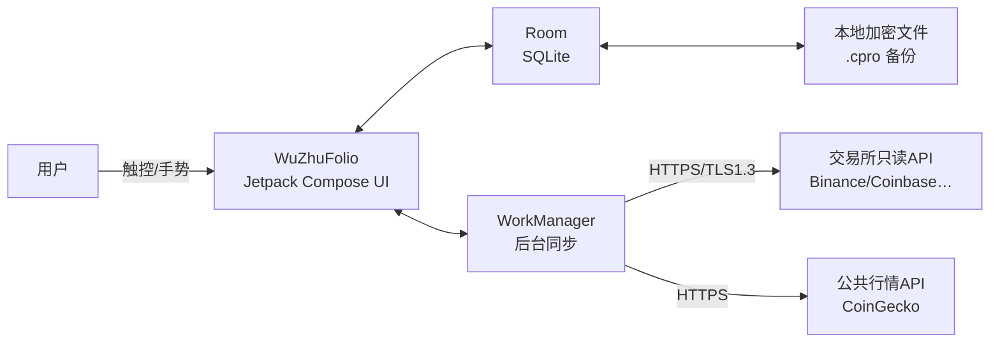

# WuZhuFolio 移动端软件需求规格说明书（SRD）  
**版本：V1.1（MVP）**  
**文档编号：SRD-2026-08-26-10**  
**遵循标准：GB/T 8567-2020、IEEE 830**

> **修订说明（2026-08-26）**：随移动端 PRD V1.2（编号 2026-08-26-09）同步桌面端 V1.3–V1.9 跨端决策与《跨端共享规范》V1.0，本 SRD 由 V1.0 升为 V1.1。主要变更：第 14 章数据模型同步（coin_id 主键、新增 coins/exchange_coin_map/reconciliation_records/sync_logs/fee_rules/price_snapshots 表、accounts/api_keys 补字段、settings 改 key-value）、加密方案改为 Argon2id 分层密钥 + 整库加密 + 凭证字段级 DEK、.cpro 备份格式与恢复语义对齐（备份文件密码、增量合并/全量覆盖、跨账户恢复）、法币退出账本、行情两级 Key + CMC 兜底。跨端规则以《跨端共享规范》为准，冲突时以共享规范为准。

---

## 1. 范围

### 1.1 系统目的
WuZhuFolio 移动端系统旨在为加密货币投资者提供一款数据完全本地化的投资组合管理工具，解决资产分散、隐私担忧、移动网络限制、操作繁琐和多用户管理不便等核心痛点。系统通过本地加密存储和自动化同步机制，确保用户数据安全可控，同时提供实时价格更新、资产跟踪和投资回报率（ROI）计算功能，支持用户在移动设备上高效管理多平台加密资产。

### 1.2 产品愿景
引用 PRD 原文：  
> “我们致力于成为注重数据主权和隐私保护的加密货币投资者的首选移动投资组合管理工具，让每一位用户都能在完全掌控自己数据的前提下，通过多账户管理和精细化资金追踪，做出更明智的投资决策。”

### 1.3 适用边界
- **平台边界**：仅限 Android 10 (API level 29) 及以上设备。
- **数据边界**：所有用户数据（包括交易记录、API 密钥、资金流水）必须存储在设备本地，禁止任何形式的云端传输或存储。
- **功能边界**：不提供云端同步、社交分享、广告推送等非核心功能，不提供撮合、交易、理财等增值服务。。
- **网络边界**：依赖移动网络的同步功能需遵循 Android 后台任务限制（WorkManager），支持“仅 WiFi”“仅充电时”同步策略。
- **网络依赖**：仅通过公共行情API和交易所只读API获取外部数据。
- **权限范围**：不请求后台定位权限，仅需存储权限（用于备份）和网络权限。
- **设计规范**：Material Design/Material 3。

---

## 2. 引用文件
| 文档类型 | 文档名称 | 版本号 |
|----------|----------|--------|
| 产品需求文档 | WuZhuFolio 产品需求文档（移动端版本） | V1.0 (MVP) |
| 国家标准 | GB/T 8567-2020《计算机软件需求规格说明规范》 | 2020 |
| 平台规范 | Android 10 Compatibility Definition | 2020 |

---

## 3. 术语与缩略语

| 术语                     | 缩写                     | 中文解释                                        | 英文解释                                                                                                   |
| ---------------------- | ---------------------- | ------------------------------------------- | ------------------------------------------------------------------------------------------------------ |
| API 密钥                 | API Key                | 应用程序接口密钥，特指交易所提供的只读权限凭证                     | Application Programming Interface Key                                                                  |
| 数据本地化                  | Local Data Storage     | 所有用户数据存储在设备本地，不上传至云端                        | All user data stored on device, not uploaded to cloud                                                  |
| 投资组合                   | Portfolio              | 用户持有的所有加密货币资产的集合                            | Collection of all user's cryptocurrency assets                                                         |
| 盈亏                     | P&L                    | Profit and Loss，指资产的盈利和亏损情况                 | Profit and Loss                                                                                        |
| 浮动盈亏                   | Unrealized P&L         | 当前持仓资产的市值与持仓成本之间的差额                         | Current market value minus cost basis                                                                  |
| 持仓成本                   | Cost Basis             | 建仓买入资产所花费的总成本，采用平均成本法计算                     | Total cost of assets bought, calculated using average cost method                                      |
| 资产净值                   | Asset Value            | 用户所有持仓按现价折算后的总价值                            | Total value of all holdings at current market price                                                    |
| 账户                     | Account                | 用户在本产品中创建的唯一身份标识，通过用户名和密码保护                 | Unique user identity in the app, protected by username and password                                    |
| 资金操作                   | Fund Movement          | 指投资者向投资组合中注入新资金（增资）或从中撤出资金（撤资）              | Injecting new funds (deposit) or withdrawing funds (withdrawal)                                        |
| 可用现金余额                 | Available Cash Balance | 账户内稳定币白名单币种持仓按当前价折算基础法币后的合计（派生展示值，不单独记账） | Sum of stablecoin-whitelist holdings converted to base fiat (derived, not separately booked)          |
| 增资                     | Deposit                | 用户向其投资组合中投入额外资金的行为，仅增加账户的投入本金               | Adding additional funds to investment portfolio, increasing invested capital                           |
| 撤资                     | Withdrawal             | 用户从其投资组合中提取资金的行为，仅减少账户的投入本金                 | Withdrawing funds from investment portfolio, decreasing invested capital                               |
| 投入本金                   | Invested Capital       | 用户通过增资和初始交易投入的总资金，减去撤资总额                    | Total funds invested, minus withdrawals                                                                |
| ROI                    | ROI                    | 投资回报率，计算公式为 `(当前资产净值 - 投入本金) / 投入本金 * 100%` | Return on Investment, calculated as (Current Asset Value - Invested Capital) / Invested Capital * 100% |
| 生物识别                   | Biometric              | 指纹或面部识别，用于快速解锁应用或授权敏感操作                     | Fingerprint or facial recognition for quick app unlock or sensitive operation authorization            |
| 手势操作                   | Gesture                | 指通过滑动、长按、双击等触控动作完成交互                        | Touch gestures such as swipe, long press, double tap for interaction                                   |
| 快捷入口                   | Quick Access           | 手机桌面 Widget 或应用内悬浮按钮，用于快速访问核心功能             | Desktop Widget or floating button for quick access to core features                                    |
| 后台同步                   | Background Sync        | 应用在后台定期同步价格和交易数据，需遵循安卓系统后台任务限制              | Periodic data sync in background, adhering to Android background task limits                           |
| Material Design        | Material Design        | Google推出的设计语言，为Android应用提供视觉、运动、交互设计指导      | Google's design language for Android applications                                                      |
| Bottom Navigation Bar  | Bottom Nav             | Android应用常见的导航模式，提供3-5个主要功能的快速切换            | Common Android navigation pattern with 3-5 main functions                                              |
| Floating Action Button | FAB                    | 用于触发主要或常用操作的可视化按钮                           | Visual button for triggering main or common actions                                                    |
| 加密存储                   | Encrypted Storage      | 所有敏感数据（如交易记录、API 密钥）加密存储。                   |                                                                                                        |
| 先进先出成本法                | FIFO                   | First In, First Out                         | First In, First Out                                                                                    |
| 可信执行环境                 | TEE                    |                                             | Trusted Execution Environment                                                                          |
| Room                   | Room                   | Android 官方 SQLite ORM 框架                    |                                                                                                        |
| WorkManager            | WorkManager            | Android 后台任务调度组件                            |                                                                                                        |
| PBKDF2                 | PBKDF2                 | 密码派生函数                                      | assword-Based Key Derivation Function 2                                                                |
| AES-256-GCM            | AES-256-GCM            | 本地数据加密算法                                    | Advanced Encryption Standard-256-Galois/Counter Mode                                                   |

---

## 4. 总体描述

### 4.1 产品视角（上下文图）


### 4.2 产品功能（功能块图）

```mermaid
graph TD
    A[账户管理] --> A1[账户创建与登录]
    A --> A2[生物识别解锁]
    A --> A3[账户登出]
    A --> A4[账户切换]
    B[投资组合初始化] --> B1[手动添加交易]
    B --> B2[手动添加初始增资]
    B --> B3[CSV导入]
    C[日常投资组合跟踪] --> C1[仪表盘]
    C --> C2[实时价格同步]
    C --> C3[持仓详情]
    C --> C4[单币种资产详情]
    D[高级与便利性功能] --> D1[API同步]
    D --> D2[系统代理]
    E[数据安全与管理] --> E1[本地加密存储]
    E --> E2[数据备份恢复]
    F[资金管理] --> F1[增资记录]
    F --> F2[撤资记录]
    F --> F3[查看资金历史]
    F --> F4[投资回报率计算与展示]
    G[交易管理] --> G1[交易手续费与总价自动计算]
    G --> G2[手续费设置]
```


### 4.3 用户特性
引用 Persona Alex：  
> “姓名：Alex  
> 身份：一位有2-5年经验的加密货币投资者，同时也是一名技术爱好者或软件工程师。  
> 行为与特点：资产分布在2-3个主流中心化交易所，并可能有一些资产在硬件钱包中。高度重视个人数据隐私和资产安全，对将敏感财务数据上传到第三方云服务持怀疑态度。熟悉API密钥的基本概念，并知道如何为应用程序创建只读权限的密钥。追求效率，希望有一个自动化的工具来替代手动维护的电子表格。希望能够在移动设备上随时查看投资组合，快速了解资产状况。需要能够方便地在手机上记录增资/撤资操作。需要在移动网络环境下也能流畅使用应用。”

### 4.4 约束
- **硬件约束**：设备内存 ≥ 2 GB RAM，支持 Android Keystore（硬件TEE/SE）。
- **功能约束**：禁止使用后台定位权限，禁止依赖任何云端服务。
- **安全约束**：所有数据必须本地加密存储，禁止远程传输；不得收集任何用户数据上传至云端。
- **网络约束**：
	- 后台同步需遵循 Android WorkManager 限制（默认间隔 ≥30 分钟）。
	- 不得接入 Firebase、Google Analytics 等云端组件。
	- 支持移动网络和WiFi，但可设置"仅WiFi"同步。
	- 必须处理网络异常和API限制。
- **软件约束**：
	- 使用Android Jetpack组件，特别是Room、WorkManager、Compose。
	- 遵循Material Design 3设计规范。

### 4.5 假设与依赖
- 用户自行提供交易所的只读 API 密钥（如 Binance 的 `Read-Only` 权限）。
- 用户自行提供公共行情API的用户密码或者密钥。
- 用户定期更新行情与交易所 API 限额内请求。
- 公共行情API（如CoinGecko）和交易所API（如Binance）可用且稳定。
- 设备已启用 Android Keystore 系统（硬件级安全存储）。
- 用户设备已配置系统代理（如需使用代理）。
- 用户已安装最新版 Android 系统（API level 29+）。
- 用户理解加密货币投资的风险，并自行负责数据准确性。

---

## 5. 功能需求

### SR-F-1-1-1 账户创建  
输入：用户名（唯一）、密码（≥8 位，含大写、小写、数字）、二次确认密码。  
处理：前端校验强度 → Argon2id（首选，按 OWASP 推荐参数；或 PBKDF2 ≥600,000 次迭代，随机 16 字节 salt）派生 KEK → 密码哈希与 KDF 参数写入 Room `accounts` 表。  
输出：提示“创建成功”，自动登录并跳转仪表盘。  
验收：1) 密码哈希与 salt 存储正确且非明文；2) 异常输入 3 次后按钮禁用 30 s；3) 通过 Android CTS 安全测试集；4) 用户名重复时返回错误码 409。

### SR-F-1-1-2 账户密码强度校验
**输入**：密码输入  
**处理**：验证密码是否 ≥8 位，包含大小写字母和数字  
**输出**：密码强度指示（"弱"、"中"、"强"）  
**验收**：1) 7 位密码输入时，提示"密码长度不足"；2) 仅字母密码输入时，提示"需包含数字"；3) 通过 Android 安全测试（密码不以明文存储）。

### SR-F-1-1-3 账户信息加密存储
**输入**：用户名、密码  
**处理**：使用 Argon2id（首选）或 PBKDF2 ≥600,000 次迭代（盐值 16 字节）生成密码哈希；DEK 由 KEK 包裹后写入 `accounts.wrapped_dek`  
**输出**：加密后的账户信息存储在 `accounts` 表  
**验收**：1) 密码哈希与盐值存储在 `accounts` 表；2) 无密码明文存储；3) 通过 Android Keystore 安全测试（密钥不可导出）。

### SR-F-1-1-4 账户登录  
输入：用户名、密码、“记住我”选项。  
处理：对比 Room 内哈希 → 成功则生成 24 h 有效会话 → 若启用“记住我”则在 EncryptedSharedPreferences 加密存储令牌。  
输出：进入仪表盘；失败提示“用户名或密码错误”。  
验收：1) 哈希对比时间 ≤200 ms；2) 3 次失败禁用登录 30 s；3) 不提示用户是否存在；4) 会话失效后自动返回登录页。

### SR-F-1-1-5 记住我功能
**输入**：勾选"记住我"复选框  
**处理**：登录成功后生成会话令牌，存入 Android Keystore（密码本身永不落盘）  
**输出**：下次启动应用时快速解锁（生物识别/令牌）  
**验收**：1) 无密码明文存储；2) 会话令牌存 Keystore、可撤销；3) 通过 Android 会话管理测试（无会话泄露）。

### SR-F-1-2-1 生物识别解锁启用
**输入**：在设置中开启生物识别  
**处理**：需先验证账户密码，存储生物识别数据  
**输出**：下次打开应用时，优先提示生物识别  
**验收**：1) 开启生物识别前，要求输入账户密码；2) 生物识别失败后，显示密码输入；3) 通过 Android 生物识别安全测试（无未授权访问）。

### SR-F-1-2-2 生物识别解锁流程
**输入**：生物识别成功  
**处理**：解密账户数据  
**输出**：直接进入仪表盘
**验收**：1) 生物识别成功时，跳转到仪表盘；2) 生物识别失败时，提示密码输入；3) 生物识别解锁过程 ≤1 秒。4) 仅用于解锁，不用于备份/恢复等敏感操作；5) 拒绝率 FAR ≤0.002%；6) 取消识别后须清空临时密钥。

### SR-F-1-2-3 生物识别敏感操作保护
**输入**：尝试备份/恢复、修改密码、添加 API 密钥  
**处理**：生物识别仅用于应用解锁，敏感操作需密码  
**输出**：备份使用备份文件密码（默认填当前账户密码，可修改）；恢复使用备份文件密码；修改密码与添加 API 密钥要求输入当前账户密码  
**验收**：1) 备份/恢复时，要求输入备份文件密码（非生物识别）；2) 无生物识别授权敏感操作；3) 通过安全测试（敏感操作需密码验证）。

### SR-F-1-3-1 账户登出
**输入**：点击登出按钮  
**处理**：清除当前账户会话  
**输出**：返回登录界面  
**验收**：1) 登出后，清除所有账户会话；2) 返回登录界面；3) 通过 Android 会话管理测试（无残留数据）。4) WorkManager 同步任务取消。

### SR-F-1-3-2 账户登出后数据安全
**输入**：登出后  
**处理**：确保账户数据不可访问  
**输出**：无数据泄露  
**验收**：1) 登出后，账户数据无法通过任何方式访问；2) 通过安全测试（数据加密不可逆）。3) WorkManager 同步任务取消。

### SR-F-1-4-1 账户切换入口
**输入**：点击切换账户  
**处理**：显示账户列表  
**输出**：显示已创建的账户列表（账户名）  
**验收**：1) 账户切换入口在顶部导航栏；2) 列表显示账户名；3) 通过 UI 测试（响应时间 ≤0.5 秒）。

### SR-F-1-4-2 账户切换流程
**输入**：用户在导航抽屉选择目标账户  
**处理**：当前账户数据加密落盘 → 解密目标账户数据库 → 刷新 UI。
**输出**：切换到目标账户  
**验收**：1) 切换过程流畅，无重启；2) 当前账户数据锁定；3) 通过性能测试（切换时间 ≤1 秒）。4) 切换过程中不得出现数据串扰；5) 失败时回滚原账户。

### SR-F-1-4-3 账户标识清晰
**输入**：切换账户  
**处理**：显示当前账户标识  
**输出**：在导航栏显示当前账户名  
**验收**：1) 当前账户名在导航栏显示；2) 无混淆；3) 通过 UI 测试（标识可见性 100%）。

### SR-F-2-1-1 手动添加交易表单
**输入**：交易对、交易类型、价格、数量、手续费、交易所、交易时间、备注
**处理**：前端校验正数 → 计算总价 → 写入 Room `transactions` 表 → 更新 `portfolio` 平均成本与数量。
**输出**：交易记录添加成功提示，更新资产列表
**验收**：1) 表单包含所有必要字段；2) 价格和数量只接受正数；3)交易记录实时显示在列表中；4) 资产持仓和成本自动更新；5)通过 UI 测试（字段布局适配 4.7-6.7 英寸屏幕）。

### SR-F-2-1-2 交易数据保存
**输入**：保存交易  
**处理**：存储交易记录到 `transactions` 表  
**输出**：交易记录立即出现在交易历史列表  
**验收**：1) 保存后，交易记录显示在列表；2) 通过数据存储测试（写入时间 ≤500 ms）。

### SR-F-2-1-3 交易类型验证
**输入**：交易类型（买入/卖出）  
**处理**：验证交易类型  
**输出**：显示错误提示  
**验收**：1) 无效交易类型时，提示"请选择买入或卖出"；2) 通过输入验证测试（错误提示实时显示）。

### SR-F-2-1-4 交易日期验证
**输入**：交易日期  
**处理**：验证日期格式（YYYY-MM-DD HH:MM）  
**输出**：显示错误提示  
**验收**：1) 无效日期时，提示"日期格式错误"；2) 通过日期验证测试（格式匹配率 100%）。

### SR-F-2-2-1 初始增资记录
**输入**：金额、日期、来源、备注  
**处理**：写入 `fund_movements` 表 → 累加 `accounts.invested_capital` 与 `available_cash`
**输出**：增资记录添加成功提示 ,资金流水列表新增条目，仪表盘 ROI 更新。
**验收**：1) 金额必须为正数；2) 增资后，可用现金余额增加；3) 通过数据验证测试（金额范围 0 < x ≤ 100,000）。

### SR-F-2-2-2 增资记录显示
**输入**：增资记录  
**处理**：更新资金操作列表  
**输出**：显示在资金操作列表  
**验收**：1) 增资记录显示在资金操作列表；2) 通过 UI 测试（列表刷新时间 ≤1 秒）。

### SR-F-2-2-3 投入本金计算
**输入**：增资金额  
**处理**：更新投入本金 = 投入本金 + 增资金额  
**输出**：投入本金增加  
**验收**：1) 投入本金增加；2) 通过 ROI 计算测试（ROI = (总资产净值 - 投入本金) / 投入本金 * 100%）。

### SR-F-2-3-1 CSV导入功能
**输入**：CSV 文件（Binance 格式）  
**处理**：解析 CSV 文件  
**输出**：显示数据预览  
**验收**：1) 支持 Binance 标准 CSV 格式；2) 显示预览数据（5 条样本）；3) 通过文件解析测试（错误率 ≤0.5%）。

### SR-F-2-3-2 CSV导入验证
**输入**：CSV 文件  
**处理**：验证格式（字段数量、数据类型）  
**输出**：提示错误  
**验收**：1) 无效 CSV 时，提示"格式错误"；2) 通过 CSV 验证测试（支持 10+ 交易所格式）。

### SR-F-2-3-3 CSV导入数据
**输入**：确认导入  
**处理**：批量导入交易记录  
**输出**：更新持仓和投入本金  
**验收**：1) 导入成功后，持仓更新；2) 通过数据导入测试（1000 条记录导入 ≤5 秒）。

### SR-F-2-3-4 CSV导入重复记录
**输入**：重复交易  
**处理**：识别重复交易（相同交易对、时间、价格）  
**输出**：提示重复  
**验收**：1) 重复交易时，提示"记录已存在"；2) 通过重复处理测试（重复率 0%）。

### SR-F-3-1-1 仪表盘总览
**输入**：应用启动或进入页面后自动加载数据
**处理**：计算总资产净值（加密资产市值 + 可用现金余额）  
**输出**：显示总资产净值、24 小时盈亏（金额和百分比）  
**验收**：1) 显示总资产净值（法币计价）；2) 显示 24 小时绝对值盈亏；3) 通过数据计算测试（误差率 ≤0.1%）。

### SR-F-3-1-2 仪表盘 ROI 显示
**输入**：总资产净值、投入本金  
**处理**：计算 ROI = (总资产净值 - 投入本金) / 投入本金 * 100%  
**输出**：显示 ROI（正数绿色，负数红色）  
**验收**：1) ROI 计算公式正确；2) 正数 ROI 显示为绿色；3) 通过 ROI 计算测试（100% 一致）。

### SR-F-3-1-3 仪表盘资产分布
**输入**：资产数据  
**处理**：计算市值占比，小额币种归为"其他"（阈值 0.01）  
**输出**：显示交互式饼图  
**验收**：1) 饼图显示资产分布；2) 小额币种归为"其他"；3) 通过图表渲染测试（渲染时间 ≤1 秒）。

### SR-F-3-1-4 仪表盘刷新机制
**输入**：应用启动  
**处理**：自动刷新（默认间隔 5 分钟）  
**输出**：显示最新数据  
**验收**：1) 每 5 分钟自动刷新；2) 提供手动刷新按钮；3) 通过刷新测试（刷新时间 ≤1 秒）。

### SR-F-3-1-5 仪表盘离线模式
**输入**：无网络  
**处理**：显示上次同步数据  
**输出**：提示"网络已断开，点击刷新"  
**验收**：1) 无网络时，显示上次同步数据；2) 提示"网络已断开，点击刷新"；3) 通过离线测试（数据一致性 100%）。

### SR-F-3-2-1 行情API集成
**输入**：应用启动  
**处理**：连接 CoinGecko REST API v3  
**输出**：获取实时价格  
**验收**：1) 默认集成 CoinGecko API；2) 价格更新；3) 通过 API 连接测试（成功率 ≥95%）。

### SR-F-3-2-2 价格同步频率
**输入**：设置  
**处理**：应用刷新频率（1 分钟、5 分钟）  
**输出**：价格更新  
**验收**：1) 刷新频率可设置；2) 通过设置测试（设置生效时间 ≤1 秒）。

### SR-F-3-2-3 价格同步失败处理
**输入**：API 失败  
**处理**：显示"网络异常，数据可能延迟"提示  
**输出**：显示上一次成功获取的价格时间戳  
**验收**：1) API 失败时，显示"网络异常，数据可能延迟"；2) 显示上一次价格时间戳；3) 通过错误处理测试（错误提示实时显示）。

### SR-F-3-2-4 网络设置支持
**输入**：设置  
**处理**：应用同步策略（"仅 WiFi"、"仅充电时"、"手动同步"）  
**输出**：同步策略生效  
**验收**：1) 支持三种同步策略；2) 通过网络设置测试（策略切换时间 ≤1 秒）。

### SR-F-3-3-1 持仓详情列表
**输入**：持仓数据  
**处理**：展示列表（币种、数量、成本、市值、盈亏）  
**输出**：显示持仓列表  
**验收**：1) 列表包含必要字段；2) 通过列表渲染测试（4.7 英寸屏幕单列显示）。

### SR-F-3-3-2 持仓列表排序
**输入**：点击排序  
**处理**：应用排序（市值、名称、盈亏）  
**输出**：列表排序  
**验收**：1) 支持按市值降序；2) 通过排序测试（排序时间 ≤0.5 秒）。

### SR-F-3-3-3 持仓列表加载
**输入**：应用启动  
**处理**：加载数据（下拉刷新、上拉加载更多）  
**输出**：列表加载完成  
**验收**：1) 支持下拉刷新；2) 支持上拉加载（每页 50 条）；3) 通过加载测试（加载时间 ≤1 秒）。

### SR-F-3-3-4 持仓列表适应
**输入**：不同屏幕尺寸  
**处理**：适配屏幕  
**输出**：显示正确  
**验收**：1) 4.7 英寸屏幕显示单列；2) 6.7 英寸屏幕显示两列；3) 通过屏幕适配测试（100% 兼容）。

### SR-F-3-4-1 单币种详情页
**输入**：点击币种  
**处理**：加载币种详情  
**输出**：显示币种汇总信息（数量、价值、占比、盈亏）  
**验收**：1) 显示持有数量、当前持有价值；2) 通过详情页测试（加载时间 ≤0.8 秒）。

### SR-F-3-4-2 单币种交易列表
**输入**：币种详情  
**处理**：加载交易记录  
**输出**：显示交易列表  
**验收**：1) 交易列表支持筛选；2) 通过交易列表测试（1000 条记录加载 ≤1 秒）。

### SR-F-3-4-3 单币种交易筛选
**输入**：筛选条件（交易所、类型）  
**处理**：应用筛选  
**输出**：显示筛选结果  
**验收**：1) 支持按交易所筛选；2) 通过筛选测试（筛选时间 ≤0.5 秒）。

### SR-F-3-4-4 单币种交易加载
**输入**：应用启动  
**处理**：加载交易  
**输出**：交易列表  
**验收**：1) 支持下拉刷新；2) 支持上拉加载更多；3) 通过加载测试（加载时间 ≤1 秒）。

### SR-F-4-1-1 API 密钥添加
**输入**：API 密钥  
**处理**：验证只读权限（提示"仅需只读权限"）  
**输出**：加密存储密钥  
**验收**：1) 明确提示"仅需只读权限"；2) 密钥 AES-256-GCM 加密存储；3) 通过安全测试（密钥不可读）。

### SR-F-4-1-2 API 同步频率
**输入**：设置  
**处理**：应用同步间隔（默认 30 分钟）  
**输出**：自动同步  
**验收**：1) 默认同步间隔 30 分钟；2) 通过同步间隔测试（误差 ≤1 分钟）。

### SR-F-4-1-3 API 状态显示
**输入**：API 同步  
**处理**：显示最后同步时间  
**输出**：显示同步状态（成功/失败）  
**验收**：1) 显示最后同步时间；2) 显示状态（成功/失败）；3) 通过状态显示测试（状态更新时间 ≤1 秒）。

### SR-F-4-1-4 API 手动同步
**输入**：点击同步按钮  
**处理**：触发同步  
**输出**：更新数据  
**验收**：1) 手动同步按钮有效；2) 同步后更新数据；3) 通过同步测试（同步时间 ≤3 秒）。

### SR-F-4-1-5 API 同步策略
**输入**：设置  
**处理**：应用同步策略（"仅 WiFi"、"仅充电时"）  
**输出**：同步生效  
**验收**：1) 支持两种策略；2) 通过策略测试（策略切换时间 ≤1 秒）。

### SR-F-4-2-1 系统代理检测
**输入**：应用启动  
**处理**：自动检测系统代理设置 ；读取系统 Proxy 设置 → OkHttp 自动配置。
**输出**：使用代理连接 
**验收**：1) 自动检测系统代理；2) 通过代理连接；3) 通过代理测试（代理生效率 100%）。

### SR-F-4-2-2 代理连接状态
**输入**：网络连接  
**处理**：显示状态  
**输出**：状态栏显示"代理连接"  
**验收**：1) 状态栏显示代理连接；2) 通过状态显示测试（状态更新时间 ≤0.5 秒）。

### SR-F-4-2-3 代理网络请求
**输入**：网络请求  
**处理**：通过代理发送请求  
**输出**：请求通过代理  
**验收**：1) 所有网络请求通过代理；2) 通过代理请求测试（请求成功率 ≥98%）。

### SR-F-5-1-1 数据本地加密
**输入**：数据  
**处理**：SQLite 单库多账户 + 整库加密（SQLCipher）+ 凭证字段按账户 DEK 字段级 AES-256-GCM（见《跨端共享规范》§7）  
**输出**：加密存储  
**验收**：1) 整库加密 + 凭证字段级加密；2) 加密密钥经 KEK 包裹、与账户密码关联；3) 通过加密测试（解密成功率 100%）。

### SR-F-5-1-2 数据加密密钥
**输入**：账户密码  
**处理**：Argon2id（首选，OWASP 推荐参数）或 PBKDF2 ≥600,000 次迭代（盐值 16 字节）派生 KEK；DEK 随机生成、由 KEK 包裹  
**输出**：KEK / 包裹后的 DEK  
**验收**：1) 使用 Argon2id 或 PBKDF2 ≥600,000 派生；2) 无密码无法解密 DEK；3) 通过密钥派生测试（密钥一致性 100%）。

### SR-F-5-1-3 数据防篡改
**输入**：数据  
**处理**：认证加密（AES-256-GCM 或 HMAC），非普通校验和  
**输出**：防篡改数据  
**验收**：1) 数据有 GCM 认证标签/HMAC；2) 通过防篡改测试（认证验证 100%）。

### SR-F-5-1-4 应用卸载后安全
**输入**：应用卸载  
**处理**：清除残留数据  
**输出**：数据不可读  
**验收**：1) 应用卸载后，数据无法读取；2) 通过安全测试（数据残留率 0%）。

### SR-F-5-2-1 数据备份
**输入**：点击备份  
**处理**：设置并确认备份文件密码（默认填当前账户密码，可修改）→ 导出当前账户业务数据（交易、资金流水、校准记录、手续费规则、API 密钥、设置、本账户涉及价格快照）→ 明文头部 + AES-256-GCM 加密 JSON 载荷 → 生成 `.cpro` 文件 → 存储至用户选定路径。
**输出**：备份文件（.cpro，与桌面端兼容）  
**验收**：1) 备份文件为 .cpro；2) 使用备份文件密码加密（非账户密码本身）；3) 不含账户信息（用户名/密码哈希/KDF 参数）；4) 通过备份测试（备份时间 ≤3 秒）。

### SR-F-5-2-2 备份文件存储
**输入**：选择路径  
**处理**：保存文件  
**输出**：备份文件存储  
**验收**：1) 支持内部存储、SD 卡；2) 通过文件存储测试（路径正确率 100%）。

### SR-F-5-2-3 数据恢复
**输入**：选择 `.cpro` 文件并输入备份文件密码。
**处理**：显示明文头部摘要 → 验证备份文件密码 → 解密载荷并校验格式 → 选择增量合并（默认）或全量覆盖 → 导入 → 触发全量重放重算 → 重启 UI。
**输出**：提示恢复成功，仪表盘显示新数据。
**验收**：1) 恢复前要求输入备份文件密码；2) 支持新设备/跨账户恢复；3) 通过恢复测试（恢复成功率 100%）。

### SR-F-5-2-4 恢复数据覆盖
**输入**：恢复操作（全量覆盖方式）  
**处理**：二次确认 → 覆盖前自动生成临时备份 → 仅覆盖账户级业务数据（全局公共表不清空）  
**输出**：新数据  
**验收**：1) 恢复前提示覆盖并二次确认；2) 通过数据覆盖测试（覆盖一致性 100%）。

### SR-F-5-2-5 恢复数据验证
**输入**：备份文件  
**处理**：验证明文头部与 GCM 认证标签（防篡改），无普通校验和  
**输出**：恢复或提示错误  
**验收**：1) 无效备份提示"文件错误"；2) 通过验证测试（认证验证 100%）。

### SR-F-6-1-1 增资记录表单
**输入**：金额、日期、来源、备注  
**处理**：验证金额 >0  
**输出**：记录增资  
**验收**：1) 金额正数；2) 记录在资金操作列表；3) 通过表单测试（表单提交成功率 100%）。

### SR-F-6-1-2 增资更新余额
**输入**：增资  
**处理**：更新可用现金余额 = 可用现金余额 + 增资金额  
**输出**：可用现金余额增加  
**验收**：1) 可用现金余额增加；2) 通过余额更新测试（更新时间 ≤500 ms）。

### SR-F-6-1-3 增资更新投入本金
**输入**：增资  
**处理**：更新投入本金 = 投入本金 + 增资金额  
**输出**：投入本金增加  
**验收**：1) 投入本金增加；2) 通过 ROI 计算测试（ROI 一致性 100%）。

### SR-F-6-1-4 增资记录显示
**输入**：增资记录  
**处理**：显示在资金操作列表  
**输出**：显示在列表  
**验收**：1) 增资记录显示；2) 通过 UI 测试（列表刷新时间 ≤1 秒）。

### SR-F-6-2-1 撤资记录表单
**输入**：金额、日期、去向、备注  
**处理**：验证金额 >0  
**输出**：记录撤资  
**验收**：1) 金额正数；2) 记录在资金操作列表；3) 通过表单测试。

### SR-F-6-2-2 撤资更新余额
**输入**：撤资  
**处理**：更新可用现金余额 = 可用现金余额 - 撤资金额  
**输出**：可用现金余额减少  
**验收**：1) 可用现金余额减少；2) 通过余额更新测试。

### SR-F-6-2-3 撤资更新投入本金
**输入**：撤资  
**处理**：更新投入本金 = 投入本金 - 撤资金额  
**输出**：投入本金减少  
**验收**：1) 投入本金减少；2) 通过 ROI 计算测试。

### SR-F-6-2-4 撤资记录显示
**输入**：撤资记录  
**处理**：显示在资金操作列表  
**输出**：显示在列表  
**验收**：1) 撤资记录显示；2) 通过 UI 测试。

### SR-F-6-3-1 资金历史列表
**输入**：资金操作  
**处理**：展示列表（按时间倒序）  
**输出**：列表  
**验收**：1) 按时间倒序；2) 显示操作类型、金额等；3) 通过列表测试。

### SR-F-6-3-2 资金历史筛选
**输入**：筛选条件  
**处理**：应用筛选  
**输出**：筛选结果  
**验收**：1) 支持筛选；2) 通过筛选测试。

### SR-F-6-3-3 资金历史加载
**输入**：应用启动  
**处理**：加载数据  
**输出**：列表加载  
**验收**：1) 支持下拉刷新；2) 支持上拉加载更多；3) 通过加载测试。

### SR-F-6-4-1 ROI 计算
**输入**：总资产净值、投入本金  
**处理**：计算 ROI = (总资产净值 - 投入本金) / 投入本金 * 100%  
**输出**：ROI  
**验收**：1) ROI 公式正确；2) 通过计算测试（100% 一致）。

### SR-F-6-4-2 ROI 显示位置
**输入**：仪表盘  
**处理**：显示 ROI  
**输出**：ROI 显示在总览卡片  
**验收**：1) 在仪表盘总览卡片显示；2) 在资产列表顶部显示；3) 通过 UI 测试。

### SR-F-6-4-3 ROI 实时更新
**输入**：数据变化  
**处理**：更新 ROI  
**输出**：ROI 更新  
**验收**：1) ROI 实时更新；2) 通过实时测试（更新时间 ≤0.5 秒）。

### SR-F-6-4-4 ROI 计算考虑
**输入**：增资/撤资  
**处理**：更新计算  
**输出**：ROI  
**验收**：1) ROI 考虑所有增资撤资；2) 通过 ROI 计算测试。

### SR-F-7-1-1 手续费自动计算
**输入**：价格、数量  
**处理**：自动计算手续费（基于预设费率）  
**输出**：显示手续费  
**验收**：1) 自动计算手续费；2) 通过计算测试（计算时间 ≤0.5 秒）。

### SR-F-7-1-2 手续费设置
**输入**：设置费率  
**处理**：应用预设费率

## 6 外部接口需求  
### 6.1 用户接口

- 采用 Material 3 组件：NavigationBar 3 栏（仪表盘、资产、设置），FAB 用于“添加交易”；    
- 手势：下拉刷新、左右滑切换账户、侧滑删除交易记录；    
- 点击区域 ≥48×48 dp，字体标题 20 sp，正文 14 sp。    

### 6.2 硬件接口

- 必须调用 TEE/SE 通过 Android Keystore 生成并存储 AES-256 密钥，密钥属性 `setUserAuthenticationRequired(true)`；    
- 生物识别传感器符合 Android BiometricPrompt 等级 3（CSD2）。    

### 6.3 软件接口

- CoinGecko REST v3 `/simple/price` 批量 ≤250 符号，返回 JSON 字段 `usd, usd_24h_change`；    
- Binance GET `/api/v3/account` 只读权限，返回 `balances, permissions=["READ"]`。    

### 6.4 通信接口

- OkHttp 4.12，TLS 1.3，证书锁定（pinning）sha256/AAAAAAAA…；    
- 自动识别系统代理，支持 HTTP/HTTPS/SOCKS，超时 10 s/20 s/60 s。    

### 6.5 行情 API 调用规范

- 频率限制：CoinGecko 免费版 10-50 次/分钟
- 频率：默认 5 min，可设 1/5/15 min；    
- 失败退避：2 s→4 s→8 s…最大 1 h；    
- 数据缓存 5 min，离线展示上次值并红色提示。    

### 6.6 交易所 API 同步协议

- 增量检测：对比 `updateTime` 字段，本地写入前事务加锁；    
- 错误码映射：401→“API 密钥失效”，429→“频率超限”，418→“IP 被封”。    

### 6.7 系统级集成

- WorkManager 约束：`setRequiredNetworkType(NetworkType.UNMETERED)`、`setRequiresCharging(true)` 可配；    
- 生物识别失败退保密码，三次失败后禁用 30 s。

## 7 备份与恢复格式规范  
### 7.1 `.cpro` 文件结构

> 与桌面端一致，见《跨端共享规范》§8。

| 段    | 说明                |
| :--- | :---------------- |
| 明文头部 | 格式版本、应用版本、导出时间、各表记录条数、数据时间范围（不含账户信息） |
| 加密载荷 | AES-256-GCM 密文（JSON 序列化，密钥由备份文件密码经 KDF 派生） |

- 数据完整性由 GCM 认证标签保证（防篡改），不另设 SHA-256 校验和。

### 7.2 恢复流程

- 选择 `.cpro` 文件 → 显示明文头部摘要 → 输入备份文件密码 → 解密载荷并校验格式 → 选择增量合并（默认）或全量覆盖 → 导入 → 全量重放重算 → 发送 `ACTION_RELOAD` 重启 Compose 导航图；    
- 失败时回滚临时数据库文件，保证原子性；全量覆盖前自动生成临时备份。

## 8 性能需求

| 指标             | 目标          | 验收方法                    |
| :------------- | :---------- | :---------------------- |
| 冷启动            | ≤2 s        | 从 Launcher 点击到仪表盘首次渲染   |
| 页面加载           | ≤2 s        | 资产列表 100 条              |
| 查询响应           | ≤300 ms     | 单币种交易记录 500 条           |
| 内存峰值           | ≤50 MB      | Android Studio Profiler |
| 后台电量           | ≤1%/24 h    | Battery Historian       |
| WorkManager 间隔 | ≥30 min     | 默认 30 min，可配 60/120 min |
| CSV 导入         | 1000 条 ≤3 s | 秒表计时                    |
| 备份耗时           | 5000 条 ≤2 s | 秒表计时                    |
| 电池消耗           | 后台同步≤1% /小时 |                         |
|                |             |                         |

### 9 安全需求
### 9.1 数据保密

- 存储与加密选型见《跨端共享规范》§7：整库加密（SQLCipher，密钥由 Android Keystore 保护）+ 凭证字段（api_keys）按账户 DEK 字段级 AES-256-GCM；KEK 由账户密码经 Argon2id（首选）或 PBKDF2 ≥600,000 次迭代派生；
- 密钥存储于 Android Keystore，硬件保护等级 `TRUSTED_ENVIRONMENT`；    
- 启用 `setUserAuthenticationRequired(true)`，生物识别或密码解锁后方可解密。
- 根设备检测，拒绝在已root设备运行。

### 9.2 完整性

- 数据防篡改采用认证加密（AES-256-GCM 或 HMAC），非普通校验和；    
- Room 数据库启用 `ENABLE_FOREIGN_KEYS`，写入事务使用`setForeignKeyConstraintsEnabled(true)`。

### 9.3 可用性

- 登录/生物识别 3 次失败锁定 30 s；
- 生物识别失败可退至密码输入；
- 数据库损坏时弹窗提示，提供“从备份恢复”或“重置应用”双选项。    

### 9.4 隐私

- 零云端上传，网络流量仅用于行情与交易所只读 API；    
- 不得集成 Firebase Analytics、Ad ID、Crashlytics；    
- 应用进程退出后 0 s 上报。
- 符合《个人信息保护法》，无需隐私政策弹窗（因无网络上传）。
- **零追踪**：不收集用户的行为数据。
- **零广告 ID**：不使用广告 ID 进行跟踪。

## 10 可靠性

- MTTF ≥1000 h（统计 100 台设备 7×24 运行 Monkey 无崩溃）；    
- 数据丢失率 =0（事务提交 + 备份校验）；    
- 自动备份提示周期 ≤7 天（首次创建后 3、7、30 天提醒）。
- 离线可用，网络异常时使用缓存数据

## 11 可维护性

- 模块化：UI（Compose）-Domain-Room 三层，依赖倒置；    
- Room 自动迁移：版本递增脚本 `Migration1To2`、`Migration2To3`；    
- 日志分级：`Log.ERROR/INFO/DEBUG` 写入 `/Android/data/<pkg>/files/logs/`；
- 用户可导出 `logcat-YYYY-MM-DD.txt` 用于诊断。

## 12 兼容性

- Android 10（API 29）至 Android 15（API 35）；    
- 屏幕 4.7-6.7 英寸，分辨率 FHD+ 以上自适应；    
- 支持横屏分屏，7 英寸平板双列布局。

## 13 其他需求
### 13.1 I18N

- 支持英文、中文，资源字符串 `values-en`、`values-zh-rCN`；    
- 法币仅作计价单位（USD/EUR/CNY），不入账本；汇率源 CoinGecko 主源 + CoinMarketCap 兜底（见《跨端共享规范》§5）。

### 13.2 易用性

- 核心任务（查看资产、添加交易、记录增资）≤3 步完成；    
- 无障碍：所有图标增加 `contentDescription`，TalkBack 朗读；盈亏数值强制 +/- 符号，色盲友好配色（蓝涨橙跌）可选。    

### 13.3 法律

- 遵守《个人信息保护法》，无个人信息上传，无需隐私政策弹窗；    
- 在应用描述与首次启动页明示“数据仅存储于本机”。

## 14 数据模型

> 与《跨端共享规范》§6/§7/§8 对齐；币种内部标识统一使用 CoinGecko id（coin_id），symbol 仅作展示。

### 14.1 核心数据库表结构

使用Room数据库，包含以下表：

#### **accounts**

| 字段            | 类型      | 说明     | 加密  | 索引  |
| ------------- | ------- | ------ | --- | --- |
| id            | INTEGER | 主键     | 否   | 是   |
| username      | TEXT    | 用户名    | 否   | 是   |
| password_hash | TEXT    | 密码哈希（Argon2id，含 salt） | 是 | 否 |
| kdf_salt      | BLOB    | KDF 盐（随机 16 字节） | 否 | 否 |
| kdf_params    | TEXT    | KDF 参数（算法/迭代/内存，JSON） | 否 | 否 |
| wrapped_dek   | BLOB    | 账户 KEK 包裹后的 DEK | 否 | 否 |
| created_at    | INTEGER | 创建时间   | 否   | 否   |
| last_active   | INTEGER | 最后活动时间 | 否   | 否   |

#### **portfolio**

|字段|类型|说明|加密|索引|
|---|---|---|---|---|
|id|INTEGER|主键|否|是|
|account_id|INTEGER|账户ID|否|是|
|coin_id|TEXT|币种内部标识（CoinGecko id）|是|是|
|quantity|REAL|数量|是|否|
|average_cost|REAL|平均成本|是|否|
|total_cost|REAL|总成本|是|否|
|last_updated|INTEGER|最后更新时间|否|否|

#### **transactions**

|字段|类型|说明|加密|索引|
|---|---|---|---|---|
|id|INTEGER|主键|否|是|
|account_id|INTEGER|账户ID|否|是|
|pair|TEXT|交易对展示字符串|是|是|
|base_coin_id|TEXT|基础币种内部标识（保存时冻结）|是|是|
|quote_coin_id|TEXT|计价币种内部标识（保存时冻结）|是|是|
|transaction_type|TEXT|类型（BUY/SELL）|是|否|
|price|REAL|价格|是|否|
|quantity|REAL|数量|是|否|
|fee|REAL|手续费|是|否|
|fee_currency|TEXT|手续费币种|是|否|
|total|REAL|总价|是|否|
|exchange|TEXT|交易所|是|是|
|exchange_order_id|TEXT|交易所订单号（可空，用于 API/CSV 去重）|是|否|
|transaction_time|INTEGER|交易时间|否|是|
|created_at|INTEGER|创建时间|否|否|
|source|TEXT|来源（Manual/CSV/Binance API）|是|否|
|note|TEXT|备注|是|否|

### **api_keys**

|字段|类型|说明|加密|索引|
|---|---|---|---|---|
|id|INTEGER|主键|否|是|
|account_id|INTEGER|账户ID|否|是|
|exchange|TEXT|交易所（MVP 仅 Binance）|是|是|
|alias|TEXT|别名|是|否|
|api_key|TEXT|API密钥|是（账户 DEK 字段级）|否|
|secret_key|TEXT|Secret密钥|是（账户 DEK 字段级）|否|
|passphrase|TEXT|额外口令（可空）|是（账户 DEK 字段级）|否|
|extra|TEXT|扩展字段（JSON，可空）|是（账户 DEK 字段级）|否|
|last_synced|INTEGER|最后同步时间|否|否|
|status|TEXT|状态|是|否|

#### **fund_movements**

|字段|类型|说明|加密|索引|
|---|---|---|---|---|
|id|INTEGER|主键|否|是|
|account_id|INTEGER|账户ID|否|是|
|type|TEXT|类型（DEPOSIT/WITHDRAWAL）|是|否|
|amount|REAL|数量（原币种）|是|否|
|coin_id|TEXT|币种内部标识（保存时冻结）|是|否|
|base_amount|REAL|折算基础法币金额|是|否|
|flow_time|INTEGER|流动时间|否|是|
|source|TEXT|来源|是|否|
|destination|TEXT|去向|是|否|
|created_at|INTEGER|创建时间|否|否|
|note|TEXT|备注|是|否|

#### **settings**（key-value 形式，与桌面端对齐）

|字段|类型|说明|加密|索引|
|---|---|---|---|---|
|id|INTEGER|主键|否|是|
|account_id|INTEGER|账户ID（全局设置此项为空）|否|是|
|key|TEXT|设置项名称|否|否|
|value|TEXT|设置项的值|是|否|

#### **coins**（币种主数据目录，全局公共数据）

|字段|类型|说明|加密|索引|
|---|---|---|---|---|
|id|TEXT|CoinGecko id（内部唯一标识）|否|是|
|symbol|TEXT|币种代码（展示用）|否|是|
|name|TEXT|币种名称|否|否|
|contracts|TEXT|各链合约地址（JSON，消歧用）|否|否|
|last_refresh|INTEGER|目录刷新时间|否|否|

#### **exchange_coin_map**（交易所资产映射，全局公共数据）

|字段|类型|说明|加密|索引|
|---|---|---|---|---|
|id|INTEGER|主键|否|是|
|exchange|TEXT|交易所名称|否|是|
|exchange_asset|TEXT|交易所资产标识|否|是|
|coin_id|TEXT|映射的内部币种 id|否|否|
|source|TEXT|来源（AUTO/MANUAL）|否|否|

#### **reconciliation_records**（持仓校准记录）

|字段|类型|说明|加密|索引|
|---|---|---|---|---|
|id|INTEGER|主键|否|是|
|account_id|INTEGER|账户ID|否|是|
|coin_id|TEXT|币种内部标识|是|是|
|exchange|TEXT|校准依据的交易所|是|否|
|balance|REAL|校准时交易所余额|是|否|
|delta|REAL|持仓数量差额（新余额−旧持仓）|是|否|
|base_amount|REAL|差额折算基础法币金额（正=增资、负=撤资）|是|否|
|price|REAL|校准时市价|是|否|
|reconciled_at|INTEGER|校准时间|否|是|

#### **sync_logs**（同步日志）

|字段|类型|说明|加密|索引|
|---|---|---|---|---|
|id|INTEGER|主键|否|是|
|account_id|INTEGER|账户ID|否|是|
|kind|TEXT|类型（TRADE_SYNC/MARKET_REFRESH）|否|否|
|exchange_or_source|TEXT|交易所或行情源|否|否|
|status|TEXT|状态（OK/FAILED）|否|否|
|detail|TEXT|结果摘要（脱敏）|否|否|
|started_at|INTEGER|开始时间|否|否|
|finished_at|INTEGER|结束时间|否|否|

#### **fee_rules**（手续费费率规则）

|字段|类型|说明|加密|索引|
|---|---|---|---|---|
|id|INTEGER|主键|否|是|
|account_id|INTEGER|账户ID|否|是|
|exchange|TEXT|交易所名称；为空表示全局默认|否|否|
|buy_rate|REAL|买入费率（百分比）|否|否|
|sell_rate|REAL|卖出费率（百分比）|否|否|
|created_at|INTEGER|创建时间|否|否|

#### **price_snapshots**（价格快照，全局公共数据）

|字段|类型|说明|加密|索引|
|---|---|---|---|---|
|id|INTEGER|主键|否|是|
|coin_id|TEXT|币种内部标识|否|是|
|fiat|TEXT|计价法币|否|是|
|price|REAL|价格|否|否|
|price_source|TEXT|数据来源（COINGECKO/COINMARKETCAP）|否|否|
|recorded_at|INTEGER|记录时间|否|是|

> 注：price_snapshots 每币种每法币每小时最多一条，同一小时取末条；永久保存并降采样（近 90 天小时级、更早日级）。

### 14.2 核心表结构（Room 实体，字段类型 Kotlin）

```kotlin
@Entity(tableName = "accounts")
data class AccountEntity(
    @PrimaryKey(autoGenerate = true) val id: Long = 0,
    val username: String, // 不加密
    val passwordHash: String, // Argon2id 哈希
    val kdfSalt: ByteArray, // 随机 16 字节
    val kdfParams: String, // KDF 参数（JSON）
    val wrappedDek: ByteArray, // KEK 包裹的 DEK
    val createdAt: Instant,
    val lastActive: Instant
)

@Entity(
    tableName = "portfolio",
    foreignKeys = [ForeignKey(
        entity = AccountEntity::class,
        parentColumns = ["id"],
        childColumns = ["accountId"],
        onDelete = ForeignKey.CASCADE
    )],
    indices = [Index(value = ["accountId", "coinId"], unique = true)]
)
data class PortfolioEntity(
    @PrimaryKey(autoGenerate = true) val id: Long = 0,
    val accountId: Long,
    val coinId: String, // AES-256-GCM
    val quantity: BigDecimal, // AES-256-GCM
    val averageCost: BigDecimal, // AES-256-GCM
    val totalCost: BigDecimal, // AES-256-GCM
    val lastUpdated: Instant
)

@Entity(
    tableName = "transactions",
    foreignKeys = [ForeignKey(
        entity = AccountEntity::class,
        parentColumns = ["id"],
        childColumns = ["accountId"],
        onDelete = ForeignKey.CASCADE
    )],
    indices = [Index(value = ["accountId", "transactionTime"])]
)
data class TransactionEntity(
    @PrimaryKey(autoGenerate = true) val id: Long = 0,
    val accountId: Long,
    val pair: String, // AES-256-GCM
    val baseCoinId: String, // AES-256-GCM（保存时冻结）
    val quoteCoinId: String, // AES-256-GCM（保存时冻结）
    val transactionType: String, // AES-256-GCM
    val price: BigDecimal, // AES-256-GCM
    val quantity: BigDecimal, // AES-256-GCM
    val fee: BigDecimal, // AES-256-GCM
    val feeCurrency: String, // AES-256-GCM
    val total: BigDecimal, // AES-256-GCM
    val exchange: String, // AES-256-GCM
    val exchangeOrderId: String?, // 交易所订单号（去重用）
    val transactionTime: Instant,
    val source: String, // AES-256-GCM
    val note: String? // AES-256-GCM
)

@Entity(tableName = "api_keys")
data class ApiKeyEntity(
    @PrimaryKey(autoGenerate = true) val id: Long = 0,
    val accountId: Long,
    val exchange: String, // AES-256-GCM
    val alias: String, // AES-256-GCM
    val apiKey: String, // 账户 DEK 字段级 AES-256-GCM
    val secretKey: String, // 账户 DEK 字段级 AES-256-GCM
    val passphrase: String?, // 账户 DEK 字段级 AES-256-GCM
    val extra: String?, // 账户 DEK 字段级 AES-256-GCM（JSON）
    val lastSynced: Instant,
    val status: String // AES-256-GCM
)

@Entity(tableName = "fund_movements")
data class FundMovementEntity(
    @PrimaryKey(autoGenerate = true) val id: Long = 0,
    val accountId: Long,
    val type: String, // AES-256-GCM
    val amount: BigDecimal, // AES-256-GCM
    val coinId: String, // AES-256-GCM（保存时冻结）
    val baseAmount: BigDecimal, // 折算基础法币金额，AES-256-GCM
    val flowTime: Instant,
    val source: String?, // AES-256-GCM
    val destination: String?, // AES-256-GCM
    val createdAt: Instant,
    val note: String? // AES-256-GCM
)

@Entity(tableName = "settings")
data class SettingsEntity(
    @PrimaryKey(autoGenerate = true) val id: Long = 0,
    val accountId: Long, // 全局设置此项为空
    val key: String,
    val value: String // AES-256-GCM
)

@Entity(tableName = "coins")
data class CoinEntity(
    @PrimaryKey val id: String, // CoinGecko id
    val symbol: String,
    val name: String,
    val contracts: String, // JSON
    val lastRefresh: Instant
)

@Entity(tableName = "exchange_coin_map")
data class ExchangeCoinMapEntity(
    @PrimaryKey(autoGenerate = true) val id: Long = 0,
    val exchange: String,
    val exchangeAsset: String,
    val coinId: String,
    val source: String // AUTO/MANUAL
)

@Entity(tableName = "reconciliation_records")
data class ReconciliationRecordEntity(
    @PrimaryKey(autoGenerate = true) val id: Long = 0,
    val accountId: Long,
    val coinId: String, // AES-256-GCM
    val exchange: String, // AES-256-GCM
    val balance: BigDecimal, // AES-256-GCM
    val delta: BigDecimal, // AES-256-GCM
    val baseAmount: BigDecimal, // AES-256-GCM
    val price: BigDecimal, // AES-256-GCM
    val reconciledAt: Instant
)

@Entity(tableName = "sync_logs")
data class SyncLogEntity(
    @PrimaryKey(autoGenerate = true) val id: Long = 0,
    val accountId: Long,
    val kind: String, // TRADE_SYNC/MARKET_REFRESH
    val exchangeOrSource: String,
    val status: String, // OK/FAILED
    val detail: String, // 脱敏摘要
    val startedAt: Instant,
    val finishedAt: Instant
)

@Entity(tableName = "fee_rules")
data class FeeRuleEntity(
    @PrimaryKey(autoGenerate = true) val id: Long = 0,
    val accountId: Long,
    val exchange: String, // 空=全局默认
    val buyRate: BigDecimal,
    val sellRate: BigDecimal,
    val createdAt: Instant
)

@Entity(tableName = "price_snapshots")
data class PriceSnapshotEntity(
    @PrimaryKey(autoGenerate = true) val id: Long = 0,
    val coinId: String,
    val fiat: String,
    val price: BigDecimal,
    val priceSource: String, // COINGECKO/COINMARKETCAP
    val recordedAt: Instant
)
```

14.2 加密方案

> 存储与加密选型见《跨端共享规范》§7。SQLite 单库多账户 + 整库加密（数据库密钥随机生成、由 Android Keystore 保护）；凭证字段（api_keys 的 api_key/secret_key/passphrase/extra）额外按账户 DEK 字段级加密；全局公共表（coins/exchange_coin_map/price_snapshots）受整库加密保护、不按账户 DEK 字段级加密。

- 用户密码 → Argon2id（首选，按 OWASP 推荐参数）或 PBKDF2-HMAC-SHA256（≥600,000 次迭代，salt=16 B）→ KEK（32 B）；
- 每个账户随机生成 DEK（32 B，AES-256-GCM）→ 由 KEK 包裹后写入 `accounts.wrapped_dek`；
- 凭证字段（api_keys.api_key/secret_key/passphrase/extra）用账户 DEK 做字段级 AES-256-GCM（随机 IV 12 B + GCM Tag 16 B）；
- 整库加密密钥由 Android Keystore 生成并保护，加密整个数据库文件；
- 数据防篡改采用认证加密（GCM）或 HMAC，非普通校验和。

14.3 索引策略

- `portfolio(accountId, coinId)` 联合唯一索引；    
- `transactions(accountId, transactionTime)` 倒序索引，用于分页；    
- `transactions(exchange, exchangeOrderId)` 索引，用于去重；    
- `fund_movements(accountId, flowTime)` 倒序索引；    
- `api_keys(accountId)` 外键索引；    
- `reconciliation_records(accountId, coinId, reconciledAt)` 索引；    
- `price_snapshots(coinId, fiat, recordedAt)` 索引，用于 24h 回查。