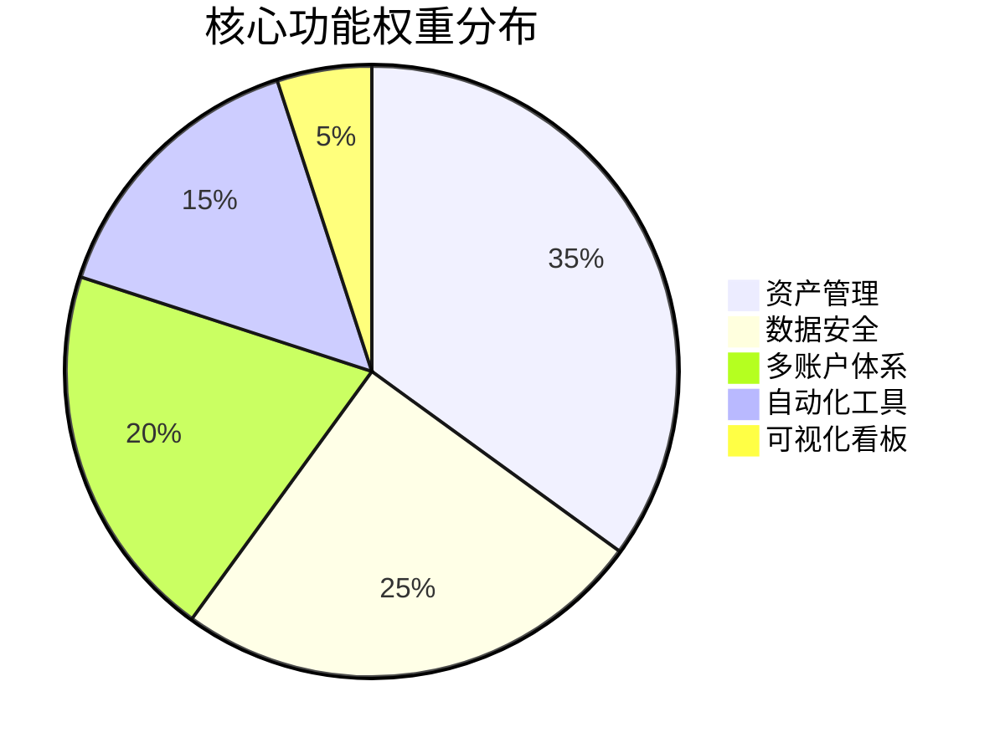
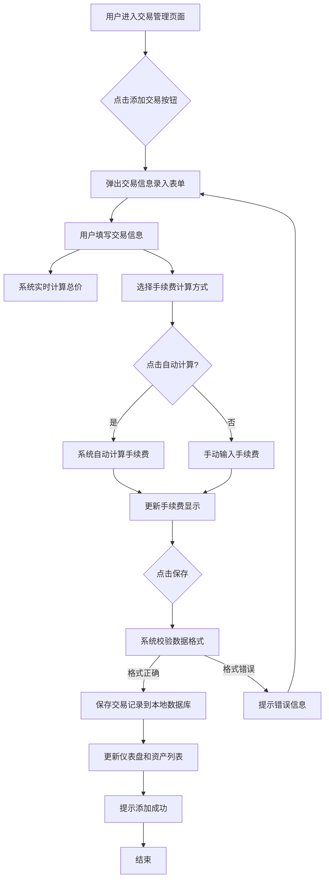
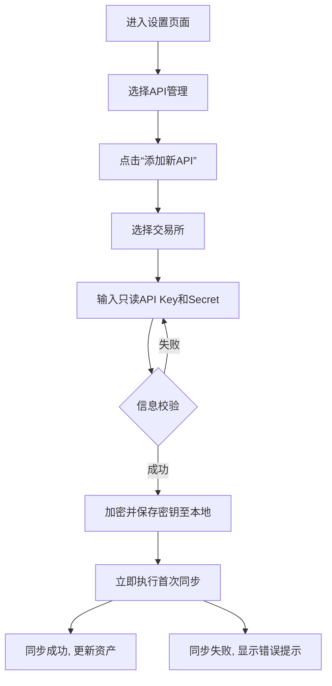
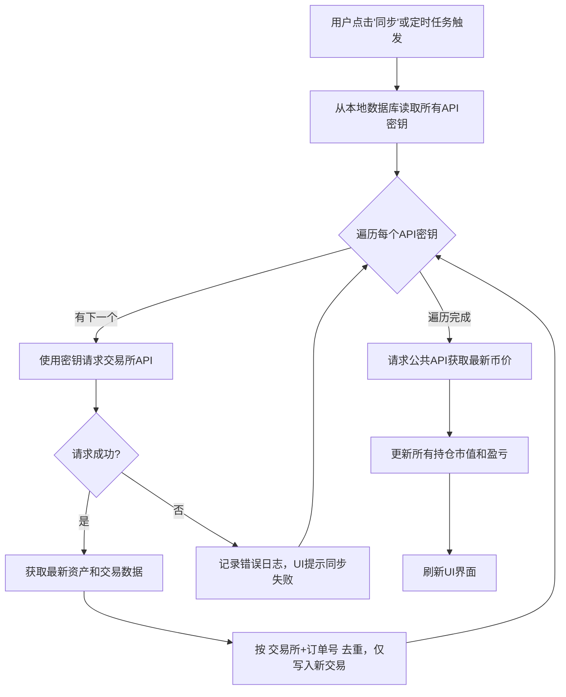
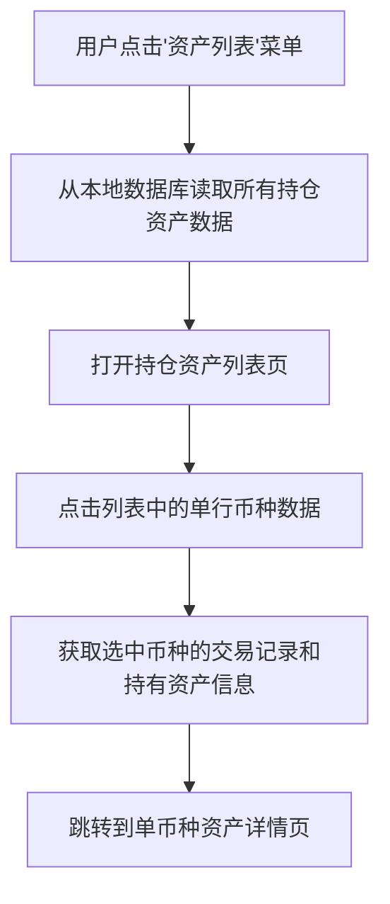

# WuZhuFolio 产品需求文档（移动端版本）  
**副标题：** V1.2 (MVP)  
**版本编号：** 2026-08-26-09  
**文档版本历史**  

| 文档版本 | 日期 | 修改人 | 状态 | 变更摘要 |
| --- | --- | --- | --- | --- |
| V1.0 | 2025-11-24 | 产品部 | 草稿 | 初始版本创建，定义了MVP版本的产品愿景、目标、核心功能范围与需求，针对Android移动应用优化 |
| V1.1 | 2026-08-25 | 产品部 | 草稿 | 按《移动端PRD评审报告》自动完成19项修订并同步桌面端V1.2跨端决策：①ROI改为总收益口径（总收益/累计增资）；②现金余额改为单一持仓账本口径（增资/撤资支持任意币种、交易联动计价币种持仓、稳定币白名单、基础法币、行情API多法币报价）；③24小时盈亏改为固定数量回算法并新增价格快照表；④密钥架构改为分层密钥+严格模式（DEK/KEK/Argon2id/AES-GCM，Keystore保管会话令牌，切换账户需密码）；⑤生物识别仅限会话解锁、添加API密钥改密码确认；⑥删除左右滑切账户与双击刷新手势；⑦分页统一20条、前台刷新1/5/30分钟+后台WorkManager≥30分钟、最低版本统一Android 10+；⑧备份格式改为AES-256-GCM（文件头含版本/账户标识/KDF参数）且语义为当前账户；⑨转账删除TRANSFER枚举、外部转入转出走增资/撤资；⑩删除编辑资产分类/Widget/语音输入朗读/分步输入等未定义功能并列入Out of Scope；⑪新增信息架构节（5 Tab+FAB）；⑫权限改为SAF模型；⑬数据模型修复（flow_time拼写、SQLite类型、settings改key-value、新增fee_rules/price_snapshots表、exchange_order_id与base_amount字段）；⑭声明移动端与桌面端.cpro暂不兼容；⑮指标重定（WAU 15%、修正用户占比<10%、4-5星>80%+4项过程指标）；⑯优先级表对齐（ROI→P1）；⑰初始化向导增加API快速通道；⑱已实现盈亏纳入MVP；⑲忘记密码提示、改密连锁、时区UTC规则、日志脱敏、删除交易确认等细节统一；⑳项目名称由 CryptoFolio Pro 更名为 WuZhuFolio |
| V1.2 | 2026-08-26 | 产品部 | 草稿 | 按《移动端对齐评审报告》同步桌面端 V1.3–V1.9 全部跨端决策并引用《跨端共享规范》V1.0：①顶部声明两端共同引用共享规范，跨端规则不再重复；②法币方案 D6（法币退出账本、仅作计价单位，增资/撤资限稳定币与加密货币）；③币种标识 D7（新增 coins/exchange_coin_map 表、coin_id 取代 symbol 主键、四级消歧、映射冻结、price_source）；④行情规则 T2（CoinGecko 主源 + CMC 兜底 + 两级 Key 模式、刷新 5/15/30 分钟移除 1 分钟档、快照永久保存降采样、额度治理/429 退避、新增行情三设置项）；⑤持仓校准 T1 方案甲（单一数据来源 + 锚点参与重放 + 差额视同系统资金操作，新增 reconciliation_records 表）；⑥备份/加密 N3+T5–T7（.cpro 明文头部 + AES-256-GCM 载荷、不含账户信息、备份文件密码、增量合并/全量覆盖、跨账户恢复、整库加密 + 凭证字段级 DEK、accounts 补 kdf_salt/kdf_params/wrapped_dek、api_keys 补 passphrase/extra），删除“跨端 .cpro 不兼容”声明；⑦成功指标注明外部度量方式（无遥测）；⑧24h 部分缺价聚合口径 + 无障碍基线（+/- 符号、色盲配色、TalkBack）；⑨交易所清单收敛 Binance；⑩残留清理（移除“或兑换”、BUSD 白名单、补默认精度/用户名枚举/备份提醒设置项）；⑪打磨包（备份提醒、日志轮转、剪贴板提示、精度自适应、明文 CSV 导出、诊断报告规范）。评审联动：移动端对齐评审报告 5 🔴 + 5 🟡/🟢 全部核销 |

---

> **跨端一致性声明**：本文档与《桌面端prd.md》V1.9 共同引用《跨端共享规范》V1.0（docs/prd/跨端共享规范.md）。跨端规则——名词表、成本计算规范、法币角色与归一化规则、时间与时区规则、行情数据与时间分辨率规则、币种标识与主数据规则、密钥架构、.cpro 备份格式——**以共享规范为准，本文档仅保留移动端专属内容与引用**；两者冲突时以共享规范为准。

---

## 全局说明

### 名词解释

> 以下跨端术语与《跨端共享规范》§1 保持一致，冲突时以共享规范为准；完整定义以共享规范为准，此处仅列移动端相关要点与移动端专属术语。

**API 密钥 (API Key)**: 应用程序接口密钥，本文档中特指交易所提供的，允许第三方应用读取用户账户信息（如资产、交易历史）的凭证。本产品只使用"只读"权限的API密钥。

**交易数据同步 (Trade Data Sync)**: 通过交易所只读 API（如 Binance）拉取新的成交记录写入本地账本的过程；使用用户自己添加的交易所 API 密钥，与行情数据无关。

**行情数据刷新 (Market Data Refresh)**: 通过行情平台 API（主源 CoinGecko，兜底 CoinMarketCap）获取当前价格、写入价格快照并更新界面估值的过程；CoinGecko 默认无 Key 公共 API、配置个人 Key 后切换专属额度，CoinMarketCap 兜底需配置个人 Key；与交易数据同步相互独立。

**待定价 (Pending Pricing)**: 离线保存含价格折算的记录时，折算价格暂缺的状态标记；暂按最近可得价格估算并标注“估算中”，联网后自动回填真实价格并重算。

**数据本地化**: 指所有用户数据，包括交易记录和API密钥，都存储在用户自己的手机设备上，而不上传到任何云端服务器。

**投资组合 (Portfolio)**: 用户持有的所有加密货币资产的集合。

**盈亏 (P&L)**: Profit and Loss，指资产的盈利和亏损情况。

**浮动盈亏 (Unrealized P&L)**: 指当前持仓资产的市值与持仓成本之间的差额，表示如果立即卖出可能获得的利润或亏损。

**持仓成本 (Cost Basis)**: 建仓买入资产所花费的总成本（含手续费折算）。MVP 采用平均成本法，详细规则见全局说明“成本计算规范”。

**资产净值**: 用户全部币种持仓按现价折算基础法币后的总价值。

**账户 (Account)**: 指用户在本产品中创建的唯一身份标识，通过用户名（或邮箱）和密码进行保护。用于隔离不同用户的数据，用户需要登录特定账户才能访问其数据。每个账户拥有独立的投资组合数据、API密钥和设置。

**资金操作 (Fund Movement)**: 指投资者向投资组合转入资产（增资）或转出资产（撤资）的行为，币种限稳定币或其他加密货币（法币不入账本，仅作计价单位）。此类操作不产生盈亏，但会改变对应币种持仓数量与总投资基数。

**可用现金余额 (Available Cash Balance)**: 账户内现金类币种（稳定币白名单）持仓按当前价折算基础法币后的合计，为派生展示值（不单独记账），便于快速查看可随时用于交易或提现的部分。

**增资 (Deposit)**: 用户向投资组合转入资产的行为（稳定币或其他加密货币均可，如转入 BTC、USDT；法币不入账本，法币入金请记录兑换后实际到账的稳定币数量），按转入时市价计入持仓成本与投入本金，不产生盈亏。

**撤资 (Withdrawal)**: 用户从投资组合转出资产的行为（任意加密货币或稳定币），按持仓平均成本移出对应数量，不产生盈亏；对应资产持仓不足时阻止保存。

**投入本金 (Invested Capital)**: 用户通过增资投入的总资金，减去撤资总额（即累计净投入），作为总览展示指标；不直接作为 ROI 计算的分母。

**ROI (Return on Investment)**: 投资回报率，计算公式为 `总收益 / 累计增资 * 100%`，其中 `总收益 = 当前资产净值 + 累计撤资 - 累计增资`。当累计增资为 0 时，ROI 显示为“--”并提示用户先记录增资。本口径为简化资金加权口径，不含时间加权调整（MVP 局限）。

**累计增资 (Total Deposits)**: 账户内所有增资记录金额之和（撤资不抵扣），作为 ROI 计算的分母。

**总收益 (Total Return)**: 当前资产净值 + 累计撤资 - 累计增资，正值表示盈利、负值表示亏损。示例：增资 100、盈利后撤资 150、当前资产净值 0，则总收益 = 0 + 150 - 100 = 50。

**基础法币 (Base Fiat Currency)**: 账户计价与增资/撤资折算的基准币种（默认 USD），在设置中可切换；仅作为计价单位使用，法币本身不作为账本资产入账（见《跨端共享规范》§3）。

**稳定币白名单 (Stablecoin Whitelist)**: 用于判定“现金类币种”，默认包含 USDT、USDC、DAI、TUSD，可在设置中扩展。

**24小时盈亏 (24h P&L)**: 按固定数量回算法计算的最近 24 小时盈亏：Σ(当前持仓数量 × 当前价) − Σ(当前持仓数量 × 24小时前价格)，仅反映价格变动，不含资金操作与交易影响；无24小时前价格时显示“--”。整体口径：部分币种缺失 24 小时前价格时，剔除缺失币种计算并标注“覆盖 N/M 个币种”；全部缺失时显示“--”。

**会话令牌 (Session Token)**: 登录成功后生成的临时凭证，存入 Android Keystore 用于生物识别/记住我快速解锁；不含密码，登出即清除。

**持仓校准 (Position Reconciliation)**: 用户在币种资产详情页手动触发的操作，用交易所 API 返回的余额修正本地持仓数量。仅限单一数据来源的币种（全部记录来自同一交易所 API 同步）；校准记录按锚点语义参与全量重放，差额视同系统生成的资金操作（正差额=增资语义、负差额=撤资语义），规则详见《跨端共享规范》§2。

**已实现盈亏 (Realized P&L)**: 卖出交易实现的盈亏：卖出净收入（总价 − 折算手续费）− 卖出数量 × 卖出时平均成本；逐笔计算，并在卖出记录行、币种详情与仪表盘累计展示。

**生物识别:** 指纹或面部识别，仅用于快速解锁应用会话；不能替代账户密码（敏感操作仍需密码验证）。

**手势操作**：指通过滑动、长按等触控动作完成交互（如下拉刷新价格、侧滑删除/编辑）。


**后台同步**：应用在后台（非前台运行时）定期同步价格和交易数据，需遵循安卓系统后台任务限制。

**移动端优化**: 指针对手机屏幕尺寸、触摸交互和移动网络环境进行的界面和功能设计优化。

**Material Design**:​ Google推出的设计语言，为Android应用提供视觉、运动、交互设计指导。

**Bottom Navigation Bar (底部导航栏)**: Android应用常见的导航模式，提供3-5个主要功能的快速切换。

**Floating Action Button (FAB, 悬浮动作按钮)**: 用于触发主要或常用操作的可视化按钮。
### **统一异常处理**
    
**网络异常:** 无法连接行情API或交易所时，顶部状态栏显示红色提示条"网络异常，数据可能延迟"，保留上次成功数据，点击可手动刷新。同步失败需显示具体原因（如"Binance API密钥失效"、"CoinGecko 额度已达本月上限，已自动降频"、"CoinGecko 共享限流触发，已自动退避；建议注册免费个人 Key 获取专属额度"）。
        
**后台服务异常:** 本地数据库损坏时，弹出模态框提示"数据异常，请从备份恢复或重置应用"，并跳转至备份恢复页面。
        
**账户操作异常**: 登录失败提示"用户名或密码错误"（不暴露用户是否存在）；密码修改失败提示"原密码不正确"。
        
**数据校验异常**: 表单输入错误时，字段下方红色文字即时提示，阻止提交。
        
**权限异常**: 网络权限被拒时，引导用户至系统设置页面开启权限并说明原因（数据备份与 CSV 导入经 SAF 完成，无需存储权限）。
        
**列表默认数据规则**
- **排序:** 资产列表默认按市值降序；交易记录与资金流水按时间倒序（最新在前）。
-  **缺省值:** 空列表显示占位图+"暂无记录"；无数据字段显示"--"。
- **数据精度:** 价格显示8位小数，市值/盈亏显示2位小数，百分比保留2位小数。支持在设置中调整。微小价格币种（单价有效数字不足 8 位）自动增加有效数字位显示，避免显示为 0。
- **加载:** 列表支持下拉刷新与上滑分页加载（每页20条）。
- **滑动交互**：列表支持侧滑操作（如交易记录侧滑删除 / 编辑）。
- **数据加载**：默认采用 “下拉刷新 + 上拉加载更多” 替代滚动加载，符合移动端用户习惯。

**成本计算规范（平均成本法）**
> 完整规则见《跨端共享规范》§2，含：平均成本合并计算、买入/增资/卖出/撤资成本规则、已实现盈亏公式、全量重放、**重放校验规则**（负持仓阻止）、**导入路径例外**（CSV/API 不做余额校验、负持仓标记“持仓异常”）、**持仓校准规则**（单一来源限定 + 锚点参与重放 + 差额视同系统资金操作）、折算价格解析（快照 → API 回填 → 待定价）。移动端不重复展开，以共享规范为准。

**法币角色与归一化规则**
> 见《跨端共享规范》§3：法币仅作计价单位不入账本；增资/撤资限稳定币或加密货币；法币计价交易对按 1:1 映射为同币种稳定币（USD→USDT、EUR→EURC）；手续费币种为法币时按同一映射处理。

**币种标识与主数据规则**
> 见《跨端共享规范》§6：内部唯一标识用 CoinGecko id；coins 目录每日刷新（全局公共数据）；exchange_coin_map 映射；四级消歧规则；映射冻结原则（保存时写入 coin_id，不回溯改写）；输入归一化；交易所专有资产与“无行情”处理。

**行情数据与时间分辨率规则**
> 见《跨端共享规范》§5：CoinGecko 主源（无 Key 公共 API 默认 + 个人 Key 专属额度两级模式）+ CoinMarketCap 兜底（需个人 Key）；额度治理与 429 退避；24h 同源原则；时间分辨率边界（近 90 天小时级、更早日级）；“记录时行情价”一律取自行情 API；离线待定价；历史回填按需触发。移动端后台同步由 WorkManager 调度，降频语义对齐即可。

**密码与数据恢复策略**
- 忘记密码无法找回：本产品本地加密、不上传不存储密码，忘记密码即无法解密数据。
- 创建账户时必须告知上述风险并要求用户确认。
- 修改密码 = 用新密码重新包裹账户密钥（数据不整体重加密），需验证原密码；不影响其他账户。
- 备份文件使用导出时设置的**备份文件密码**加密（默认填当前账户密码，可修改），恢复时输入该文件密码；与当前账户密码是否变更无关。备份文件密码须满足与账户密码相同的最低强度要求。
- 密钥架构、整库加密与凭证字段级加密、.cpro 备份格式与合并/恢复语义详见《跨端共享规范》§7/§8。

**时间与时区规则**
- 所有时间戳（交易时间、资金流水时间、快照时间等）统一以 UTC 存储。
- 界面显示统一转换为设备本地时区；日期时间格式随 I18N 语言设置。
- 交易所 CSV 导入（如 Binance）按 UTC 解析；手动录入按本地时区输入，保存时转换为 UTC。

**移动端适配**
- 本产品主要兼容Android平台，支持版本为Android 10及以上的设备。
- **网络异常**：除状态栏提示外，支持 “仅 WiFi 同步”“仅数据同步” 选项，避免流量消耗。
- **权限异常**：网络权限被拒时弹窗引导用户开启并说明原因。数据备份与 CSV 导入经系统文件选择器（SAF）完成，无需申请存储权限；备份文件默认写入应用私有目录或用户选择的目录。
- **屏幕适配**：支持主流安卓屏幕尺寸（4.7-6.7 英寸），关键数据在小屏设备上优先展示，次要信息可折叠。

## 1. 引言与产品愿景

### 产品简介
WuZhuFolio 是一款以隐私和安全为核心、数据完全本地化的移动应用程序，旨在帮助加密货币投资者在移动设备上清晰地跟踪和分析其分散在多个平台的资产。它支持多账户管理，并提供精确的资金流动记录和投资回报率计算。本产品不包含任何遥测、统计上报或第三方分析 SDK，所有网络请求仅用于行情数据与交易所 API。

### 产品愿景
我们致力于成为注重数据主权和隐私保护的加密货币投资者的首选移动投资组合管理工具，让每一位用户都能在完全掌控自己数据的前提下，通过多账户管理和精细化资金追踪，做出更明智的投资决策。

### 产品定位
本产品定位于为注重隐私安全的加密货币投资者提供一款数据完全本地化的移动投资组合管理工具。与市场上现有的在线工具不同，本产品不依赖云端服务器，所有用户数据（包括交易记录、API密钥）均存储在用户本地设备上，确保用户数据的绝对安全与隐私。

### 产品价值主张
- **数据主权保障**：所有数据100%本地存储，绝不上传至任何服务器
- **多平台资产整合**：统一管理分散在多个交易所和钱包的资产
- **精细化资金追踪**：清晰记录资金流入流出，准确计算投资回报率
- **多账户隔离管理**：支持在同一设备管理不同投资策略或家庭成员的独立账户
- **自动化数据同步**：通过API自动获取最新资产与交易数据，减少手动录入
- **隐私优先设计**：仅需"只读"API权限，最大限度降低安全风险
- **移动端优化体验**：简洁、直观的触摸界面，适应移动使用场景
- **智能后台同步**: WorkManager定时同步，省电且及时。

---

## 2. 问题陈述

当前加密货币投资者在管理其资产时面临诸多挑战，这些痛点构成了我们产品的核心价值主张：

- **资产分散**：用户的加密资产往往分布在多个交易所和钱包中，导致无法快速、准确地获得统一、实时的资产全局视图。
- **隐私担忧**：现有移动应用普遍要求用户上传API密钥或交易数据到云端服务器，使用户核心财务数据面临潜在风险。
- **移动网络限制**：移动网络连接不稳定，导致无法获取实时资产价格和同步交易。
- **操作繁琐**：在移动设备上手动输入交易信息效率低下，且容易出错。
- **多用户/多策略管理不便**：缺少账户概念导致数据混乱，难以在手机上管理多个投资组合。
- **资金流动记录缺失**：现有应用难以清晰记录和分析投资者向投资组合注资或撤资的历史。

---

## 3. 目标用户与画像

### 核心用户画像 (Persona)

**姓名**：Alex  
**身份**：一位有2-5年经验的加密货币投资者，同时也是一名技术爱好者或软件工程师。  
**行为与特点**：
- 资产分布在2-3个主流中心化交易所，并可能有一些资产在硬件钱包中。
- 高度重视个人数据隐私和资产安全，对将敏感财务数据上传到第三方云服务持怀疑态度。
- 熟悉API密钥的基本概念，并知道如何为应用程序创建只读权限的密钥。
- 追求效率，希望有一个自动化的工具来替代手动维护的电子表格。
- 希望能够在移动设备上随时查看投资组合，快速了解资产状况。
- 需要能够方便地在手机上记录增资/撤资操作。
- 需要在移动网络环境下也能流畅使用应用。

### 用户需求优先级

| 需求类别 | 具体需求 | 优先级 | 验证方式 |
| --- | --- | --- | --- |
| 基础需求 | 资产统一视图 | P0 | 用户访谈 |
| | 实时价格更新 | P0 | 用户访谈 |
| | 数据本地化存储 | P0 | 用户调研 |
| | 优化移动网络体验 | P0 | 用户调研 |
| 期望需求 | 多账户隔离管理 | P1 | 用户调研 |
| | 资金流动记录 | P1 | 用户调研 |
| | API自动同步 | P1 | 用户调研 |
| | ROI精确计算 | P1 | 用户访谈 |
| 兴奋需求 | 手续费自动计算 | P2 | 用户调研 |

> 说明：优化移动网络体验（P0）对应故事 4.2；ROI 精确计算（P1）对应故事 6.4 与第 7 章第 8 节。
---

## 4. 产品目标与成功指标

### 用户目标
让用户能够安全、私密、便捷地管理多个独立的投资账户，并在移动设备上清晰了解自己每个投资组合的真实表现、历史盈亏、总投入成本和真实投资回报率（ROI）。

### 业务目标
打造一款在注重隐私的加密投资者细分市场中具有良好口碑和高用户粘性的移动应用产品，并在未来探索基于高级功能或专业服务的付费模式。

### 成功指标 (Metrics) for MVP

> **度量方式（零遥测）**：本应用不内置任何遥测、统计上报或第三方分析 SDK（见硬约束）。下表中所有指标均通过**应用商店公开下载量、公开社区评价、内测阶段人工统计与客服/工单记录**获取，**不埋点、不上报使用数据**。

| 指标 | 目标 | 说明 |
| --- | --- | --- |
| 用户激活率 | >60% | 新用户在首次启动应用的24小时内，成功添加第一笔交易或关联第一个交易所API的比例 |
| 周/月留存率 | WAU > 15%, MAU > 40%（WAU/MAU ≈ 40%，符合移动工具型产品使用节奏） | 产品发布后，每周/每月至少打开一次应用的活跃用户比例 |
| 核心功能使用率 | API自动同步 >50% | 衡量高级功能的吸引力 |
| | 资金操作记录 >40% | 至少记录一次增资/撤资 |
| | 多账户管理 >20% | 创建并使用2个以上账户 |
| 用户满意度 | 4-5星占比 >80% | 以应用内嵌的5星评分为准；公开社区评价仅作参考，不计入指标 |
| 数据准确性 | 修正用户占比 <10% | 分母=当月活跃用户数，分子=当月至少一次编辑或删除交易/资金记录的用户数 |
| 过程指标 | CSV导入成功率 ≥90% | 成功导入文件数 / 尝试导入文件数 |
| | API首次连通率 ≥80% | 首次测试请求即成功的密钥占比 |
| | 后台同步成功率 ≥90% | WorkManager 同步任务成功占比 |
| | 冷启动达标率 ≥95% | 冷启动 ≤2s 的启动次数占比 |

---

## 5. 功能范围与用户故事 (MVP v1.2)

### 史诗故事 1: 账户管理

**用户故事 1.1 (账户创建与登录)**  
*描述*: 作为一名新用户，我希望在首次启动应用时能够创建一个账户并设置密码，或者登录一个已有的账户，以便访问我的投资数据，并确保我的数据被隔离和保护。  
*验收标准*:
- 首次启动应用时，若无账户存在，应引导用户创建账户并设置密码（二次确认）。
- 若已有账户存在，应提供登录界面，用户需输入正确的用户名和密码才能进入应用。
- 密码应进行强度校验（如最小长度、包含数字/字母等）。
- 账户信息（密码哈希采用 Argon2id 哈希）加密后存储在本地。
- 提供"记住我"选项：勾选后，仅将会话令牌安全存入 Android Keystore，用于下次启动快速解锁（密码本身永不落盘）；不勾选则每次启动需重新输入密码。
- 创建账户时，界面必须明确提示“密码是数据的唯一钥匙，本产品不上传也不存储密码，忘记密码将无法恢复任何数据；请妥善保管密码并定期备份”，用户勾选“我已了解上述风险”后方可完成创建。
- 登录页提供“忘记密码”入口，点击后提示“本产品无法找回密码。若记得某次备份使用的密码，可通过该备份恢复数据；否则数据不可恢复。”

**用户故事 1.2 (生物识别解锁):**
    
*描述*: 用户启用指纹/面部识别，快速解锁应用，无需重复输入密码。
        
*验收标准:
 - 在设置中可开启生物识别，需先验证账户密码。
 - 下次打开应用时，优先提示生物识别，失败后可切换密码。
 - 生物识别仅用于解锁当前账户会话，不能替代账户密码；敏感操作（备份/恢复、修改密码、添加 API 密钥）仍需密码验证。
 - 生物识别连续失败 5 次后锁定生物识别，要求改用密码解锁；密码连续错误采用指数退避防护。

**用户故事 1.3 (账户登出)**  
*描述*: 作为一名用户，我希望能够安全地登出当前账户，以便在共享设备上保护我的数据。  
*验收标准*:
- 提供明确的"登出"入口（如在应用顶部导航栏或用户头像处）。
- 登出后，清除当前账户的会话信息与会话令牌（含 Keystore 中的令牌），返回到登录或账户选择界面。

**用户故事 1.4 (账户切换)**  
*描述*: 作为一名管理多个投资组合的用户，我希望能够在已登录的账户之间切换，且切换时需重新输入目标账户密码，以保证各账户数据在共享设备上的隔离安全。  
*验收标准*:
- 在主界面（如顶部导航栏）提供"切换账户"入口，提供账户列表。
- 用户选择列表中的账户后，必须输入该账户密码并验证通过，才能切换到该账户（严格模式：无密码无法解密）。
- 选择另一个账户后，应用应锁定当前账户数据，加载并解密新账户的数据。
- 切换过程应流畅，无需重启应用。
- 应有清晰的当前账户标识。

### 史诗故事 2: 投资组合初始化

**用户故事 2.1 (手动添加交易)**  
*描述*: 作为一名新用户，我希望能逐条手动添加我的买入/卖出交易记录（包括币种、数量、价格、日期），以便构建我的初始持仓。（外部资产转入/转出请使用“资金操作”中的增资/撤资记录，见史诗故事 6。）  
*验收标准*:
- 提供简洁的表单用于添加交易，适应移动屏幕尺寸。
- 表单字段包括：交易对（如 BTC/USDT）、交易类型（买入/卖出）、成交价格、成交数量、手续费（可选）、手续费币种（默认计价币种，可选基础币种或自定义）、交易日期与时间。
- 价格和数量字段只接受正数输入。
- 保存后，该条记录立即出现在交易历史列表中；保存时按统一规则联动持仓：买入扣减计价币种、增加基础币种，卖出相反；买入时计价币种持仓不足阻止保存并提示“XX 余额不足，请先记录转入（增资）”。

**用户故事 2.2 (手动添加初始增资)**  
*描述*: 作为一名新用户，我希望能够记录初始的资产转入（增资）操作（稳定币或其他加密货币，如转入 BTC、USDT；法币不入账本），以便构建我的起始持仓、资金记录和投入本金。  
*验收标准*:
- 提供"记录增资"功能，界面简洁，适应移动设备。
- 增资需输入币种（默认基础法币对应的稳定币，可选任意稳定币或加密货币）、数量（需为正数）、日期、来源（可选）和备注（可选）。
- 记录成功后，对应币种持仓数量增加（成本 = 转入时市价），并按记录时行情汇率折算基础法币金额计入“累计增资”与“投入本金”。

**用户故事 2.3 (CSV导入)**  
*描述*: 作为一名拥有大量历史记录的用户，我希望能从主流交易所（如Binance）导出的标准CSV文件批量导入我的历史交易记录，以便快速完成初始化，节省时间。  
*验收标准*:
- 提供CSV导入功能，界面简洁，适应移动屏幕。
- 软件提供一个标准的CSV模板文件供用户下载。
- 提供导入接口，通过系统文件选择器（SAF）选择 CSV 文件（支持下载目录与云端文件选择器）。
- 软件能智能解析文件内容（交易所 CSV 的日期时间按 UTC 解析），并向用户预览将要导入的数据。
- 导入过程中能识别并提示格式错误或重复的交易记录：有订单号的文件按“交易所 + 订单号”精确去重；无订单号的模板文件按“交易时间 + 交易对 + 类型 + 数量 + 价格”模糊匹配，疑似重复时提示用户逐条确认。
- 用户确认后，数据被成功批量导入，并正确更新持仓、投入本金和资金余额。

### 史诗故事 3: 日常投资组合跟踪

**用户故事 3.1 (仪表盘)**  
*描述*: 作为一名用户，我希望在打开软件时能立刻看到一个仪表盘，上面清晰地汇总了我的总资产净值、24小时盈亏变化（金额和百分比）以及一个显示各类资产占比的饼图。  
*验收标准*:
- 仪表盘是应用启动后的默认页面。
- 显著位置显示以基础法币（默认为USD）计价的总资产净值（全部币种持仓市值之和；其中现金类币种持仓合计即“可用现金余额”）。
- 总资产净值旁边，显示过去24小时的盈亏金额和百分比（精确到小数点后两位，**强制显示 +/- 符号**，颜色仅作辅助：默认“绿涨红跌”，可切换“红涨绿跌”或“色盲友好（蓝涨橙跌）”）。计算口径：24h盈亏 = Σ(当前持仓数量 × 当前价) − Σ(当前持仓数量 × 24小时前价格)；24h百分比 = 盈亏 ÷ Σ(当前持仓数量 × 24小时前价格)；无24小时前价格（新用户或新币种）时显示“--”；部分币种缺失 24 小时前价格时剔除缺失币种计算并标注“覆盖 N/M 个币种”。
- 显示当前账户的“投入本金（净）”、“总收益”、“累计已实现盈亏”和基于此计算的“总投资回报率 (ROI)”。
- 仪表盘包含一个交互式的饼图，直观展示不同加密货币在总资产中的市值占比。
- 饼图能将低于特定阈值的小额币种合计归为"其他"。

**用户故事 3.2 (实时价格同步)**  
*描述*: 作为一名用户，我希望应用能自动从公开、可靠的数据源获取我所持币种的实时价格，以便准确计算我的资产实时价值。  
*验收标准*:
- 行情数据源按《跨端共享规范》§5 两级模式：主源 CoinGecko（未配置 Key 默认无 Key 公共 API、配置个人 Key 后切换专属额度），兜底 CoinMarketCap（需个人 Key）；支持多法币报价（USD、EUR、CNY 等），作为持仓计价与增资/撤资折算的汇率来源。
- 价格数据能自动刷新，用户可在设置中调整刷新频率（前台 5/15/30 分钟，默认 5 分钟）；退到后台后由 WorkManager 按 ≥30 分钟间隔同步。
- 当公共行情API请求失败或网络断开时，价格数据旁或状态栏应有明显提示，并显示上一次成功获取的价格时间戳。
- 网络请求应自动使用系统代理（如果已配置）。
- 同步设置支持 “仅 WiFi”“仅充电时同步”“手动同步” 选项，减少非必要消耗。
- 每次成功获取价格后，将各币种按各法币计价的价格写入价格快照表（每币种每法币每小时最多一条，同一小时多次取价以该小时最后一条为准；快照永久保存并降采样——近 90 天小时级、更早日级，详见共享规范 §5），用于按固定数量回算法计算 24 小时盈亏。

**用户故事 3.3 (持仓详情)**  
*描述*: 作为一名用户，我希望能在一个专门的页面查看我的每一个持仓的详细信息，包括币种、持有数量、平均买入成本、当前市值和总的浮动盈亏。  
*验收标准*:
- 提供"持仓情况"页面，以列表形式展示所有持有的币种。
- 列表的每一行至少包含：币种名称、持有数量、平均持仓成本、当前价格、当前总市值、浮动盈亏（金额和百分比）、累计已实现盈亏。
- 列表支持按不同列进行排序。
- 适应移动屏幕，支持下拉刷新和上拉加载更多。

**用户故事 3.4 (单币种资产详情)**  
*描述*: 作为一名用户，我希望点击资产列表中的任一币种，能查看该币种的详细持有情况和所有相关的历史交易记录。  
*验收标准*:
- 点击资产列表中的币种后，跳转到该币种的详情页。
- 详情页顶部显示该币种的汇总信息：持有数量、当前持有价值、在总资产中的占比、平均成本价、总浮动盈亏（金额和百分比）、累计已实现盈亏。
- 详情页下方以列表形式展示该币种的所有交易记录。
- 交易记录列表支持按交易所、交易类型、时间进行筛选和搜索。
- 适应移动屏幕，支持下拉刷新和上拉加载更多。

### 史诗故事 4: 网络与自动化功能

**用户故事 4.1 (API 同步)**  
*描述*: 作为一名注重效率的用户，我希望能添加交易所的只读API密钥，让应用自动同步我的最新资产和交易，避免手动录入。  
*验收标准*:
- 在设置中提供添加API密钥的入口。
- 明确提示用户必须使用"只读"权限的密钥，并提供相关交易所的创建教程链接。
- API密钥在本地被高强度加密存储。
- 添加成功后，应用能定期自动从交易所同步资产余额和新的交易记录。同步采用增量策略：仅按“交易所 + 订单号”去重后导入本地不存在的新交易，不自动覆盖本地持仓余额。
- 用户可在币种资产详情页手动触发“以交易所余额校准持仓”，规则见《跨端共享规范》§2 持仓校准规则：仅限单一数据来源币种（全部记录来自同一交易所 API 同步，多来源时隐藏入口并提示）；校准记录按锚点语义参与全量重放；差额视同系统生成的资金操作（正差额=增资、负差额=撤资，均不产生盈亏）。
- 文档需明确：Binance 等交易所的 API 仅返回最近 500 条成交记录，更早的历史交易必须通过 CSV 导入补录。
- 提供手动同步按钮，用户可以随时触发同步。
- 同步设置支持 “仅 WiFi”“仅充电时同步”“手动同步” 选项，减少非必要消耗。

**用户故事 4.2 (系统代理)**  
*描述*: 作为一名在特殊网络环境下的用户，我希望应用能够自动识别并使用我设备的系统代理设置来连接互联网，而无需在应用里进行复杂的单独网络配置。  
*验收标准*:
- 应用启动时会自动检测设备的代理设置。
- 所有对外网络请求（行情、交易所API）都必须通过检测到的代理进行。
- 界面状态栏需有图标或文字，清晰地指示当前网络是通过代理连接的。

### 史诗故事 5: 数据安全与管理

**用户故事 5.1 (本地加密存储)**  
*描述*: 作为一名注重安全的用户，我希望我的所有数据（特别是交易记录、资金流动记录和API密钥）都经过强加密后，存储在我自己的手机设备上，确保即使设备丢失，数据也无法被轻易破解。  
*验收标准*:
- 存储与加密选型见《跨端共享规范》§7：SQLite 单库多账户 + 整库加密（数据库密钥随机生成、由 Android Keystore 保护）；凭证字段（api_keys 的 api_key/secret_key/passphrase/extra）额外按账户 DEK 字段级加密；全局公共表（coins、exchange_coin_map、price_snapshots）受整库加密保护、不按账户 DEK 字段级加密。
- 采用分层密钥架构：每个账户使用独立随机数据密钥（DEK，AES-256-GCM）加密凭证字段；DEK 由账户密钥（KEK）包裹后存储，KEK 由账户密码经 KDF（Argon2id 或 PBKDF2 ≥600,000 次迭代）派生，确保无密码无法解密。
- 数据防篡改采用认证加密（GCM）或 HMAC，而非普通校验和。
- 会话令牌存入 Android Keystore（受设备安全芯片保护）；密码本身与登录凭据一律不落盘。
- 切换账户必须重新输入目标账户密码；登出即清除会话令牌。
- 应用被卸载后私有目录数据将被系统删除，如需保留请先备份。

**用户故事 5.2 (数据备份恢复)**  
*描述*: 作为一名用户，我希望能一键将我的所有数据备份成一个加密的本地文件，并能在新设备上或重装应用后，通过这个文件方便地恢复我的全部数据。  
*验收标准*:
- 提供"备份数据"功能，能将当前账户的所有业务数据（交易、资金流水、校准记录、手续费规则、API 密钥、设置及本账户涉及的价格快照）打包为`.cpro`格式的单一文件；格式见《跨端共享规范》§8（明文头部 + AES-256-GCM 加密 JSON 载荷，不含账户信息），与桌面端兼容。
- 备份文件使用导出时设置的**备份文件密码**加密（默认填当前账户密码，可修改，须满足最低强度要求）；用户可选择保存路径（如内部存储、SD卡）。
- 提供"恢复数据"功能，允许用户选择`.cpro`备份文件；显示明文头部摘要后输入备份文件密码验证（与当前账户密码是否变更无关，支持新设备/跨账户恢复；全新安装无账户时先创建或选定目标账户再导入）。
- 恢复方式分两种：**增量合并**（默认，按共享规范 §8 去重键幂等合并）与**全量覆盖**（二次确认，覆盖前自动生成临时备份；仅覆盖账户级业务数据，全局公共表不清空）。
- 恢复成功后，应用应重新加载数据并触发全量重放重算。

### 史诗故事 6: 资金管理

**用户故事 6.1 (增资记录)**  
*描述*: 作为一名用户，当我向我的投资组合转入资产时（稳定币或其他加密货币入金，如 USDT、BTC；法币不入账本），我希望能在应用中记录这笔"增资"操作，以便准确追踪我的总投入成本。  
*验收标准*:
- 提供一个"资金操作"页面，界面简洁，适合移动设备。
- 提供记录增资的功能，需要输入币种（任意稳定币或加密货币，默认基础法币对应稳定币）、数量、日期、来源（可选）和备注（可选）。
- 增资记录应单独列表展示。
- 增资会增加"累计增资"与"投入本金"的统计值（按折算基础法币金额）。
- 记录成功后，对应币种持仓数量增加（成本 = 转入时市价）；现金类币种同时反映在"可用现金余额"中。

**用户故事 6.2 (撤资记录)**  
*描述*: 作为一名用户，当我从我的投资组合中转出资产时（任意加密货币或稳定币，如转出 BTC 或 USDT；法币不入账本），我希望能在应用中记录这笔"撤资"操作，以便准确追踪我的总投入成本。  
*验收标准*:
- 在同一"资金操作"页面提供记录撤资的功能。
- 需要输入币种（任意加密货币或稳定币）、数量、日期、去向（可选）和备注（可选）。
- 撤资记录应单独列表展示。
- 撤资会减少"投入本金"的统计值（按折算基础法币金额）。
- 记录成功后，对应币种持仓数量减少（按平均成本移出）；持仓数量不足时阻止保存并提示。
- 现金类币种撤资同时反映在"可用现金余额"中。

**用户故事 6.3 (查看资金历史)**  
*描述*: 作为一名用户，我希望在一个列表中查看所有历史资金操作记录（增资和撤资），以便审计和分析我的资金流向。  
*验收标准*:
- 在"资金操作"页面显示所有资金操作记录列表。
- 列表按时间倒序排列。
- 列表字段包括：操作类型、币种、数量、折算基础法币金额、日期时间、来源/去向、备注。
- 资金记录支持编辑与删除：删除需二次确认，并提示将重算投入本金与 ROI；新增、编辑、删除后均触发持仓与指标的全量重放重算。
- 适应移动屏幕，支持下拉刷新和上拉加载更多。

**用户故事 6.4 (投资回报率计算与展示)**  
*描述*: 作为一名用户，我希望在仪表盘和资产列表中能看到基于累计增资计算的总收益和投资回报率（ROI），以便更全面地评估我的投资表现。  
*验收标准*:
- 总收益 = 当前资产净值 + 累计撤资 - 累计增资；ROI = 总收益 / 累计增资 * 100%。
- 累计增资为 0 时，总收益与 ROI 显示为“--”，并提示用户先记录增资。
- 在仪表盘总览卡片和资产列表页面顶部的总览区域，显示投入本金（净）、总收益和基于此计算的ROI。
- ROI数值应清晰展示，正数为绿色，负数为红色（颜色方案可在设置中切换）。
- ROI 计算应考虑所有增资和撤资操作（撤资计入总收益，不抵扣累计增资分母）。

### 史诗故事 7: 交易管理

**用户故事 7.1 (交易手续费与总价自动计算)**  
*描述*: 作为一名用户，在手动添加交易时，我希望系统能根据我输入的价格和数量，自动计算出交易的总价，并根据我选择的手续费币种和交易所预设的费率，自动计算或建议手续费，以减少手动计算错误。  
*验收标准*:
- 在"设置"中新增"手续费设置"。
- 允许用户为不同的交易所（或全局）预设一个默认的手续费费率（百分比），可区分买入/卖出。
- 在"添加/编辑交易"页面，输入价格和数量后，系统自动计算并显示"总价"。
- 提供"自动计算手续费"按钮，点击后系统根据当前交易的交易所、交易对和币种，查找并应用最匹配的预设费率进行计算。
- 手续费和总价的计算应实时更新。
- 适应移动屏幕，输入字段简洁。

**用户故事 7.2 (手续费设置)**  
*描述*: 作为一名用户，我希望能够设置不同交易所或交易对的默认手续费率，以便在自动计算手续费时使用更准确的数值。  
*验收标准*:
- 在设置页面增加"手续费设置"或类似选项。
- 允许用户添加、编辑、删除"交易所特定手续费率"规则（例如：Binance 买入 0.1%, 卖出 0.1%）。
- 允许用户添加、编辑、删除"交易对特定手续费率"规则（优先级最高，例如：Binance BTC/USDT 买入 0.075%）。
- 允许用户设置一个"全局默认手续费率"（买入、卖出分别设置）。
- 在"添加/编辑交易"页面，自动计算手续费时优先使用匹配度最高的预设费率。

---

## 6. 设计与用户体验原则

### 数据优先与清晰呈现
- 界面设计应以清晰、准确、高效地展示数据为第一要务。
- 关键数据（如总资产、盈亏、ROI）应在显眼位置，且易于理解。
- 采用简洁的卡片式设计，减少视觉干扰。

### 简洁直观与易用性
- 整体交互流程应简单明了，用户无需阅读冗长的教程即可完成核心操作。
- 减少不必要的干扰，让用户能快速找到核心功能和信息。
- 操作路径不超过两层，确保移动设备上的易用性。
- 优化触摸区域，确保按钮大小适合手指点击。
- 遵循Material 3设计规范，确保在移动设备上的触摸友好性。信息架构扁平，主要功能通过底部导航栏（Bottom Navigation）即可访问，核心操作步骤不超过3步。
- 合理运用常见手势（如下拉刷新、左滑删除、长按编辑）提升操作效率。动画和过渡效果流畅自然，提供即时反馈。
- 减少弹窗使用，采用底部抽屉（如添加交易表单）和 toast 提示（如 “保存成功”），提升流畅度。
- 默认显示关键数据（总资产、TOP 币种），次要信息（历史交易、详细设置）通过点击展开，避免界面拥挤。

### 安全感与信任建立
- 登录页与设置页高亮"数据仅存储于本机"文案；使用Material Design锁形图标强化安全认知。
- 在API密钥输入等敏感操作区域提供清晰的安全提示。
- 通过视觉设计（如锁形图标、加密提示）建立用户信任。

### **离线优先与数据韧性**
- 网络断开时展示上次缓存数据，所有写操作本地排队，恢复网络后自动重试。
 
### 主题定制与个性化
- 提供明亮（Light）和黑暗（Dark）两种主题模式，以适应不同用户的工作环境和视觉偏好。
- 在设置中一键切换，支持系统主题自动切换。

### 响应时间与流畅体验
- 核心数据（如仪表盘、持仓列表）的加载和刷新时间应在2秒以内。
- 价格更新、API同步等后台任务应在不影响前台UI流畅性的情况下异步执行。
- 提供明确的加载状态提示，避免用户等待时的困惑。

### 无障碍基线
- 所有盈亏数值强制显示 +/- 符号，颜色仅作辅助（避免红绿双色为唯一语义载体）。
- 提供色盲友好配色（蓝涨橙跌）选项。
- 关键控件与表单字段提供 TalkBack 语义标签与焦点顺序，读屏可完整朗读核心数据；对比度满足 WCAG AA。

### 日志管理与可追溯性
- 应用应在本地记录关键操作日志和错误日志。
- 提供一个用户可访问的日志文件，当用户遇到问题时，可以方便地导出日志以协助排查问题。
- 日志应包含时间戳、操作类型、结果等信息。
- 日志中禁止出现 API 密钥明文、密码、密钥哈希及完整 API 响应体；敏感字段一律脱敏。
- 本地日志与 sync_logs 采用轮转策略（各上限 1 万条 / 保留 90 天）；诊断报告复用日志脱敏规则并列举字段（版本号、OS 版本、账户数、数据范围、错误码），不含任何密钥/密码。

### 账户清晰性与隔离
- 界面必须清晰地展示当前登录的账户名称。
- 提供便捷的账户切换入口（如顶部导航栏的账户头像）。
- 用户应能随时知道当前操作的是哪个账户的数据。
- 不同账户间的数据必须完全隔离，切换账户时用户体验清晰无干扰。

### 资金透明与可审计性
- 清晰展示资金流动对投资组合的影响，帮助用户理解总投入与当前市值的关系。
- 所有资金操作记录应可查、可追溯，确保数据的可审计性。
- 采用简洁的列表展示资金操作，支持筛选和搜索。

### 国际化 (I18N)
- 支持多语言（初期支持英文、中文）。
- 支持多法币单位显示（USD、EUR、CNY等）。
- 日期、时间格式应适配用户所在地区的习惯。

---

## 7. 功能需求

### 7.1 功能全景图



### 7.2 核心功能模块及详细需求

#### 1. 仪表盘 (Dashboard)
- **总览卡片**: 显示总资产净值（以基础法币计价，= 全部币种持仓市值之和）、24小时盈亏（金额与百分比，按固定数量回算法计算）、投入本金（净）、总收益、累计已实现盈亏和投资回报率 (ROI)。
- **资产分布图**: 以饼图形式展示资产分布，展示不同币种在总资产中的市值占比；当前持有的各币种，持仓市值低于小额币种设置阈值时，在饼图中将此类币种合计归为"其他"。
- **刷新机制**: 行情数据按设置中的刷新频率自动更新（前台 5/15/30 分钟，默认 5 分钟），提供手动刷新按钮。

#### 2. 资产列表 (Portfolio)
- **持仓资产列表页**:
  - 页面上部显示总资产净值（= 全部币种持仓市值之和）、24小时盈亏（金额与百分比，按固定数量回算法，无24小时前价格时显示“--”，部分币种缺失时剔除缺失币种计算并标注“覆盖 N/M 个币种”）。
  - 页面下部以列表形式展示所有持仓资产。
  - 列表字段包括：币种名称/代码、持有数量、平均成本价、当前价、总市值、总浮动盈亏（金额及百分比）、累计已实现盈亏。
  - 支持按市值、名称、盈亏等字段排序。
  - 适应移动屏幕，支持下拉刷新和上拉加载更多。

- **币种资产详情页**:
  - 显示单币种持有数量、当前持有价值、在总资产中的占比、总浮动盈亏、累计已实现盈亏等信息。
  - 列表显示单币种所有交易记录，支持按交易所、交易类型进行筛选和搜索。
  - 列表字段包括：交易对（如 BTC/USDT）、交易类型（买入/卖出）、价格、数量、手续费、交易所、交易时间、备注；卖出记录行额外显示该笔已实现盈亏。

#### 3. 交易管理 (Transactions)
- **手动添加**:
  - 提供简洁的表单，输入字段包括：交易对、交易类型、价格、数量、手续费、手续费币种（默认计价币种）、交易所、交易时间、备注。
  - 系统根据输入自动计算交易总额；保存时按统一规则联动持仓（买入扣减计价币种、增加基础币种，卖出相反）；买入时计价币种持仓不足阻止保存并提示“XX 余额不足，请先记录转入（增资）”；手续费币种为第三币种时按记录时行情价折算计入成本（见《跨端共享规范》§2）。
  - 适应移动屏幕，输入字段简洁。

- **CSV导入**:
  - 支持主流交易所（初期支持Binance）的交易历史CSV文件。
  - 应用能自动解析文件格式并导入数据。
  - 导入前提供数据预览，允许用户确认。
  - 支持导入包含手续费字段的CSV。

- **交易列表**:
  - 显示所有交易记录，支持按币种、交易所、交易类型进行筛选和搜索。
  - 列表字段包括：交易对、交易类型、价格、数量、手续费、总价、交易所、交易时间、备注；卖出记录行额外显示该笔已实现盈亏。
  - 适应移动屏幕，支持下拉刷新和上拉加载更多。

#### 4. API 同步管理
- **管理API密钥**:
  - 提供添加、编辑、删除交易所API密钥的功能。
  - **MVP 仅支持 Binance**（凭证模型 api_key + secret_key 只读）；后续交易所按凭证模型逐个评审接入（api_keys 表已预留 passphrase/extra 扩展字段，见第 10 章）。
  - 输入字段包括别名、交易所、API Key、Secret Key。
  - 系统对密钥进行加密后保存在本地。
  - 输入API密钥时明确提示用户"仅需要只读权限"。

- **自动同步**:
  - 应用启动时和固定时间间隔（如每30分钟，后台由 WorkManager 调度）自动通过API同步用户的最新资产持仓和交易历史。同步为增量式：按“交易所 + 订单号”去重，仅导入本地不存在的新交易，不自动覆盖本地持仓；交易所 API 仅返回最近 500 条成交，历史数据需 CSV 导入。
  - 提供手动同步按钮，用户可以随时触发同步。

- **API 状态管理**:
  - 显示每个API的最后同步时间和同步状态（成功/失败）。
  - 用户可以手动触发同步、编辑或删除API密钥。

#### 5. 数据管理
- **备份**:
  - 提供"备份数据"按钮，将当前账户的所有业务数据（交易、资金流水、校准记录、手续费规则、API 密钥、设置及本账户涉及的价格快照）导出为一个加密的、带时间戳的 `.cpro` 文件；格式与桌面端兼容，见《跨端共享规范》§8（明文头部 + AES-256-GCM 载荷，不含账户信息）。
  - 允许用户选择保存路径（内部存储、SD卡）。
  - 备份文件使用导出时设置的备份文件密码加密（默认填当前账户密码，可修改）。

- **恢复**:
  - 提供"恢复数据"功能，允许用户通过选择备份文件来恢复数据；显示明文头部摘要后输入备份文件密码验证（支持新设备/跨账户恢复；全新安装无账户时先创建或选定目标账户）。
  - 恢复方式分**增量合并**（默认，幂等）与**全量覆盖**（二次确认，覆盖前自动生成临时备份；仅覆盖账户级业务数据，全局公共表不清空）。
  - 恢复完成后触发持仓与指标的全量重放重算。

- **备份提醒（数据韧性）**:
  - 设置中提供“定期备份提醒”开关（默认开启），距上次成功备份超过 30 天时在仪表盘提示用户备份。

- **明文导出（数据主权）**:
  - 提供 CSV 明文导出（交易记录、资金流水、持仓汇总），不含 API 密钥；经 SAF 选择保存位置；JSON 明文导出延后版本提供。

#### 6. 设置 (Settings)
- **通用设置**:
  - 本地货币（基础法币）：允许用户选择默认的基础法币（如 USD, EUR, CNY），用于计价与增资/撤资折算；汇率来自行情 API 的多法币报价，切换本地货币即切换计价与折算基准。法币仅作计价单位，不入账本。
  - 主题切换：提供明亮/黑暗主题切换选项。
  - 盈亏颜色方案：默认“绿涨红跌”（国际惯例），提供“红涨绿跌”选项（适配中文用户习惯）与“色盲友好（蓝涨橙跌）”选项；所有盈亏数值强制显示 +/- 符号，颜色仅作辅助。
  - 稳定币白名单：允许用户查看并扩展稳定币白名单（默认 USDT、USDC、DAI、TUSD），白名单内币种视为“现金类币种”，合计计入“可用现金余额”。
  - 小额币种：设置小额阈值（占总资产百分比，默认 1%），低于阈值的币种，在仪表盘页面的统计数据中属于小额，该币种的总资产占比计入小额范围、合计归于"其他"。
  - 默认精度：金额/价格/市值/盈亏/百分比默认小数位（默认：价格 8 位、市值/盈亏 2 位、百分比 2 位），可调整；微小价格币种自动增加有效数字位显示。
  - 用户名下拉枚举：登录页用户名输入是否提供已存在账户下拉列表的开关（默认关闭，避免枚举用户）。

- **行情设置**:
  - 行情刷新频率：5 / 15 / 30 分钟（默认 5 分钟）；后台由 WorkManager 按 ≥30 分钟降频调度。
  - 行情数据源（CoinGecko API Key）：可选；默认开箱即用无 Key 公共 API，填写个人 Key 后切换专属额度（约 30 次/分钟、1 万次/月）。
  - 行情兜底（CoinMarketCap API Key）：可选；配置后主源失败时兜底；未配置时保持上次价格并显示时间戳。
  - 备份提醒开关：默认开启，距上次成功备份超过 30 天提示。

- **网络设置**:
  - 默认自动检测并使用系统代理。
  - 显示当前网络连接状态（通过代理/直接连接）。

- **手续费设置**:
  - 允许用户设置全局默认手续费率。
  - 允许用户为特定交易所设置默认手续费率（MVP 仅 Binance）。
  - 设置项应包括买入费率和卖出费率。
  - 注：交易对级手续费率不在 MVP 范围，后续版本提供。

- **关于**:
  - 显示应用版本号、开发者信息、隐私政策链接、行情数据源与官方渠道链接，并注明“无遥测：本应用不收集、不上传任何使用数据”。

#### 7. 账户管理
- **账户创建**:
  - 首次启动时，若无账户，引导用户创建账户（用户名、密码）。

- **账户登录**:
  - 提供登录界面，验证用户名和密码。

- **账户登出**:
  - 提供登出功能，清除会话。

- **账户切换**:
  - 提供账户列表，允许用户在已登录账户间切换；切换时必须重新输入目标账户密码（严格模式）。

- **账户存储**:
  - 账户信息（用户名、加密后的密码）存储在本地。

#### 8. 资金管理
- **增资记录**:
  - 提供表单记录增资（币种、数量、日期、来源、备注）；对应币种持仓数量增加（成本 = 转入时市价），并折算基础法币金额计入累计增资。

- **撤资记录**:
  - 提供表单记录撤资（币种、数量、日期、去向、备注）；对应币种持仓数量减少（按平均成本移出），数量不足时阻止保存。

- **增资/撤资/校准列表**:
  - 显示所有增资、撤资与持仓校准记录（含币种、数量、折算基础法币金额），支持筛选和搜索；记录支持编辑与删除（校准记录可审计、只读），删除需二次确认。

- **投入本金计算**:
  - 实时计算并维护「投入本金（净） = 累计增资 - 累计撤资」与「累计增资总额」两个指标。

- **ROI计算与展示**:
  - 在仪表盘和资产列表页展示总收益（当前资产净值 + 累计撤资 - 累计增资）与基于累计增资的 ROI（总收益 / 累计增资 * 100%；累计增资为 0 时显示“--”）。

#### 9. 信息架构与导航
- **底部导航栏（Bottom Navigation）**：5 个 Tab——仪表盘、资产、交易、资金、设置（设置内含账户管理与 API 管理入口）。
- **FAB（悬浮按钮）**：交易页右下角提供“添加交易”FAB；资金页右下角提供“记录资金操作”FAB。
- **顶部导航**：资产列表页顶部显示当前账户头像与名称，点击进入账户菜单（切换账户/登出/修改密码）。
- **导航层级**：核心操作路径不超过两层（如：交易 → 添加交易）。

---

## 8. 功能流程图

使用 Mermaid 语法绘制核心功能流程图：

### 1. 新用户初始化流程

```mermaid
graph TD
    A[启动应用] --> B{检测到账户存在?}
    B -- 否 --> C1[创建新账户]
    C1 --> C[显示欢迎与初始化向导]
    C --> D{选择初始化方式}
    D -- 手动添加 --> E[进入'添加交易'页面]
    D -- CSV导入 --> F[打开文件选择器选择CSV]
    F --> G[预览CSV数据]
    G --> H[确认导入]
    D -- 关联交易所API&#40;推荐&#41; --> F2[进入API密钥添加向导]
    F2 --> G2[验证并保存密钥]
    G2 --> H2[立即执行首次同步]
    D -- 从备份恢复 --> R1[选择.cpro备份文件]
    R1 --> R2[输入备份文件密码验证]
    R2 --> R3[增量合并或全量覆盖导入]
    R3 --> I[保存第一笔交易或跳转仪表盘]
    E --> I[保存第一笔交易]
    H --> I
    H2 --> I
    I --> J[跳转到仪表盘]
    B -- 是 --> J
```


### 2. 手动添加交易流程


### 3. API 设置流程


### 4. API 数据同步流程


### 5. 资产列表操作流程


### 6. 数据备份与恢复流程

```mermaid
graph TD
    subgraph 备份
        A[进入设置页面] --> B[选择数据管理];
        B --> C[点击“备份数据”];
        C --> D[设置并确认备份文件密码 &#40;默认填当前账户密码，可修改&#41;];
        D --> F[选择文件保存路径];
        F --> G[生成加密备份文件 .cpro &#40;备份文件密码加密，明文头部 + AES-256-GCM 载荷&#41;];
    end
    subgraph 恢复
        I[进入设置页面] --> J[选择数据管理];
        J --> K[点击“恢复数据”];
        K --> N[选择备份文件 .cpro];
        N --> O[显示明文头部摘要，输入备份文件密码];
        O --> P{密码验证};
        P -- 正确 --> Q[解密载荷并校验格式];
        Q -- 格式正确 --> Q2{选择恢复方式: 增量合并 / 全量覆盖?};
        Q2 -- 增量合并 --> R1[按去重键幂等合并导入];
        Q2 -- 全量覆盖 --> R2[二次确认并自动生成临时备份后覆盖];
        R1 --> S[重启应用或刷新所有页面];
        R2 --> S;
        Q -- 格式错误 --> T[提示“无效的备份文件或密码错误”];
        P -- 错误 --> U[提示密码错误，返回O];
    end
```


## 9. 页面描述及交互细节（移动端优化版）

**9.1 登录/创建账户页面**
-   **启动页**: 显示Logo与版本号，持续<800ms，用于初始化数据库。
*   **登录页:** 
	*   应用首次启动且无账户时自动进入。
	*   用户主动登出后进入。
*   **页面说明:**
    *   **创建账户表单**: 用户名输入框、密码输入框（带强度指示）、确认密码输入框、“记住我”复选框、创建账户按钮。
    *   **登录表单**: 用户名下拉选择（或输入框，若有多个账户）、密码输入框、登录按钮。
    *   **切换按钮:** 提供“创建新账户”和“已有账户登录”的链接，用于在两个表单间切换。
    *   **切换/登出区域**: 若已登录，显示当前账户名，并提供“切换账户”和“登出”链接。
    *   "使用指纹/面部解锁"按钮（若已开启生物识别）。
*   **校验规则:**
    *   创建账户时，用户名不能为空且唯一，密码需满足强度要求，两次密码输入需一致。- 创建账户密码需≥8位，含大小写字母+数字。
    *   登录时，用户名和密码不能为空，密码需与存储的加密密码匹配。
    *   生物识别连续失败 5 次后锁定生物识别，要求改用密码解锁；密码连续错误采用指数退避防护。
*   **交互逻辑:**
    *   生物识别失败后可切换至密码输入。
    *   输入信息后，点击相应按钮执行操作。
    *   创建或登录成功后，跳转至主界面（仪表盘）。
    *   创建或登录失败，显示明确的错误提示。

####  **9.2 账户切换页面 (Modal/Popup)**

*   **入口:** 
	*   主界面顶部的账户头像或名称（顶部导航栏的“账户”入口）。
*   **页面说明:**
    *   显示当前登录账户的用户名。
    *   提供“切换账户”、“登出”、“管理账户”（可选，如修改密码）选项。
    *   显示当前已创建的账户列表。
    *   列表项包含账户名。
    *   管理账户提供“修改密码”功能：需验证原密码，新密码满足强度要求并二次确认；改密后仅用新密码重新包裹该账户 KEK（数据不整体重加密）；历史备份文件仍使用备份时的密码解密，不受当前密码变更影响；改密不影响其他账户。
*   **校验规则:**
    *   无
*   **交互逻辑:**
    *   点击列表中的账户名，弹出密码输入框，验证目标账户密码通过后切换到该账户（严格模式），弹窗关闭。
    *   点击“登出”按钮，执行登出操作，跳转至登录页面。

### 9.3 仪表盘页面（移动端核心入口）
**目标**：在最小的交互步骤内呈现核心数据  
**布局原则**：
- **单手操作优先**：所有关键操作（刷新、切换账户）集中在屏幕下半部
- **信息层级清晰**：使用卡片式布局，关键数据顶部展示
- **手势支持**：下拉刷新价格；账户切换使用顶部账户菜单（不采用全局滑动切换，避免与列表侧滑及系统边缘返回手势冲突）

**移动端特性适配**：
- **动态字体大小**：根据屏幕尺寸自动调整关键数据字体大小（如7英寸屏幕显示24px，5英寸显示18px）
- **离线模式**：在网络断开时显示上次同步的数据，并提示"网络已断开，点击刷新"
- **夜间模式**：暗色主题下，关键数据使用高对比色；盈亏颜色默认绿涨红跌，可在设置切换为红涨绿跌

**交互细节**：
- **快速刷新**：下拉刷新时显示进度条，松手即触发同步
- **饼图交互**：点击饼图任意部分高亮显示，并浮窗显示该币种的名称、持有市值与总资产占比
- **ROI展示**：负值ROI时显示警示图标（❗️），并提供"查看详细分析"按钮

---

### 9.4 资产列表页面（移动端核心交互页）
**目标**：在有限屏幕空间内实现高效浏览和操作  
**移动端优化**：
- **折叠式布局**：默认显示关键字段（币种、市值、盈亏），长按展开完整信息
- **智能排序**：默认按市值降序排列，但可自定义排序方式（最近更新、最大涨幅等）

**手势交互**：
- **下拉刷新**：下拉列表刷新行情数据
- **长按展开**：长按资产行展开完整字段信息
- 交易记录的侧滑删除/编辑在交易列表与币种详情页提供（左滑删除带撤销动画、右滑进入编辑）

**适配细节**：
- **小屏优化**：在4.7英寸屏幕上，采用单列布局，隐藏次要字段
- **横屏模式**：在7英寸平板上，允许分屏显示资产列表和详情

#### **9.5 币种资产详情页**

*   **入口:** 点击“资产列表”页面的列表中的单行币种数据，跳转到该币种的详情页（整页导航，支持系统返回手势返回）。
*   **页面说明:**	
	 *   页面上部显示单币种持有数量、当前持有价值、在总资产中的占比、总浮动盈亏、累计已实现盈亏等信息。
	 *   页面下部显示列表，列表显示单币种所有交易记录，支持按交易所、交易类型进行筛选和搜索。
	 *   列表字段包括：交易对（如 BTC/USDT）、交易类型（买入/卖出）、价格、数量、手续费、交易所、交易时间、备注；卖出记录行额外显示该笔已实现盈亏。
*   **校验规则:** 无。
*   **交互逻辑:**
    *   使用系统返回键/手势返回资产列表。
    *   若该币种在关联交易所 API 中有余额，提供“以交易所余额校准持仓”按钮（生成校准记录并留痕，见“持仓校准”）。
    *   列表支持下拉刷新与上拉加载更多


### 9.6 交易管理页面（移动端核心输入页）
**目标**：简化移动端输入流程，减少错误率  
**移动端特性**：
- **键盘预设**：数字键盘默认聚焦价格/数量字段
- **自动纠错**：输入错误时自动提示（如"您输入的价格高于当前市价"；当该交易对无可用行情时跳过此提示）
- **手势引导**：首次使用时显示操作引导动画（如"滑动查看历史价格"）

**交互优化**：
- **一键清空**：在输入框右侧添加❌图标，点击清空当前输入
- **历史记录**：在交易对选择时显示最近使用的5个交易对
- **快捷填充**：交易对选择时显示最近使用的 5 个交易对，并记住上次使用的交易所/交易对，减少重复输入

**无障碍设计**：
- **震动反馈**：保存成功时触发轻微震动反馈
- 兼容系统读屏（TalkBack）的语义标签，不内置语音朗读（避免公共场合泄露财务数据）

**9.7 添加/编辑交易页面 (Modal/Popup)**

*   **入口:** 在“交易管理”页面点击“添加交易”按钮；或点击某条已有交易的“编辑”按钮。
*   **页面说明:**
    *   `交易所` (下拉选择/手动输入)
    *   `交易对` (文本输入，支持自动补全，如输入 "BTC" 提示 "BTC/USDT", "BTC/USDC")
    *   `类型` (单选：买入 / 卖出)
    *   `价格` (数字输入)
    *   `数量` (数字输入)
    *   `手续费` (可手工数字输入，或点击按钮自动计算)
    *   `手续费币种` (下拉选择：计价币种/基础币种/自定义币种，默认计价币种)
    *   `总价`   (实时计算，价格 × 数量)
    *   `交易时间` (日期时间选择器，按本地时区输入，保存时转换为 UTC)
    *   `备注` (文本输入，可选)
*   **校验规则:**
    *   价格和数量必须是大于0的数字。
    *   交易时间不能为空；
    *   所有必填项不能为空；
    *   手续费若非空，必须为数字（可为0）。
    *   实时计算手续费（可选，基于预设或手动输入）；
    *   实时计算总成本（数量 × 单价）
    *   交易对必填；
    *   保存买入交易时，计价币种持仓余额须 ≥ 总价 + 以计价币种计的手续费，否则阻止保存并在表单下方提示“XX 余额不足，请先记录转入（增资）”。
*   **交互逻辑:**
    *   输入交易对、价格、数量后，自动计算出“总额”。
    *   提供“自动计算手续费”按钮或选项，点击后根据交易所预设费率或全局默认费率（按“交易所 > 全局”优先级）计算手续费并填充到“手续费”字段。
    *   点击“保存”后，弹窗关闭，交易列表自动刷新并显示新记录。
    *   若校验失败，在对应输入框下方显示红色错误提示。

### 9.8 资金操作页面（移动端关键财务页）
**目标**：确保资金操作的准确性和安全性  
**移动端优化**：
- **双重验证**：大额资金操作（折算基础法币 ≥ $5,000，阈值可在设置中调整）要求两次金额确认
- **防误操作**：提交中禁用重复点击；退出表单时若有未保存内容，提示“未保存的更改将丢失”（自动保存草稿）
- **实时汇率**：显示当前行情报价（来自行情 API 多法币报价，如"1 BTC = $30,000 USD"）

**交互设计**：
- **金额范围**：设置最小/最大输入限制（如"最低增资$10"）
- **来源建议**：根据历史记录推荐常见资金来源（如"工资收入"）
- **时间选择**：日期时间选择器，默认当前时间，可修改

#### **9.9 数据备份与恢复页面 (Data Backup & Restore - Enhanced)**

- **入口:** 通过底部导航进入“设置”，再选择“数据管理”。
- **页面说明:**
    -   **备份区域:** 显示“备份数据”按钮和上次备份时间（可选）。
    -   **恢复区域:** 显示“恢复数据”按钮和上次恢复时间（可选）。
- **交互逻辑:**
    -   点击“备份数据”按钮后，弹出模态窗口要求设置/确认**备份文件密码**（默认填当前账户密码，可修改，须满足最低强度要求）；验证通过后继续文件保存操作。
    -   点击“恢复数据”按钮后，选择 `.cpro` 文件 → 显示明文头部摘要 → 输入**备份文件密码**验证（与当前账户密码无关，支持新设备/跨账户恢复）→ 选择增量合并或全量覆盖 → 二次确认（全量覆盖）后执行。
    -   整个备份/恢复过程应有明确的进度提示（如进度条）。

### 9.10 API管理页面（移动端安全敏感页）
**目标**：在保证安全的前提下简化操作流程  
**移动端特性**：
- **密码确认**：添加或编辑 API 密钥时要求输入当前账户密码确认（生物识别不能替代密码，仅用于会话解锁）
- **密钥隐藏**：默认不显示密钥明文，点击眼睛图标可查看
- **紧急删除**：在设置中添加"一键删除所有API密钥"选项，执行前要求输入账户密码二次确认

**交互细节**：
- **安全提示**：每次添加API时显示"仅需只读权限"警示弹窗
- **进度可视化**：同步时显示交易所Logo旋转动画
- **错误处理**：失败时显示具体错误代码（如"401 - 权限不足"）

**9.11 设置页面 - 手续费设置 (Settings - Fee Configuration)**
-   **入口:** 通过底部导航进入“设置”，选择“交易设置”或“手续费设置”。
-   **页面说明:**
    -   允许用户设置一个“全局默认手续费费率”（买入、卖出分别设置）。
    -   提供一个列表，允许用户为特定交易所（MVP 仅 Binance）设置自定义的买/卖手续费费率。
    -   每个交易所的费率设置包括：交易所名称（下拉选择）、买入费率（百分比）、卖出费率（百分比）。
    -   匹配优先级为“交易所 > 全局”；交易对级费率不在 MVP 范围。
 -   **交互逻辑:**
    -   提供“添加费率规则”按钮，弹出表单添加新的交易所特定费率。
    -   列表中的费率规则可编辑和删除。

### 9.12 通用交互规范（移动端专属）
| 项目 | 移动端标准 | 说明 |
|------|------------|------|
| **点击区域** | ≥48x48px | 符合Android Material Design规范 |
| **输入框高度** | 56dp | 适配单手操作 |
| **字体大小** | 标题20sp，正文14sp | 保证阅读清晰度 |
| **加载动画** | 旋转Logo+进度条 | 避免纯文字提示 |
| **错误提示** | 红色图标+简短文案 | 如"❌ 网络错误，请检查连接" |
| **手势反馈** | 0.2秒缩放动画 | 增强操作感知 |

### 9.13 移动端特定场景适配
| 场景 | 设计策略 |
|------|----------|
| **弱网环境** | 显示"正在缓存数据"提示，自动启用数据压缩 |
| **横屏模式** | 仪表盘切换为双列布局，资产详情并排显示 |
| **多任务处理** | 支持后台同步数据，状态栏显示进度 |
| **设备旋转** | 保持当前操作状态，自动调整布局 |
| **低电量模式** | 关闭非必要动画，降低数据刷新频率 |

### 9.14 移动端用户习惯适配
| 用户行为 | 设计响应 |
|----------|----------|
| **频繁切换账户** | 在导航栏添加快速切换按钮（最多显示5个最近账户） |
| **快速查看数据** | 应用内关键数据一屏呈现，无需 Widget（Widget 不在 MVP 范围，见第 11 章） |
| **减少输入** | 交易表单记住上次使用的交易所/交易对，减少重复输入 |
| **即时反馈** | 每次操作后显示简短成功提示（如"✅ 数据已保存"） |
| **分心操作** | 自动保存草稿，退出时提示"未保存的更改将丢失" |

### 9.15 性能与体验优化
- **冷启动时间**：≤2秒（加载核心数据）
- **页面切换**：动画流畅度保持在60fps
- **数据加载**：分页加载，每页不超过20条记录
- **内存占用**：控制在50MB以内（Android 10+）
- **电池消耗**：后台同步任务间隔≥30分钟

## 10. 数据结构（移动端优化版）

在移动端加密货币投资组合跟踪App中，数据结构设计至关重要，原因如下：

1. **数据本地化要求**：所有数据必须存储在用户设备上，而非云端，因此需要明确的本地数据库设计
2. **安全需求**：数据加密存储需要明确的结构支持
3. **移动端性能限制**：需要考虑移动设备的存储空间和内存限制
4. **数据迁移需求**：备份和恢复功能需要标准化的数据结构

---

### 10.1 为什么移动端需要专门的数据结构章节

| 传统云端应用 | 移动端本地化应用 | 差异点 |
|-------------|----------------|--------|
| 云数据库设计（如MySQL） | 本地SQLite/Room数据库 | 无需考虑网络延迟、分布式事务 |
| 数据同步机制 | 本地数据加密存储 | 无需考虑数据冲突解决 |
| 大规模数据存储 | 有限设备存储空间 | 需要优化存储效率 |
| 云端数据备份 | 本地备份文件格式 | 需要定义标准化备份格式 |
| 多用户共享数据 | 账户隔离数据存储 | 需要明确账户隔离机制 |

---

### 10.2 移动端数据结构设计原则

#### 10.2.1 核心设计原则

| 原则 | 说明 | 移动端应用价值 |
|------|------|---------------|
| **最小化存储** | 仅存储必要数据 | 节省设备存储空间 |
| **加密优先** | 所有敏感数据加密 | 保障用户数据安全 |
| **索引优化** | 为高频查询字段建立索引 | 提升移动端查询性能 |
| **版本兼容** | 支持数据结构版本迁移 | 保证应用升级后数据可用 |
| **轻量级** | 避免冗余字段 | 减少内存占用 |

#### 10.2.2 数据库选择

- **首选**：Android Room（基于SQLite的ORM库）
- **原因**：
  - 官方支持，与Android生态完全兼容
  - 提供编译时SQL检查，减少运行时错误
  - 内置数据观察和异步查询支持
  - 适合移动端的轻量级数据库需求

---

### 10.3 数据库表结构设计

#### 10.3.1 核心表结构

##### 1. `accounts` 表（账户信息）
| 字段 | 类型 | 说明 | 加密 |
|------|------|------|------|
| `id` | INTEGER | 唯一标识 | 否 |
| `username` | TEXT | 账户用户名 | 否 |
| `password_hash` | TEXT | 密码哈希（Argon2id，含 salt） | 是 |
| `kdf_salt` | BLOB | KDF 盐（随机 16 字节） | 否 |
| `kdf_params` | TEXT | KDF 参数（算法/迭代/内存等，JSON） | 否 |
| `wrapped_dek` | BLOB | 账户 KEK 包裹后的 DEK | 否（本身已加密） |
| `created_at` | INTEGER | 创建时间戳 | 否 |
| `last_active` | INTEGER | 最后活动时间戳 | 否 |

##### 2. `portfolio` 表（投资组合）
| 字段 | 类型 | 说明 | 加密 |
|------|------|------|------|
| `id` | INTEGER | 唯一标识 | 否 |
| `account_id` | INTEGER | 关联账户ID | 否 |
| `coin_id` | TEXT | 币种内部唯一标识（CoinGecko id，关联 coins 表） | 是 |
| `quantity` | REAL | 持有数量 | 是 |
| `average_cost` | REAL | 平均成本 | 是 |
| `total_cost` | REAL | 总持仓成本 | 是 |
| `last_updated` | INTEGER | 最后更新时间戳 | 否 |

> 注：portfolio 为派生表，由 `transactions`、`fund_movements` 与 `reconciliation_records` 按时间顺序全量重放计算；任何历史记录变更触发重算。

##### 3. `transactions` 表（交易记录）
| 字段                 | 类型        | 说明                                   | 加密  |
| ------------------ | --------- | ------------------------------------ | --- |
| `id`               | INTEGER   | 唯一标识                                 | 否   |
| `account_id`       | INTEGER   | 关联账户ID                               | 否   |
| `pair`             | TEXT      | 交易对展示字符串，如 "BTC/USDT"            | 是   |
| `base_coin_id`     | TEXT      | 基础币种内部标识（保存时冻结，关联 coins）     | 是   |
| `quote_coin_id`    | TEXT      | 计价币种内部标识（保存时冻结，关联 coins）     | 是   |
| `transaction_type` | TEXT      | 交易类型（BUY/SELL）                       | 是   |
| `price`            | REAL      | 交易价格                                 | 是   |
| `quantity`         | REAL      | 交易数量                                 | 是   |
| `fee`              | REAL      | 手续费（以 fee_currency 计价；非 quote 计费时按记录时行情折算计入成本） | 是   |
| `fee_currency`     | TEXT      | 手续费币种                                | 是   |
| `total`            | REAL      | 交易总价                                 | 是   |
| `exchange`         | TEXT      | 交易所名称                                | 是   |
| `exchange_order_id`| TEXT      | 交易所订单号/成交ID（可空；手动录入为空，用于 API/CSV 去重） | 是   |
| `transaction_time` | INTEGER   | 交易时间戳                                | 否   |
| `created_at`       | INTEGER   | 记录创建时间（UTC 时间戳）                  | 否   |
| `source`           | TEXT      | 来源, 如 'Manual', 'CSV', 'Binance API' | 是   |
| `note`             | TEXT      | 备注                                   | 是   |

##### 4. `api_keys` 表（API密钥）
| 字段            | 类型      | 说明                   | 加密           |
| ------------- | ------- | -------------------- | ------------ |
| `id`          | INTEGER | 唯一标识                 | 否            |
| `account_id`  | INTEGER | 关联账户ID               | 否            |
| `exchange`    | TEXT    | 交易所名称（MVP 仅 Binance） | 是            |
| `alias`       | TEXT    | 别名                   | 是            |
| `api_key`     | TEXT    | API密钥                | 是（账户 DEK 字段级） |
| `secret_key`  | TEXT    | Secret密钥             | 是（账户 DEK 字段级） |
| `passphrase`  | TEXT    | 额外口令（可空，部分交易所凭证模型需要） | 是（账户 DEK 字段级） |
| `extra`       | TEXT    | 扩展字段（JSON，可空，按交易所定义） | 是（账户 DEK 字段级） |
| `last_synced` | INTEGER | 最后同步时间戳              | 否            |
| `status`      | TEXT    | 当前状态 (如: OK, FAILED) | 否            |

> 注：去重键 = (exchange_name + 别名)，用于备份增量合并；凭证字段为账户 DEK 字段级加密（见 §10.4）。

##### 5. `fund_movements` 表（资金流动）
| 字段            | 类型        | 说明                       | 加密  |
| ------------- | --------- | ------------------------ | --- |
| `id`          | INTEGER   | 唯一标识                     | 否   |
| `account_id`  | INTEGER   | 关联账户ID                   | 否   |
| `type`        | TEXT      | 操作类型（DEPOSIT/WITHDRAWAL） | 是   |
| `amount`      | REAL      | 数量（原币种）             | 是   |
| `base_amount` | REAL      | 折算基础法币金额（按记录时行情汇率） | 是   |
| `coin_id`     | TEXT      | 币种内部标识（CoinGecko id，保存时冻结）      | 是   |
| flow_time     | INTEGER   | 资金流动发生时间（UTC 时间戳）    | 否   |
| `source`      | TEXT      | 来源（可选）                   | 是   |
| `destination` | TEXT      | 去向（可选）                   | 是   |
| created_at    | INTEGER   | 记录创建时间（UTC 时间戳）       | 否   |
| `note`        | TEXT      | 备注                       | 是   |

##### 6. `settings` 表（应用设置，key-value 形式，与桌面端对齐）
| 字段 | 类型 | 说明 | 加密 |
|------|------|------|------|
| `id` | INTEGER | 唯一标识 | 否 |
| `account_id` | INTEGER | 关联账户ID（全局设置此项为空） | 否 |
| `key` | TEXT | 设置项名称，如 "currency"、"theme"、"small_asset_threshold"、"sync_interval"、"pnl_color_scheme"、"market_refresh_interval"、"coingecko_api_key"、"cmc_api_key"、"default_precision"、"username_enum_switch"、"backup_reminder" | 否 |
| `value` | TEXT | 设置项的值（如 "CNY"、"dark"；小额阈值单位为占总资产百分比，默认 1%） | 是 |

> 注：手续费费率规则使用独立的 `fee_rules` 表，不存放在 settings 中。

##### 6b. `coins` 表（币种主数据目录，全局公共数据）
| 字段 | 类型 | 说明 | 加密 |
|------|------|------|------|
| `id` | TEXT | CoinGecko id（内部唯一标识，如 bitcoin） | 否 |
| `symbol` | TEXT | 币种代码（展示用，非标识） | 否 |
| `name` | TEXT | 币种名称 | 否 |
| `contracts` | TEXT | 各链合约地址（JSON，消歧用） | 否 |
| `last_refresh` | INTEGER | 目录刷新时间 | 否 |

> 注：目录每日刷新（CoinGecko /coins/list），全局公共数据，各账户共享、不随账户备份导出。

##### 6c. `exchange_coin_map` 表（交易所资产映射，全局公共数据）
| 字段 | 类型 | 说明 | 加密 |
|------|------|------|------|
| `id` | INTEGER | 唯一标识 | 否 |
| `exchange` | TEXT | 交易所名称 | 否 |
| `exchange_asset` | TEXT | 交易所资产标识 | 否 |
| `coin_id` | TEXT | 映射的内部币种 id | 否 |
| `source` | TEXT | 来源（AUTO/MANUAL；用户消歧选择固化 MANUAL） | 否 |

##### 6d. `reconciliation_records` 表（持仓校准记录）
| 字段 | 类型 | 说明 | 加密 |
|------|------|------|------|
| `id` | INTEGER | 唯一标识 | 否 |
| `account_id` | INTEGER | 关联账户ID | 否 |
| `coin_id` | TEXT | 币种内部标识 | 是 |
| `exchange` | TEXT | 校准依据的交易所 | 是 |
| `balance` | REAL | 校准时交易所余额 | 是 |
| `base_amount` | REAL | 差额折算基础法币金额（正=增资、负=撤资语义） | 是 |
| `delta` | REAL | 持仓数量差额（新余额 − 旧持仓） | 是 |
| `price` | REAL | 校准时市价 | 是 |
| `reconciled_at` | INTEGER | 校准时间（UTC 时间戳） | 否 |

> 注：校准记录按锚点语义参与全量重放；差额视同系统生成的资金操作（详见《跨端共享规范》§2）。

##### 6e. `sync_logs` 表（同步日志）
| 字段 | 类型 | 说明 | 加密 |
|------|------|------|------|
| `id` | INTEGER | 唯一标识 | 否 |
| `account_id` | INTEGER | 关联账户ID | 否 |
| `kind` | TEXT | 类型（TRADE_SYNC / MARKET_REFRESH） | 否 |
| `exchange_or_source` | TEXT | 交易所或行情源 | 否 |
| `status` | TEXT | 状态（OK / FAILED） | 否 |
| `detail` | TEXT | 结果摘要（脱敏，不含密钥/响应体） | 否 |
| `started_at` / `finished_at` | INTEGER | 起止时间（UTC 时间戳） | 否 |

> 注：sync_logs 与本地日志均采用轮转策略（各上限 1 万条 / 保留 90 天）。

---

### 10.4 数据加密与安全设计

#### 10.4.1 加密方案

> 存储与加密选型见《跨端共享规范》§7：SQLite 单库多账户 + 整库加密（数据库密钥随机生成、由 Android Keystore 保护）；凭证字段按账户 DEK 字段级加密；全局公共表（coins、exchange_coin_map、price_snapshots）受整库加密保护、不按账户 DEK 字段级加密。

| 数据类型 | 加密算法 | 密钥管理 | 说明 |
|----------|----------|----------|------|
| 密码（验证哈希） | Argon2id（或 bcrypt） | 与账户绑定 | 仅用于登录验证 |
| 数据加密密钥（DEK） | AES-256-GCM | 随机生成，由 KEK 包裹 | 加密凭证字段（api_keys 的 api_key/secret_key/passphrase/extra） |
| 账户密钥（KEK） | Argon2id（或 PBKDF2 ≥600,000 次）派生 | 由账户密码派生 | 包裹 DEK |
| 整库加密密钥 | SQLCipher（移动端经 SQLCipher for Android / Room 集成） | 随机生成，由 Android Keystore 保护 | 加密整个数据库文件（含业务表与全局公共表） |
| 会话令牌 | 随机令牌 | Android Keystore 保管 | 生物识别/记住我快速解锁 |
| 账户标识 | 无 | 本地存储 | 用于账户隔离 |

#### 10.4.2 密钥派生

- 使用 Argon2id（首选）或 PBKDF2-HMAC-SHA256 从用户密码派生 KEK
- 迭代次数：Argon2id 按 OWASP 推荐参数；PBKDF2 ≥600,000 次
- salt：随机生成的 16 字节值
- 密钥长度：32 字节（AES-256）

---

### 10.5 数据备份与恢复格式

#### 10.5.1 备份文件格式

> 与桌面端一致的跨端格式，完整规范见《跨端共享规范》§8。

- 文件扩展名：`.cpro`
- 文件结构：
  ```
  [明文头部] 格式版本、应用版本、导出时间、各表记录条数、数据时间范围（不含账户信息）
  [加密载荷] AES-256-GCM 密文（JSON 格式，密钥由备份文件密码经 KDF 派生）
  ```
- 数据完整性由 GCM 认证标签保证（防篡改），不另设校验和。
- 备份文件密码独立于账户密码（导出时设置，默认填当前账户密码，可修改）；跨设备/跨账户恢复仅需该文件密码。

#### 10.5.2 备份内容

1. **业务数据**：交易记录、资金流水、持仓校准记录
2. **手续费规则**：fee_rules
3. **API 密钥**：以备份文件密码加密（导出时先解密 DEK 加密字段，导入时按目标账户 DEK 重加密）
4. **账户级设置**：settings
5. **本账户涉及的价格快照**
6. **不包含**：任何账户信息（用户名、密码哈希、KDF 参数）

---

### 10.6 数据迁移与版本兼容

#### 10.6.1 数据库版本管理

| 版本 | 变更内容 | 迁移策略 |
|------|----------|----------|
| 1.0 | 初始版本 | 无迁移 |
| 1.1 | 添加`small_asset_threshold`字段（示例） | 添加新字段，设置默认值 |
| 1.2 | 优化索引结构（示例） | 重建索引，保持数据 |
| 1.3 | 添加`fund_movements`表（示例） | 创建新表，迁移数据 |

> 注：上表 1.1-1.3 为示例说明，非承诺版本计划；本地数据库维护 `schema_version` 字段，升级时按迁移脚本执行。

#### 10.6.2 迁移策略

- 每次应用升级时检查数据库版本
- 自动执行迁移脚本
- 迁移失败时保留旧数据并提示用户
- 提供手动数据迁移选项

---

### 10.6b 新增表：`fee_rules` 与 `price_snapshots`

#### `fee_rules` 表（手续费费率规则）
| 字段 | 类型 | 说明 | 加密 |
|------|------|------|------|
| `id` | INTEGER | 唯一标识 | 否 |
| `account_id` | INTEGER | 关联账户ID | 否 |
| `exchange` | TEXT | 交易所名称；为空表示全局默认费率 | 否 |
| `buy_rate` | REAL | 买入费率（百分比，如 0.1 表示 0.1%） | 否 |
| `sell_rate` | REAL | 卖出费率（百分比） | 否 |
| `created_at` | INTEGER | 记录创建时间（UTC 时间戳） | 否 |

> 注：费率匹配优先级为“交易所 > 全局”；交易对级费率不在 MVP 范围。

#### `price_snapshots` 表（价格快照，用于24小时盈亏计算）
| 字段 | 类型 | 说明 | 加密 |
|------|------|------|------|
| `id` | INTEGER | 唯一标识 | 否 |
| `coin_id` | TEXT | 币种内部标识（CoinGecko id） | 否 |
| `fiat` | TEXT | 计价法币（如 USD、CNY） | 否 |
| `price` | REAL | 该币种按该法币计价的价格 | 否 |
| `price_source` | TEXT | 数据来源（COINGECKO / COINMARKETCAP，24h 同源配对用） | 否 |
| `recorded_at` | INTEGER | 记录时间（UTC 时间戳） | 否 |

> 注：价格快照为全局公共数据（行情与账户无关），各账户共享；每币种每法币每小时最多写入一条，同一小时多次取价以该小时最后一条为准；永久保存并降采样（近 90 天小时级、更早日级），见《跨端共享规范》§5。

#### `.cpro` 备份兼容性声明
- 移动端 V1.2 与桌面端 V1.9 的 `.cpro` 备份格式**已统一**（共同引用《跨端共享规范》§8），跨端备份可互导：桌面端导出 → 移动端导入、移动端导出 → 桌面端导入均支持（以备份文件密码验证，与两端账户密码无关）。

---

### 10.7 移动端数据库性能优化

#### 10.7.1 优化策略

| 优化点 | 实施方式 | 优化效果 |
|--------|----------|----------|
| **索引优化** | 为高频查询字段创建索引（如`account_id`, `timestamp`） | 查询速度提升3-5倍 |
| **分页加载** | 交易记录分页加载（每页20条） | 内存占用减少50% |
| **批量操作** | 交易导入时使用批量插入 | 导入速度提升10倍 |
| **缓存机制** | 仪表盘数据缓存1分钟 | 减少数据库查询 |

---

### 10.8 数据结构设计价值

| 角色 | 价值 | 说明 |
|------|------|------|
| **系统工程师** | 明确数据库架构 | 了解数据存储和访问方式 |
| **软件开发工程师** | 提供开发规范 | 确保数据操作一致性 |
| **UI设计师** | 理解数据展示基础 | 确保UI与数据匹配 |
| **测试工程师** | 提供测试用例基础 | 验证数据存储和恢复 |
| **市场人员** | 理解产品技术优势 | 传达"数据本地化"特性 |

### 10.9 **移动端存储策略:**
- 使用Android系统提供的安全存储空间。
- 数据库文件（如SQLite）及备份文件存储在应用私有目录下。
- 密钥等敏感信息使用Android Keystore System进行加密。

---

## 11. 超出范围的功能 (Out of Scope for v1.2)

为确保 MVP 版本专注核心价值，以下功能明确排除在 V1.2 范围之外：

- **移动端外的其他平台**：本版本专注于 Android 移动端体验。
- **直接在应用内进行交易的功能**：本产品定位为跟踪和分析工具，不涉及交易执行。
- **站内/跨交易所内部划转（内部转账）功能**：外部转入/转出通过增资/撤资（稳定币或加密货币）记录；账户内部的交易所间、钱包间划转不在 MVP 范围。
- **交易对级手续费率**：MVP 仅支持“交易所 > 全局”两级匹配（见 7.2/9.11）。
- **Widget 与桌面快捷方式**：锁屏隐私风险与刷新机制待评估，MVP 不做。
- **语音输入与语音朗读**：隐私与误识别风险较高，MVP 不做。
- **复杂的税务报告生成功能**：税务计算逻辑复杂且各国标准不一，暂不考虑。
- **社交或社区功能**：如分享投资组合、跟随他人策略等功能。
- **DeFi & 钱包直接集成**：暂不支持通过钱包地址直接跟踪链上资产。
- **高级图表分析**：如K线图、技术指标等专业分析工具。
- **账户间数据迁移/合并功能**。
- **多设备间账户数据同步功能**（因数据本地化原则）。

> 注：`.cpro` 跨端备份互导已从 Out of Scope 移入 V1.2 范围（与桌面端 V1.9 统一，见《跨端共享规范》§8）。
