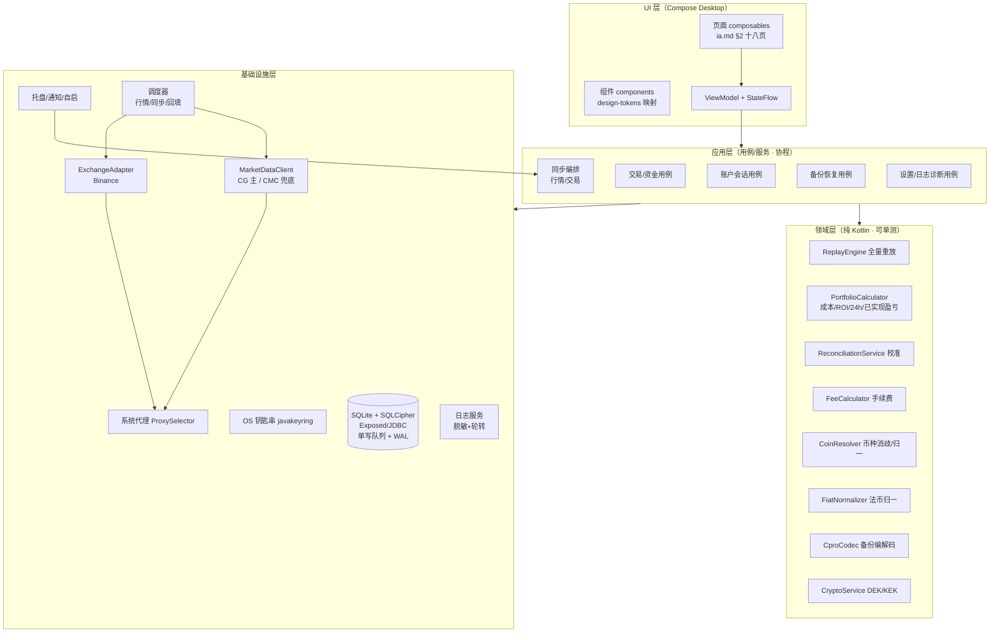

# WuZhuFolio 桌面端技术架构（architecture.md）

> P2 产物 · 桌面端 · 依据 PRD V1.9 + 跨端共享规范 V1.0 + P1 设计（ia/flows/interaction/design-tokens）。
> 技术栈以 ADR-001（**Kotlin + Compose Desktop**）为准；存储/加密见 ADR-002，行情见 ADR-003，交易所见 ADR-004，备份见 ADR-005，构建分发见 ADR-006。
> 本轮按人工指令（2026-08-31）：桌面端改 Kotlin + Compose Desktop；行情客户端基于 CG/CMC 真实 API；其余全面适配 Kotlin 栈。

---

## 1. 架构总览

分层：UI 层（Compose）→ 应用层（用例/服务）→ 领域层（纯 Kotlin，可单测）→ 基础设施层（数据/网络/平台）。Compose 桌面端**无跨进程 IPC**，UI 与核心同进程，经协程 + StateFlow 通信。

## 2. 分层职责与模块边界

### 2.1 UI 层（Compose Desktop）

- 页面：严格对应 `ia.md` §2 十八页（登录/创建/初始化向导/仪表盘/资产列表/币种详情/交易管理/交易表单/CSV 导入/资金管理/资金表单/设置/手续费/API 管理/备份恢复/关于/账户菜单/忘记密码）。
- 主题与组件：将 `design-tokens.md` 的 CSS 变量 1:1 映射为 Compose 主题（明/暗双主题、F4 修正色值）；环形图用 Canvas；数据表用 LazyColumn。
- a11y：`Modifier.semantics` + 全键盘导航 + 文本标签；读屏走查在 P4（ADR-001 风险）。
- 状态：ViewModel + StateFlow 承载会话态、行情态、同步态、异常态（interaction.md §2）。

### 2.2 应用层（用例/服务）

- 每个用例一个 Kotlin 服务（suspend 函数），契约见 api-contracts.md §3；不写 SQL、不持密钥，只编排领域服务与基础设施。
- 编排：账户会话（登录/创建/切换/改密/登出/记住我）、交易与资金 CRUD、同步编排（行情刷新、交易同步、历史回填、校准）、备份恢复、设置与日志诊断。

### 2.3 领域层（纯 Kotlin，无 IO，可单测）

- `ReplayEngine`：按时间升序重放 transactions + capital_flows + reconciliation_records，推导持仓/平均成本/累计增资/撤资/已实现盈亏；校准锚点语义（共享规范 §2）；负持仓校验（手动阻止/导入标记异常）。被交易/资金/校准/导入/恢复复用（flows.md §9）。
- `PortfolioCalculator`：净值、可用现金余额、投入本金（净）、总收益、ROI、24h 盈亏（同源/覆盖 N/M）。
- `ReconciliationService`：单一来源判定、校准差额账务（恒等式保持）。
- `FeeCalculator`：手续费自动计算（交易所>全局费率、计价/基础/第三币种基数）。
- `CoinResolver`：币种归一/消歧（四级规则，共享规范 §6）、pair 注册表切分。
- `FiatNormalizer`：法币计价交易对 1:1 映射稳定币、无映射第三币种（共享规范 §3）。
- `CproCodec`：.cpro 编解码（ADR-005）。
- `CryptoService`：Argon2id、DEK/KEK 包解包、字段级加解密（ADR-002）。

### 2.4 基础设施层

- `SQLite + SQLCipher`（Exposed/JDBC）：单库多账户；WAL + busy_timeout；**单写队列**（`Mutex`）串行化全部写操作（ADR-002）。
- `javakeyring`：数据库密钥 + 设备密钥（行情 Key 等应用级秘密，ADR-002 §2.1）+ 「记住我」会话令牌。
- `MarketDataClient`：CG 主 + CMC 兜底 + 额度治理 + 429 退避（ADR-003）。
- `ExchangeAdapter`：Binance 只读同步 + 增量去重（ADR-004）。
- `系统代理`：JVM `ProxySelector` 自动检测，所有对外请求经代理（PRD 故事 4.2）；状态栏代理指示。
- `托盘/通知/自启`：Compose Tray/Notification API（首选，ADR-001）+ dorkbox（Linux AppIndicator 备选）+ 平台自启注册（PRD §7.2 模块 9）。
- `日志服务`：脱敏 + 轮转（各 1 万条或 90 天先到为准，PRD §6）。
- `调度器`：行情刷新（5/15/30 分钟）、交易同步（15/30/60 分钟）、历史回填、目录每日刷新、日志轮转（协程 + 定时）。

## 3. 关键机制

### 3.1 数据流向（读写分离）

- 读：UI → ViewModel → 用例 → 查询服务 → 只读 SQL 连接（多读连接，WAL）。
- 写：UI/后台任务 → 单写队列（`Mutex`）→ 写连接串行执行 → 触发全量重放 → StateFlow 通知 UI 刷新。

### 3.2 全量重放（核心引擎）

- 输入：账户内三类事件（交易/资金/校准锚点）按时间升序。
- 输出：持仓、平均成本、累计增资/撤资、投入本金（净）、总收益、ROI、已实现盈亏、持仓异常标记。
- 触发：任何历史记录新增/编辑/删除、校准、导入、恢复（flows.md §9）。
- 数值基准：PRD 附录 A 十二黄金用例，作为引擎单测硬验收。

### 3.3 两类独立 API 的隔离

- 行情（MarketDataClient）与交易（ExchangeAdapter）独立接口、独立调度、独立日志、独立额度治理（PRD 名词解释）。

### 3.4 安全边界

- 密码/凭据永不落盘（ADR-002）；密钥驻内存并擦除；凭证字段级加密仅限 api_keys 四列；行情 Key 等应用级秘密按设备密钥加密、不进 .cpro 备份（ADR-002 §2.1 方案甲）。
- 零遥测：无任何统计上报/分析 SDK（PRD §1.1）；对外网络仅行情平台 + 交易所 API，经系统代理。

## 4. 模块清单（映射 task-breakdown.md）

| 模块 ID | 模块 | 归属层 | 关键产物 |
|---------|------|--------|----------|
| M0 | 工程骨架与 CI | 横切 | Gradle 工程（官方模板基座）、dev-setup.md、CI 矩阵 |
| M1 | 存储与加密 | 基础设施/领域 | SQLCipher(JDBC)、Exposed schema、CryptoService、javakeyring |
| M2 | 账户与会话 | 应用/领域 | accounts 用例、登录/切换/改密/记住我 |
| M3 | 币种主数据 | 领域/基础设施 | coins、exchange_coin_map、CoinResolver、FiatNormalizer |
| M4 | 重放与计算引擎 | 领域 | ReplayEngine、PortfolioCalculator、FeeCalculator、ReconciliationService |
| M5 | 行情链路 | 基础设施/应用 | MarketDataClient、快照、24h、回填、额度治理 |
| M6 | 交易所同步 | 基础设施/应用 | BinanceAdapter、增量去重、sync_logs、校准数据源 |
| M7 | 交易管理 | 应用 | 手动增删改、手续费自动计算、CSV 导入/模板 |
| M8 | 资金管理 | 应用 | 增资/撤资、校准记录入列 |
| M9 | 备份与恢复 | 应用/领域 | CproCodec、增量合并/全量覆盖、CSV 明文导出 |
| M10 | 设置与日志诊断 | 应用/基础设施 | settings、fee_rules、日志脱敏/轮转、诊断报告 |
| M11 | 桌面集成 | 基础设施 | 托盘、通知、自启、代理指示 |
| M12 | UI 整合收尾 | UI | 主壳导航 + 聚合页（仪表盘/资产列表/币种详情）+ 双主题总验 + a11y/i18n 收尾 |
| M13 | 安全自查与发布准备 | 横切 | security-checklist、签名/公证、打包 |

**垂直切片原则（2026-08-31 评审 F3 修订）**：M0 先建 Compose UI 基座（T0.6：主题/组件/导航壳）；M2/M5/M6/M7/M8/M9/M10 各模块**自带其 Compose 页面**（按 P1 原型逐页还原、截图走查），保证 P4 逐模块人工门有 UI 可验；M12 只做主壳整合、聚合页与全局收尾。依赖顺序与每模块验收标准见 `task-breakdown.md`。

## 5. 需求回溯（代表性映射，全量见 task-breakdown.md）

| 架构决策 | PRD 章节 | 共享规范 |
|----------|----------|----------|
| 分层 + Compose Desktop 栈 | §12、§1、§6 | — |
| SQLCipher + DEK/KEK | §10 注、故事 5.1 | §7 |
| 单写队列 + WAL | §10 注 | §7 |
| 全量重放/校准/ROI | 全局说明「成本计算规范」、附录 A | §2 |
| 行情两级 + 额度治理 | 全局说明「行情数据与时间分辨率规则」 | §5 |
| 币种消歧/冻结 | 全局说明「币种标识与主数据规则」 | §6 |
| .cpro 格式与恢复 | 故事 5.2、§9.9 | §8 |
| 两类 API 独立 | 名词解释 | §1 |
| 日志脱敏/轮转 | §6 | — |

## 6. 图例说明

本文档图例按 AGENTS.md §7.2 决策 14：md 内优先 Mermaid。独立可视化可追加 huashu-design HTML 信息图（非必做）。
