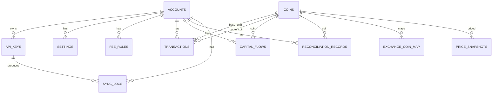

# WuZhuFolio 数据模型（data-model.md）

> P2 产物 · 桌面端 · 依据 PRD V1.9 §10 数据结构 + 跨端共享规范 V1.0 §6/§7/§8。
> 本文件是 P4 各模块建表与 SQL 的唯一基准；表结构以 PRD §10 为准，此处补充 ER 关系、索引、约束与派生口径。

---

## 1. 实体总览与 ER 图

11 张表分两类：
- **账户级业务表**（按 account_id 隔离，备份导出/恢复范围）：accounts、api_keys、settings（账户级）、fee_rules、transactions、capital_flows、reconciliation_records、sync_logs。
- **全局公共表**（各账户共享，不随账户备份导出、全量覆盖不清空）：coins、exchange_coin_map、price_snapshots。

派生值（不落表）：持仓、平均成本、累计增资/撤资、投入本金（净）、总收益、ROI、已实现盈亏、可用现金余额、24h 盈亏 —— 全部由 ReplayEngine/PortfolioCalculator 从三类事件（transactions、capital_flows、reconciliation_records）推导（PRD §10 注）。

## 2. 表结构（含索引与约束）

> 类型口径：Integer 主键自增；Decimal 用 Kotlin `BigDecimal`（或 `Long` 按 1e-8 缩放定点）映射 SQLite NUMERIC，精度满足「金额/价格 8 位小数」（PRD 全局说明「数据精度」）；时间戳一律 UTC（共享规范 §4）；uuid 为 UUID v4。访问层用 Exposed（JDBC + SQLCipher，见 ADR-002）。

### 2.1 accounts（账户表）—— PRD §10-4

| 字段 | 类型 | 约束/说明 |
|------|------|-----------|
| id | Integer | PK 自增 |
| username | String | UNIQUE，非空 |
| password_hash | String | 不可逆哈希（仅登录校验） |
| kdf_salt | String | KDF 盐 |
| kdf_params | String | KDF 算法与参数 JSON（Argon2id m/t/p） |
| wrapped_dek | String | KEK 包裹的账户 DEK（AES-256-GCM） |
| created_at | Timestamp | 默认 UTC 当前 |

索引：UNIQUE(username)。备注：不含明文密码（PRD 故事 5.1-4）。

### 2.2 api_keys（API 密钥表）—— PRD §10-2

| 字段 | 类型 | 约束/说明 |
|------|------|-----------|
| id | Integer | PK 自增 |
| account_id | Integer | FK accounts.id，非空 |
| name | String | 别名 |
| exchange_name | String | 交易所标识（MVP=BINANCE） |
| api_key | String | **DEK 字段级加密** |
| secret_key | String | **DEK 字段级加密** |
| passphrase | String | 可选，**DEK 字段级加密**（MVP 空） |
| extra | JSON | 可选，**DEK 字段级加密**（后续交易所） |
| last_sync_time | Timestamp | 最后成功同步 |
| status | String | OK / FAILED |

唯一约束：UNIQUE(account_id, exchange_name, name)。去重键（备份）= (exchange_name, name)（PRD 故事 5.2-6）。加密边界见 ADR-002。

### 2.3 settings（设置表）—— PRD §10-3

| 字段 | 类型 | 约束/说明 |
|------|------|-----------|
| id | Integer | PK 自增 |
| account_id | Integer | 可空（NULL=全局设置） |
| key | String | 设置项名 |
| value | String | 设置项值 |

唯一约束：表达式唯一索引 UNIQUE(COALESCE(account_id, 0), key)——SQLite 中 NULL 参与 UNIQUE 视为互不相等，普通 UNIQUE(account_id, key) 对全局设置（account_id NULL）不生效（评审 N1）。账户级备份按 key 覆盖（备份优先）。**行情平台 Key（CG/CMC）**：存本表**全局行**（account_id NULL，key=market.coingecko_key / market.cmc_key），按**设备密钥**加密（非账户 DEK，ADR-002 §2.1 方案甲）；**不随 .cpro 备份导出**，恢复后在设置中重新配置（ADR-005 §3）。**行情自选（watch.coins，决策 D21）**：亦存本表**全局行**（account_id NULL，key=watch.coins，value=JSON 数组 [cg_id]，上限 50；未写入=默认种子=稳定币白名单 USDT/USDC/DAI/TUSD）。属**展示偏好**（与 theme/fiat 同层，多账户共享），非财务数据，**不随 .cpro 备份导出**（D21 §2 归属口径）。

### 2.4 fee_rules（手续费费率规则表）—— PRD §10-7

| 字段 | 类型 | 约束/说明 |
|------|------|-----------|
| id | Integer | PK 自增 |
| account_id | Integer | FK accounts.id |
| exchange | String | 空=全局默认 |
| buy_rate | Decimal | 买入费率（%） |
| sell_rate | Decimal | 卖出费率（%） |
| created_at | Timestamp | — |

匹配优先级：交易所 > 全局（PRD §10-7 注）；备份去重键 (account_id, exchange)。

> **M7 勘误（随 M010 落 DDL，2026-09-07）**：buy_rate / sell_rate 实际落为 TEXT 十进制串（百分比值，
> 如 0.1 = 0.1%）——延续 M005/M006/M009 勘误链（SQLite NUMERIC 浮点截断风险，见模块记录 M5 §5）。
> M7 只读消费（交易表单「自动计算手续费」，FeeRateResolver 交易所 > 全局）；费率 CRUD UI 归 M10
> （task-breakdown T10.1，拆分登记见模块记录 M7 §5）。

### 2.5 transactions（交易记录表）—— PRD §10-1

| 字段 | 类型 | 约束/说明 |
|------|------|-----------|
| id | Integer | PK 自增 |
| account_id | Integer | FK accounts.id |
| exchange | String | 交易所名称 |
| exchange_order_id | String | 可空；手动录入空；API/CSV 去重键 |
| pair | String | 交易对（展示） |
| base_coin_id | Integer | FK coins.id，保存时冻结 |
| quote_coin_id | Integer | FK coins.id，保存时冻结 |
| type | Enum | BUY / SELL |
| price | TEXT（十进制串） | 成交价。**M6 勘误（随 M009 落 DDL）**：同 price_snapshots.price（SQLite NUMERIC 浮点截断），账本级价格/数量/手续费一律 TEXT 十进制串（BigDecimal 精确读写）；见模块记录 M6 §5 |
| quantity | TEXT（十进制串） | 数量（base），同上 |
| fee | TEXT（十进制串） | 手续费（以 fee_currency 计价），同上 |
| fee_currency | String | 手续费币种 |
| transaction_time | Timestamp | 交易时间（UTC） |
| notes | String | 备注 |
| created_at | Timestamp | — |
| source | String | Manual / CSV / BINANCE API |
| uuid | String | UUID v4，备份去重 |
| price_status | String | OK / PENDING |

索引：account_id、transaction_time。去重键落为部分唯一索引 UNIQUE(account_id, exchange, exchange_order_id) WHERE exchange_order_id IS NOT NULL（数据库层防并发漏重，评审 N1）；无订单号走模糊匹配（时间+交易对+类型+数量+价格）。

> **M7 口径（2026-09-07）**：手动/CSV 写入口径——手动行 exchange_order_id = null（无去重键）、
> source='Manual'；CSV 行 source='CSV'、order_id 有则精确去重 / 无则模糊去重（时间+交易对+类型+数量+价格，
> 疑似重复提示逐条确认，PRD 故事 2.3-4）；法币计价交易对按 1:1 归一为孪生稳定币冻结 quote_coin_id
> （pair 展示保留录入形态，如 BTC/USD，黄金用例 12）。事件构造层（FK -> cg_id + 折算价解析 + PENDING）
> 归 M7 交易半边，见 api-contracts §3 M7 补录。

> M6 口径：API 同步导入行 source='BINANCE API'、exchange_order_id = 交易所成交 id（Binance myTrades.id，逐笔去重，部分成交 orderId 重复故不用 orderId——规格落档见模块记录 M6 §5）；pair 存展示拼接 "BASE/QUOTE"（原始 symbol 切分以 exchangeInfo 注册表为准，不靠字符串猜测）。

### 2.6 capital_flows（资金流水表）—— PRD §10-5

> **M8 落表（M011，schema 10→12，2026-09-09）**：type 枚举 DEPOSIT/WITHDRAWAL；amount/base_amount
> 存 TEXT 十进制串（延续 M005/M006/M009/M010 勘误链——SQLite NUMERIC 浮点截断风险，**类型勘误：原
> Decimal → TEXT 十进制串**，登记 docs/dev/modules/M8.md §5）；flow_time 为 SqlUtc 文本（同 §2.11 口径）。
> base_amount 为**记录时折算快照**（审计/备份口径）——引擎与展示以事件构造层动态重建为准
>（行情回填后自动纠正，黄金用例 9 语义）；price_status OK/PENDING（保存时点快照）。

| 字段 | 类型 | 约束/说明 |
|------|------|-----------|
| id | Integer | PK 自增 |
| account_id | Integer | FK accounts.id |
| type | Enum | DEPOSIT / WITHDRAWAL |
| amount | Decimal | 数量（原币种） |
| base_amount | Decimal | 折算基础法币金额 |
| currency | String | 币种（展示） |
| coin_id | Integer | FK coins.id，保存时冻结 |
| flow_time | Timestamp | 流水时间（UTC） |
| source_dest | String | 来源/去向 |
| notes | String | 备注 |
| created_at | Timestamp | — |
| uuid | String | UUID v4 |
| price_status | String | OK / PENDING |

### 2.7 reconciliation_records（持仓校准记录表）—— PRD §10-8

> **M8 落表（M012，schema 10→12，2026-09-09）**：local_quantity/exchange_quantity/delta/base_amount
> 存 TEXT 十进制串（勘误链同 §2.6）；created_at 为 SqlUtc 文本。差额账务（delta/base_amount）按**记录值
> 固定**参与重放（M4 §5-7，不随行情重解析）；uuid = 事件 id + 备份去重键。

| 字段 | 类型 | 约束/说明 |
|------|------|-----------|
| id | Integer | PK 自增 |
| account_id | Integer | FK accounts.id |
| symbol | String | 币种代码（展示） |
| coin_id | Integer | FK coins.id，冻结 |
| exchange | String | 校准依据交易所 |
| local_quantity | Decimal | 校准前本地持仓 |
| exchange_quantity | Decimal | 交易所余额 |
| delta | Decimal | exchange_quantity − local_quantity |
| base_amount | Decimal | 差额折算基础法币金额 |
| uuid | String | UUID v4 |
| created_at | Timestamp | 校准时间 |

锚点语义参与全量重放；不可编辑、仅可删除（PRD §10-8 注）。

### 2.8 sync_logs（同步日志表）—— PRD §10-9

| 字段 | 类型 | 约束/说明 |
|------|------|-----------|
| id | Integer | PK 自增 |
| account_id | Integer | FK accounts.id |
| api_key_id | Integer | 可空（行情刷新记录时为空） |
| sync_time | Timestamp | — |
| status | String | OK / FAILED |
| new_trades_count | Integer | 本次新增交易数 |
| message | String | 脱敏结果信息（禁密钥/完整响应体） |

轮转：与本地日志各保留 1 万条或 90 天先到为准（PRD §6）。

### 2.9 coins（币种目录表，全局）—— PRD §10-10

| 字段 | 类型 | 约束/说明 |
|------|------|-----------|
| id | Integer | PK 自增 |
| cg_id | String | UNIQUE，CoinGecko id = 内部唯一标识 |
| cmc_id | String | 可空，CMC id（/cryptocurrency/map 每日缓存） |
| symbol | String | 展示 ticker（大小写归一） |
| name | String | 名称 |
| status | String | ACTIVE / DELISTED / UNTRACKED |
| display_precision | Integer | 价格展示精度 |
| contracts | String(JSON) | 各链合约地址（平台 -> 合约地址 JSON；消歧规则② 用）。**M3 勘误回写（2026-09-03，人工认可）**——PRD §10-10 注「含各链合约地址缓存」未列字段、消歧② 需要，桌面 M004 已落列；移动端 SRD §14 coins.contracts 同源；登记见 docs/dev/modules/M3.md §5-1 |
| updated_at | Timestamp | 目录刷新时间 |

来源 CoinGecko /coins/list（每日，合约地址经 include_platform=true 缓存于 contracts 列）+ CMC /cryptocurrency/map（cmc_id）；全局公共、不随备份导出。

### 2.10 exchange_coin_map（交易所资产映射表，全局）—— PRD §10-11

| 字段 | 类型 | 约束/说明 |
|------|------|-----------|
| id | Integer | PK 自增 |
| exchange | String | 交易所 |
| exchange_asset | String | 交易所资产标识 |
| coin_id | Integer | FK coins.id |
| source | String | AUTO / MANUAL |
| created_at / updated_at | Timestamp | — |

唯一约束 (exchange, exchange_asset)；pair 注册表另作缓存；全局公共、不随备份导出（MANUAL 丢失后下次导入重确认）。

### 2.11 price_snapshots（价格快照表，全局）—— PRD §10-6

| 字段 | 类型 | 约束/说明 |
|------|------|-----------|
| id | Integer | PK 自增 |
| coin_id | Integer | FK coins.id |
| fiat | String | 计价法币 |
| price | TEXT（十进制串） | 价格。**勘误回写（M5 §5 登记，人工认可随 M6 门执行）**：SQLite NUMERIC 对非整小数落 REAL 有浮点截断风险，落 TEXT 十进制串（BigDecimal 精确读写）——M006 DDL 自始即 TEXT |
| price_source | String | COINGECKO / COINMARKETCAP |
| recorded_at | Timestamp | UTC |

每 (coin_id, fiat) 每小时最多一条（同小时取末条；应用层 upsert 实现：按 (coin_id, fiat, 小时桶) 先查后写，写入经单写队列串行保证，评审 N1）；永久保存 + 降采样（近 90 天小时级、更早日级）；仅记录持仓涉及币种、现金类币种与使用中法币；随备份打包降采样数据。

## 3. 派生口径（不落表，由引擎推导）

| 派生值 | 公式/来源 | 需求依据 |
|--------|-----------|----------|
| 持仓数量/平均成本 | 三类事件按时间升序重放 | 共享规范 §2 |
| 累计增资 / 累计撤资 | 增资 base_amount 之和 / 撤资 base_amount 之和（含校准差额） | PRD 名词解释 |
| 投入本金（净） | 累计增资 − 累计撤资 | PRD 名词解释 |
| 总收益 | 当前资产净值 + 累计撤资 − 累计增资 | PRD 名词解释 |
| ROI | 总收益 / 累计增资 × 100%（累计增资=0 显示 "--"） | PRD 名词解释 |
| 已实现盈亏 | 卖出净收入 − 卖出数量 × 当时平均成本（逐笔） | 共享规范 §2 |
| 可用现金余额 | 稳定币白名单持仓按现价折算基础法币之和 | PRD 名词解释 |
| 24h 盈亏 | Σ(持仓×现价) − Σ(持仓×24h 前价)，同源/覆盖 N/M 口径 | PRD 名词解释 |

## 4. 需求回溯

| 表 | PRD 章节 | 共享规范 |
|----|----------|----------|
| accounts / api_keys / settings / fee_rules | §10-2/3/4/7 | §7（密钥/加密边界） |
| transactions / capital_flows | §10-1/5 | §2/§3/§6 |
| reconciliation_records | §10-8 | §2（校准） |
| sync_logs | §10-9 | §1（交易数据同步） |
| coins / exchange_coin_map | §10-10/11 | §6（币种标识与主数据） |
| price_snapshots | §10-6 | §5（行情/时间分辨率） |
| 派生口径 | 全局说明/附录 A | §2 |

## 5. 迁移与版本

- `schema_version` + 迁移脚本管理（PRD §10 末尾）；`.cpro` 内 format_version 独立（ADR-005）。
- P4 建表严格按本节字段名与约束；字段级加密仅限 api_keys 四列（ADR-002），其余列可索引/排序。
- M6 落地：M007 api_keys / M008 sync_logs / M009 transactions（schema 6→9）；字段级加密由账户 DEK + FieldCipher（AAD=account_id|api_key_id|column）在服务层完成，库内只存密文（模块记录 M6.md）。