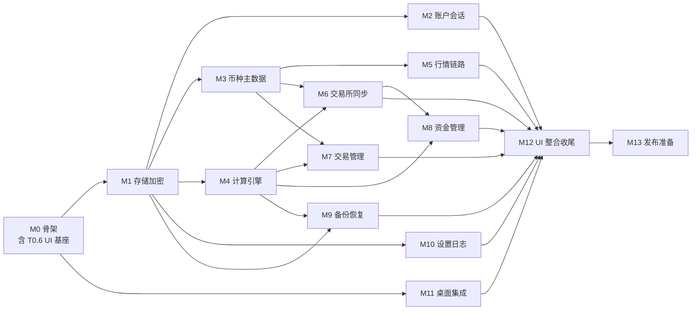

# WuZhuFolio 任务拆解（task-breakdown.md）

> P2 产物 · 桌面端 · WBS + 里程碑 + 依赖顺序 + 可测试验收标准。
> 技术栈：**Kotlin + Compose Desktop**（ADR-001）；任务拆到「可独立验收的最小粒度」，每条附需求回溯（PRD 章节号 / 共享规范条款号 / 黄金用例编号）。
> 里程碑 M0=P3 工程脚手架；M1–M13=P4 分模块开发；P5/P6/P7 在末尾衔接。
> **任务优先级/顺序已人工拍板（2026-08-31）**：按 §2 依赖图（F3 垂直切片）执行——M0（含 T0.6 UI 基座）→ M1 → 并行面 M2/M3/M4/M10/M11 → M5/M6 → M7/M8/M9 → M12 → M13；M4 引擎先行并全绿黄金用例为硬前置。
> 本轮适配：构建/测试改为 Gradle + JUnit5 + Compose UI 测试；P1 HTML 原型降级为**视觉基准**（截图走查），不再作为运行时基座。
> 2026-08-31 评审修订：**F3 垂直切片**（M0 增 T0.6 UI 基座；M2/M5–M10 自带 Compose 页面；M12 退化为整合收尾）；**F2** T6.2 增 symbol 枚举与权重预算验收；**N5** T0.1 增依赖许可证清单。

---

## 1. 里程碑与任务总览

| 里程碑 | 任务 | 内容 | 依赖 |
|--------|------|------|------|
| M0 骨架 | T0.1–T0.6 | Gradle 工程（官方模板基座）/CI/dev-setup/hello 链路/迁移框架/**Compose UI 基座** | — |
| M1 存储加密 | T1.1–T1.4 | SQLCipher(JDBC)/Exposed/CryptoService/钥匙串 | T0 |
| M2 账户会话 | T2.1–T2.5 | accounts 用例/登录/切换/改密/记住我/**登录链路页面** | T1、T0.6 |
| M3 币种主数据 | T3.1–T3.3 | coins/exchange_coin_map/消歧归一 | T1 |
| M4 计算引擎 | T4.1–T4.4 | ReplayEngine/PortfolioCalculator/Fee/Reconciliation | T1 |
| M5 行情链路 | T5.1–T5.5 | CG/CMC/快照/24h/回填/额度/**行情 Key 设置 UI** | T1、T3、T0.6 |
| M6 交易所同步 | T6.1–T6.4 | Binance 适配/增量去重/sync_logs/**API 管理页** | T1、T3、T4、T0.6 |
| M7 交易管理 | T7.1–T7.4 | 手动增删改/手续费/CSV 导入/**交易页+表单+CSV UI** | T3、T4、T0.6 |
| M8 资金管理 | T8.1–T8.3 | 增资/撤资/校准记录/**资金页+表单 UI** | T3、T4、T6、T0.6 |
| M9 备份恢复 | T9.1–T9.4 | .cpro 编解码/合并/覆盖/CSV 导出/**备份恢复 UI** | T1、T4、T0.6 |
| M10 设置日志 | T10.1–T10.4 | settings/fee_rules/日志诊断/**设置页 UI** | T1、T0.6 |
| M11 桌面集成 | T11.1–T11.3 | 托盘/通知/自启/代理指示 | T0 |
| M12 UI 整合收尾 | T12.1–T12.4 | 主壳整合/聚合页（仪表盘/资产/币种详情）/a11y/i18n | M2–M11 |
| M13 发布准备 | T13.1–T13.2 | 安全自查/签名公证打包 | M12 |

## 2. 依赖图

## 3. 任务明细与验收标准

### M0 工程骨架（对应 P3）
- **T0.1 Gradle 工程**：以官方 `JetBrains/compose-multiplatform-desktop-template` 或 KMP 向导为基座，建多模块（app/domain/data/ui）+ version catalog + AGPL-3.0 LICENSE。验收：`./gradlew build` 通过；**依赖许可证清单出具并核验 AGPL-3.0 兼容（N5，重点：argon2-jvm/javakeyring/dorkbox/sqlite-jdbc-crypt/BouncyCastle/OkHttp）**。回溯：ADR-001/006。
- **T0.2 CI**：GitHub Actions 三平台矩阵（`./gradlew test` + detekt + `package*` 冒烟；JDK 用 `setup-java` temurin-17，与本地 mise 口径一致）。验收：CI 绿。回溯：ADR-006。
- **T0.3 dev-setup.md + 环境检查（mise 工具链，2026-08-31 人工指令）**：开发基准环境 = WSL2 + Ubuntu 24.04；SDK 管理优先用已安装的 **mise**：① JDK 17 → `mise use java@temurin-17`（写项目 `.mise.toml`，团队与 CI 对齐）；② Gradle → 以仓库内 **Gradle Wrapper 为唯一真源**（版本锁 `gradle-wrapper.properties`，日常只用 `./gradlew`；全局 gradle 不安装，仅首次 bootstrap 可用 `mise use gradle` 生成 wrapper 后移除）；③ Kotlin → 不单独安装，由 version catalog 的 Kotlin Gradle 插件驱动；④ 其他适合 mise 管理的 CLI（detekt/ktlint 等）同样入 `.mise.toml`。文档含**环境检查清单**（`mise ls` 含 temurin-17、`java -version` 正确、`./gradlew build` 通过）与 **WSL2 注记**（GUI 冒烟走 WSLg；托盘/通知在 WSLg 下行为不完整，最终以 CI 三平台 runner + 实机验证为准）。验收：按文档在新环境可跑起 hello 链路；`.mise.toml` 入库。回溯：AGENTS.md P3 DoD、ADR-001/006。
- **T0.4 hello 链路**：空界面启动 → 读设置 → 打一条脱敏日志。验收：端到端可跑，日志脱敏。回溯：AGENTS.md P3、PRD §6。
- **T0.5 schema 迁移框架**：Exposed schema_version + 迁移脚本骨架。验收：空库初始化 + 迁移跑通。回溯：PRD §10 末尾。
- **T0.6 Compose UI 基座（F3 垂直切片前置）**：design-tokens 单源映射为 Compose 主题（明/暗双主题、F4 修正色值）、核心组件库（按钮/输入/表格/Modal/Toast/状态栏）、主壳导航骨架（侧边栏五页空壳）。验收：组件走查页双主题渲染正确、两主题对比度 ≥4.5:1（沿用 P1 F4 token）；后续模块页面直接基于本基座开发。回溯：design-tokens.md、ADR-001。

### M1 存储与加密
- **T1.1 SQLCipher(JDBC)**：建库、随机 DB 密钥入钥匙串、WAL/busy_timeout/foreign_keys。验收：重启可解锁；无钥匙串降级提示；**三平台 SQLCipher 驱动可用性验证（锁版）**。回溯：ADR-002、共享规范 §7。
- **T1.2 CryptoService**：Argon2id、DEK/KEK 包解包、字段级加解密、密钥擦除。验收：单测覆盖包解包/错误密钥失败/密文不相等。回溯：ADR-002、PRD 故事 5.1。
- **T1.3 KDF 基准校准**：4GB 双核夹具测 Argon2id 耗时。验收：登录解密 ≤2s（记录实测，不达标降参数）。回溯：PRD §12。
- **T1.4 单写队列**：`Mutex` 串行化 + 读写连接分离。验收：并发写无锁冲突、WAL 生效。回溯：PRD §10 注、共享规范 §7。

### M2 账户与会话
- **T2.1 账户创建/登录**：accounts 表、密码强度、风险确认门控。验收：创建含风险确认勾选；登录失败提示不暴露存在性。回溯：PRD 故事 1.1、interaction A1。
- **T2.2 记住我/会话**：会话令牌入钥匙串、自动恢复、登出清除。验收：勾选后重启免密；登出回登录页。回溯：PRD 故事 1.1/1.2。
- **T2.3 切换账户**：严格模式需目标密码。验收：切换需密码、失败提示 A3。回溯：PRD 故事 1.3。
- **T2.4 修改密码**：重包 KEK、作废会话令牌。验收：改密后旧「记住我」失效、历史备份仍可解。回溯：PRD 故事 5.1-6/9.2。
- **T2.5 登录链路页面（Compose）**：登录/账户创建（含风险确认门控）/初始化向导四方式/忘记密码/账户菜单（切换账户、登出回环），按原型逐页还原。验收：与原型登录链路 4 页截图走查一致；密码强度、字段级校验、风险确认门控可点验。回溯：ia.md §2、flows.md §1、原型 wuzhufolio-light.html。

### M3 币种主数据
- **T3.1 coins 目录**：/coins/list + cmc_id 每日缓存。验收：目录可检索、UNIQUE(cg_id)。回溯：共享规范 §6。
- **T3.2 CoinResolver 消歧归一**：四级消歧 + 映射冻结。验收：歧义示例命中候选，选择固化 source=MANUAL。回溯：共享规范 §6、PRD 故事 2.3-7。
- **T3.3 FiatNormalizer**：法币交易对 1:1 映射稳定币。验收：BTC/USD→quote=USDT；EUR→EURC。回溯：共享规范 §3、黄金用例 12。

### M4 计算引擎（核心）
- **T4.1 ReplayEngine**：三类事件重放、负持仓校验、校准锚点。验收：**黄金用例 1–9 全部通过**。回溯：共享规范 §2、PRD 附录 A。
- **T4.2 PortfolioCalculator**：净值/可用现金/投入本金/总收益/ROI/已实现盈亏。验收：黄金用例 2/3/4；累计增资=0 显示 "--"。回溯：PRD 名词解释。
- **T4.3 FeeCalculator**：费率优先级、三币种基数。验收：黄金用例 5。回溯：PRD 故事 7.1。
- **T4.4 ReconciliationService**：单一来源判定、差额账务恒等式。验收：黄金用例 8；多来源隐藏入口。回溯：共享规范 §2、PRD 故事 4.1-5。

### M5 行情链路
- **T5.1 MarketDataClient（CG/CMC 真实 API）**：两 provider、兜底切换、退避、额度计数。验收：MockEngine 覆盖 429/额度耗尽/币种未收录/主源恢复回落；真实 API 端点/头/参数对齐 ADR-003。回溯：ADR-003、共享规范 §5。
- **T5.2 价格快照**：每小时末条、price_source、永久降采样。验收：同小时去重、降采样正确。回溯：PRD 故事 3.2-4。
- **T5.3 24h 盈亏与历史回填**：固定数量回算法、同源/覆盖 N/M、待定价回填。验收：黄金用例 11；回填后 PENDING 消除。回溯：PRD 名词解释、黄金用例 9/11。
- **T5.4 行情调度**：5/15/30 分钟、托盘降频、手动刷新、额度 80% 降档。验收：调度时序、状态栏提示。回溯：PRD 故事 3.2-6、§7.2 模块 6.1。
- **T5.5 行情 Key 设置 UI**：设置页「行情数据源」分组（CG Key + 注册链接 + CMC Key + 数据源指示），Key 按设备密钥加密存全局 settings（方案甲），保存即生效。验收：与原型设置页走查一致；429/额度提示文案可达。回溯：PRD 故事 3.2、§7.2 模块 6.2/6.3、ADR-002 §2.1。

### M6 交易所同步
- **T6.1 BinanceAdapter**：四端点、HMAC 签名、错误映射。验收：MockEngine 覆盖密钥失效/429/时间戳偏差。回溯：ADR-004、api-contracts §2。
- **T6.2 增量同步与去重**：启动+定时+手动；exchange+订单号去重；不覆盖本地持仓；500 条提示 CSV 补录；**symbol 枚举按 ADR-004 §3.1 收敛（余额推导 pair ∪ 已同步 pair）**。验收：重复同步不重复；**单次同步 myTrades 调用数 ≤120（权重预算 1200 内），超额排队下轮续传并在 sync_logs 注明**。回溯：PRD 故事 4.1-4/6、ADR-004 §3.1。
- **T6.3 sync_logs 与状态**：写日志（脱敏）、API 状态、同步中指示。验收：message 不含密钥/完整响应体。回溯：PRD §6、§10-9。
- **T6.4 API 管理页（Compose）**：API 列表/添加弹窗（验证后保存 + 保存即首次同步）/状态与同步记录展示。验收：与原型 API 管理走查一致；B2 密钥失效文案正确；人工可走通「添加→首次同步→看到新交易」。回溯：ia.md §2、flows.md §3、PRD 故事 4.1。

### M7 交易管理
- **T7.1 手动增删改**：表单校验、实时总价、联动持仓、买入余额校验、删除确认。验收：interaction V1–V5/V9 全通过。回溯：PRD 故事 2.1/7.1、§9.7。
- **T7.2 手续费自动计算**：费率匹配、三态手续费币种。验收：黄金用例 5。回溯：PRD 故事 7.1/7.2。
- **T7.3 CSV 导入/模板**：模板下载、解析预览影响摘要、去重、消歧。验收：黄金用例 6（负持仓异常→补增资消除）。回溯：PRD 故事 2.3。
- **T7.4 交易页+表单+CSV UI（Compose）**：交易管理页（表头排序/筛选/行内编辑/删除确认）、交易表单（实时总价/手续费三态联动）、CSV 导入向导（模板下载/预览影响摘要/消歧选择）。验收：与原型对应页面截图走查一致；V1–V5/V9 真实 UI 可点验。回溯：ia.md §2、interaction.md、PRD 故事 2.1/2.3。

### M8 资金管理
- **T8.1 增资/撤资**：表单校验、折算、撤资持仓校验、删除确认重算。验收：interaction V6/V7；黄金用例 2/3/4。回溯：PRD 故事 6.1/6.2。
- **T8.2 校准记录入列**：校准差额以「校准」类型入资金列表、详情页校准历史。验收：列表含校准行、不可编辑可删除。回溯：PRD §9.8、§10-8。
- **T8.3 资金页+表单 UI（Compose）**：资金管理页（筛选/校准行展示）、增资/撤资表单（币种单选下拉/折算预览）。验收：与原型资金页走查一致；V6/V7 真实 UI 可点验。回溯：ia.md §2、interaction.md、PRD 故事 6.1/6.2。

### M9 备份恢复
- **T9.1 CproCodec**：明文头部 + AES-256-GCM 载荷、解密→重加密（kotlinx.serialization）。验收：导出→导入往返无损；错误密码失败。回溯：ADR-005、共享规范 §8。
- **T9.2 增量合并/全量覆盖**：三级去重、api_keys/fee_rules/settings/快照幂等、全量覆盖临时备份+不清空全局表。验收：黄金用例 10。回溯：PRD 故事 5.2-6。
- **T9.3 恢复流程与 CSV 明文导出**：摘要预览→密码→导入→全量重放；CSV 导出（不含密钥）；全新安装恢复前建账。验收：流程图 6 全路径。回溯：PRD 故事 5.2、§9.9。
- **T9.4 备份恢复 UI（Compose）**：数据管理页（导出 .cpro/恢复向导：文件选择→摘要预览→密码→导入方式→进度与结果）+ CSV 导出入口。验收：流程图 6 全路径真实 UI 可走；**行情 Key 不在备份内容内（方案甲）**；与原型数据管理走查一致。回溯：flows.md §6、ADR-005、ADR-002 §2.1。

### M10 设置与日志诊断
- **T10.1 settings/fee_rules**：全局+账户级设置、稳定币白名单、基础法币、精度、小额阈值、费率 CRUD。验收：设置持久化、费率「交易所>全局」生效。回溯：PRD §7.2 模块 6。
- **T10.2 日志脱敏与轮转**：禁密钥/完整响应体、遮蔽、轮转 1 万条或 90 天。验收：导出日志含脱敏。回溯：PRD §6。
- **T10.3 诊断报告**：版本/schema/脱敏片段/调用计数。验收：内容受限清单达标。回溯：PRD §6、interaction §2.6。
- **T10.4 设置页 UI（Compose）**：设置页全分组（常规/手续费/网络代理/日志与诊断/关于），与 T5.5 行情分组汇合。验收：与原型设置页走查一致；设置持久化生效；诊断报告可生成导出。回溯：ia.md §2、PRD §7.2 模块 6。

### M11 桌面集成
- **T11.1 托盘与通知**：最小化到托盘、托盘菜单、同步通知开关。验收：托盘驻留行为正确。回溯：PRD §7.2 模块 9、design-tokens §5。
- **T11.2 开机自启**：默认关，可开关（平台注册）。验收：开启后自启驻留托盘。回溯：PRD §7.2 模块 9.3。
- **T11.3 系统代理检测与指示**：ProxySelector 检测、请求经代理、状态栏指示。验收：代理指示与直连/代理一致。回溯：PRD 故事 4.2。

### M12 UI 整合收尾（F3：模块页面已前置，本里程碑做整合与全局收尾）
- **T12.1 主壳整合 + 聚合页（Compose）**：主壳导航（侧边栏五页 + 顶栏主题切换/代理指示/同步状态）+ 聚合页——仪表盘（净值/环形图/24h）、资产列表（排序/异常标记）、币种详情（三重筛选/校准入口）。验收：十八页全部可达（模块页面 + 聚合页）；聚合页与原型截图走查一致；双主题切换全页正确、两主题对比度 ≥4.5:1 总验。回溯：ia.md、design-tokens.md、原型。
- **T12.2 异常态全量走查**：加载/空/错误/离线/限流态在真实 UI 全量核对（interaction.md §2；各模块已就近落异常态，本任务做全量一致性核对）。验收：N1–N3/B1–B5/A1–A4/V1–V9 文案与呈现匹配。回溯：interaction.md。
- **T12.3 a11y 基线**：键盘导航、semantics、文本标签、焦点可见；读屏走查（NVDA/JAWS）在 P4 实测（ADR-001 风险）。验收：Tab 序、focus、semantics。回溯：PRD §6/T12、design-tokens §6。
- **T12.4 i18n**：en/zh、UTC 存本地显、多法币、精度。验收：语言/法币切换正确。回溯：PRD §6、共享规范 §4。

### M13 发布准备
- **T13.1 安全自查**：§1.1 硬约束逐条核验。验收：security-checklist 全通过。回溯：PRD §1.1。
- **T13.2 签名公证打包**：jpackage 三平台产物 + macOS 公证 + Windows 签名；AppImage/Flatpak 追加（ADR-006 风险）。验收：产物可安装、签名合规。回溯：ADR-006、PRD §12。

## 4. 里程碑验收门槛

| 里程碑 | 门槛（DoD 前置） |
|--------|------------------|
| M0 | 本地构建通过、CI 绿、hello 链路可跑（P3 DoD）；UI 基座双主题渲染正确、对比度达标 |
| M1–M4 | 存储/加密/账户/币种/引擎单测绿；**黄金用例 1–9、12 通过** |
| M5–M6 | 行情/同步 mock 全分支绿；两类 API 隔离验证 |
| M7–M8 | 交易/资金/校准交互验收（interaction V 系）全过；黄金用例 2/3/4/5/6/8 |
| M9 | 备份往返无损、幂等（黄金用例 10） |
| M10–M11 | 设置/日志/托盘/代理验收通过 |
| M12 | 十八页全可达 + 聚合页走查 + 异常态 + a11y + i18n 全量走查 |
| M13 | 安全自查全通过、签名公证合规 |

## 5. 衔接下一阶段

- M0 = P3 工程脚手架（AGENTS.md P3 DoD）。
- M1–M13 = P4 分模块开发，严格按依赖顺序，每模块落 `docs/dev/modules/<模块名>.md` 并停人工门（AGENTS.md P4）。
- M4（计算引擎）是 M7/M8/M9 前置，必须先行并全绿黄金用例。
- **F3 垂直切片**：T0.6（UI 基座）是 M2/M5/M6/M7/M8/M9/M10 页面任务的前置；各模块页面随模块验收，P4 人工门按「单测绿 + 页面截图走查」双轨执行。
- 全部模块完成 → P5 集成联调；P6 测试以 interaction.md 异常态清单 + PRD 验收标准为输入。
