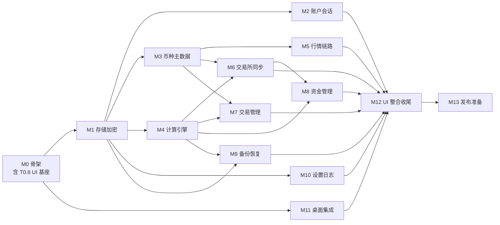

# WuZhuFolio 任务拆解（task-breakdown.md）

> P2 产物 · 桌面端 · WBS + 里程碑 + 依赖顺序 + 可测试验收标准。
> 技术栈：**Kotlin + Compose Desktop**（ADR-001）；任务拆到「可独立验收的最小粒度」，每条附需求回溯（PRD 章节号 / 共享规范条款号 / 黄金用例编号）。
> 里程碑 M0=P3 工程脚手架；M1–M13=P4 分模块开发；P5/P6/P7 在末尾衔接。
> **任务优先级/顺序已人工拍板（2026-08-31）**：按 §2 依赖图（F3 垂直切片）执行——M0（含 T0.6 UI 基座）→ M1 → 并行面 M2/M3/M4/M10/M11 → M5/M6 → M7/M8/M9 → M12 → M13；M4 引擎先行并全绿黄金用例为硬前置。
> 本轮适配：构建/测试改为 Gradle + JUnit5 + Compose UI 测试；P1 HTML 原型降级为**视觉基准**（截图走查），不再作为运行时基座。
> 2026-08-31 评审修订：**F3 垂直切片**（M0 增 T0.6 UI 基座；M2/M5–M10 自带 Compose 页面；M12 退化为整合收尾）；**F2** T6.2 增 symbol 枚举与权重预算验收；**N5** T0.1 增依赖许可证清单。

---

## 1. 里程碑与任务总览

| 里程碑 | 任务 | 内容 | 依赖 |
|--------|------|------|------|
| M0 骨架 | T0.1–T0.6 | Gradle 工程（官方模板基座）/CI/dev-setup/hello 链路/迁移框架/**Compose UI 基座** | — |
| M1 存储加密 | T1.1–T1.4 | SQLCipher(JDBC)/Exposed/CryptoService/钥匙串 | T0 |
| M2 账户会话 | T2.1–T2.5 | accounts 用例/登录/切换/改密/记住我/**登录链路页面** | T1、T0.6 |
| M3 币种主数据 | T3.1–T3.3 | coins/exchange_coin_map/消歧归一 | T1 |
| M4 计算引擎 | T4.1–T4.4 | ReplayEngine/PortfolioCalculator/Fee/Reconciliation | T1 |
| M5 行情链路 | T5.1–T5.6 | CG/CMC/快照/24h/回填/额度/**行情 Key 设置 UI**/行情浏览页（D21） | T1、T3、T0.6 |
| M6 交易所同步 | T6.1–T6.4 | Binance 适配/增量去重/sync_logs/**API 管理页** | T1、T3、T4、T0.6 |
| M7 交易管理 | T7.1–T7.4 | 手动增删改/手续费/CSV 导入/**交易页+表单+CSV UI** | T3、T4、T0.6 |
| M8 资金管理 | T8.1–T8.3 | 增资/撤资/校准记录/**资金页+表单 UI** | T3、T4、T6、T0.6 |
| M9 备份恢复 | T9.1–T9.4 | .cpro 编解码/合并/覆盖/CSV 导出/**备份恢复 UI** | T1、T4、T0.6 |
| M10 设置日志 | T10.1–T10.4 | settings/fee_rules/日志诊断/**设置页 UI** | T1、T0.6 |
| M11 桌面集成 | T11.1–T11.3 | 托盘/通知/自启/代理指示 | T0 |
| M12 UI 整合收尾 | T12.1–T12.4 | 主壳整合/聚合页（仪表盘/资产/币种详情）/a11y/i18n | M2–M11 |
| M13 发布准备 | T13.1–T13.2 | 安全自查/签名公证打包 | M12 |
| **M14 UI 体系统一（0.2.0）** | **T14.1–T14.10** | 主题层全量映射 / Hot Reload / 组件层收口（含 DEF-56）/ 日期时间选择器（DEF-55）+ 数值输入（DEF-54）/ 逐页回归与文档同步 / 0.2.0 发布准备 | M12、**ADR-007**、**D38** |

## 2. 依赖图

```mermaid
flowchart LR
  T0[M0 骨架<br/>含 T0.6 UI 基座] --> T1[M1 存储加密]
  T1 --> T2[M2 账户会话]
  T1 --> T3[M3 币种主数据]
  T1 --> T4[M4 计算引擎]
  T1 --> T10[M10 设置日志]
  T0 --> T11[M11 桌面集成]
  T3 --> T5[M5 行情链路]
  T3 --> T6[M6 交易所同步]
  T4 --> T6
  T4 --> T7[M7 交易管理]
  T3 --> T7
  T4 --> T8[M8 资金管理]
  T6 --> T8
  T1 --> T9[M9 备份恢复]
  T4 --> T9
  T2 & T5 & T6 & T7 & T8 & T9 & T10 & T11 --> T12[M12 UI 整合收尾]
  T12 --> T13[M13 发布准备]
```

## 3. 任务明细与验收标准

### M0 工程骨架（对应 P3）
- **T0.1 Gradle 工程**：以官方 `JetBrains/compose-multiplatform-desktop-template` 或 KMP 向导为基座，建多模块（app/domain/data/ui）+ version catalog + AGPL-3.0 LICENSE。验收：`./gradlew build` 通过；**依赖许可证清单出具并核验 AGPL-3.0 兼容（N5，重点：argon2-jvm/javakeyring/dorkbox/sqlite-jdbc-crypt/BouncyCastle/OkHttp）**。回溯：ADR-001/006。
- **T0.2 CI**：GitHub Actions 三平台矩阵（`./gradlew test` + detekt + `package*` 冒烟；JDK 用 `setup-java` temurin-17，与本地 mise 口径一致）。验收：CI 绿。回溯：ADR-006。
- **T0.3 dev-setup.md + 环境检查（mise 工具链，2026-08-31 人工指令）**：开发基准环境 = WSL2 + Ubuntu 24.04；SDK 管理优先用已安装的 **mise**：① JDK 17 → `mise use java@temurin-17`（写项目 `.mise.toml`，团队与 CI 对齐）；② Gradle → 以仓库内 **Gradle Wrapper 为唯一真源**（版本锁 `gradle-wrapper.properties`，日常只用 `./gradlew`；全局 gradle 不安装，仅首次 bootstrap 可用 `mise use gradle` 生成 wrapper 后移除）；③ Kotlin → 不单独安装，由 version catalog 的 Kotlin Gradle 插件驱动；④ 其他适合 mise 管理的 CLI（detekt/ktlint 等）同样入 `.mise.toml`。文档含**环境检查清单**（`mise ls` 含 temurin-17、`java -version` 正确、`./gradlew build` 通过）与 **WSL2 注记**（GUI 冒烟走 WSLg；托盘/通知在 WSLg 下行为不完整，最终以 CI 三平台 runner + 实机验证为准）。验收：按文档在新环境可跑起 hello 链路；`.mise.toml` 入库。回溯：AGENTS.md P3 DoD、ADR-001/006。
- **T0.4 hello 链路**：空界面启动 → 读设置 → 打一条脱敏日志。验收：端到端可跑，日志脱敏。回溯：AGENTS.md P3、PRD §6。
- **T0.5 schema 迁移框架**：Exposed schema_version + 迁移脚本骨架。验收：空库初始化 + 迁移跑通。回溯：PRD §10 末尾。
- **T0.6 Compose UI 基座（F3 垂直切片前置）**：design-tokens 单源映射为 Compose 主题（明/暗双主题、F4 修正色值）、核心组件库（按钮/输入/表格/Modal/Toast/状态栏）、主壳导航骨架（侧边栏五页空壳）。验收：组件走查页双主题渲染正确、两主题对比度 ≥4.5:1（沿用 P1 F4 token）；后续模块页面直接基于本基座开发。回溯：design-tokens.md、ADR-001。

### M1 存储与加密
- **T1.1 SQLCipher(JDBC)**：建库、随机 DB 密钥入钥匙串、WAL/busy_timeout/foreign_keys。验收：重启可解锁；无钥匙串降级提示；**三平台 SQLCipher 驱动可用性验证（锁版）**。回溯：ADR-002、共享规范 §7。
- **T1.2 CryptoService**：Argon2id、DEK/KEK 包解包、字段级加解密、密钥擦除。验收：单测覆盖包解包/错误密钥失败/密文不相等。回溯：ADR-002、PRD 故事 5.1。
- **T1.3 KDF 基准校准**：4GB 双核夹具测 Argon2id 耗时。验收：登录解密 ≤2s（记录实测，不达标降参数）。回溯：PRD §12。
- **T1.4 单写队列**：`Mutex` 串行化 + 读写连接分离。验收：并发写无锁冲突、WAL 生效。回溯：PRD §10 注、共享规范 §7。

### M2 账户与会话
- **T2.1 账户创建/登录**：accounts 表、密码强度、风险确认门控。验收：创建含风险确认勾选；登录失败提示不暴露存在性。回溯：PRD 故事 1.1、interaction A1。
- **T2.2 记住我/会话**：会话令牌入钥匙串、自动恢复、登出清除。验收：勾选后重启免密；登出回登录页。回溯：PRD 故事 1.1/1.2。
- **T2.3 切换账户**：严格模式需目标密码。验收：切换需密码、失败提示 A3。回溯：PRD 故事 1.3。
- **T2.4 修改密码**：重包 KEK、作废会话令牌。验收：改密后旧「记住我」失效、历史备份仍可解。回溯：PRD 故事 5.1-6/9.2。
- **T2.5 登录链路页面（Compose）**：登录/账户创建（含风险确认门控）/初始化向导四方式/忘记密码/账户菜单（切换账户、登出回环），按原型逐页还原。验收：与原型登录链路 4 页截图走查一致；密码强度、字段级校验、风险确认门控可点验。回溯：ia.md §2、flows.md §1、原型 wuzhufolio-light.html。

### M3 币种主数据
- **T3.1 coins 目录**：/coins/list + cmc_id 每日缓存。验收：目录可检索、UNIQUE(cg_id)。回溯：共享规范 §6。
- **T3.2 CoinResolver 消歧归一**：四级消歧 + 映射冻结。验收：歧义示例命中候选，选择固化 source=MANUAL。回溯：共享规范 §6、PRD 故事 2.3-7。
- **T3.3 FiatNormalizer**：法币交易对 1:1 映射稳定币。验收：BTC/USD→quote=USDT；EUR→EURC。回溯：共享规范 §3、黄金用例 12。

### M4 计算引擎（核心）
- **T4.1 ReplayEngine**：三类事件重放、负持仓校验、校准锚点。验收：**黄金用例 1–9 全部通过**。回溯：共享规范 §2、PRD 附录 A。
- **T4.2 PortfolioCalculator**：净值/可用现金/投入本金/总收益/ROI/已实现盈亏。验收：黄金用例 2/3/4；累计增资=0 显示 "--"。回溯：PRD 名词解释。
- **T4.3 FeeCalculator**：费率优先级、三币种基数。验收：黄金用例 5。回溯：PRD 故事 7.1。
- **T4.4 ReconciliationService**：单一来源判定、差额账务恒等式。验收：黄金用例 8；多来源隐藏入口。回溯：共享规范 §2、PRD 故事 4.1-5。

#### T4.5 负持仓区间成本口径返工（D26 · C2 增补，2026-09-11 人工拍板方案甲）
- **背景**：M12 走查实测（M12.md §7.2）——导入账本缺入金时计价腿转负，引擎在负区间仍累积成本，
  持仓回正后成本被摊到更小数量上，平均成本与已实现盈亏失真（实测 USDT 均价 1.4874、BTC 均价 125,176.63、
  单笔卖出已实现 −57,843.47）。命中 AGENTS.md §8.1 红线 3 → C2 mini 闭环。
- **返工内容**：`ReplayEngine` 新增「穿越点拆分」流入口径 + 数量 ≤ 0 时成本归零归一；
  `SellRealizedTracer`（M7 复制实现）同步；界面「成本不可靠」文案口径随之改写。
- **验收**：① 不变式「数量 ≤ 0 ⟹ 成本 = 0」四类流入全覆；② 穿越点成本 = `v × (q − d) / q` 精确断言；
  ③ `q ≤ d` 时成本保持 0；④ **从未转负的账本全部既有断言逐字不变**（黄金用例 1–9、12 全绿）；
  ⑤ 逐笔轨迹与引擎合计交叉校验全绿；⑥ 走查场景复现：重建后均价 = 补买价、再卖出已实现为正常量级。
- **回溯**：PRD 全局说明「成本计算规范」「重放校验规则」「持仓校准规则」、共享规范 §2、决策档 D26、M12.md §7.2。

#### T4.6 白名单稳定币 1:1 锚定折算（D27 · C2 增补，2026-09-13 人工拍板方案 B）
- **背景**：P5 人工验收实测（`docs/test/integration-report.md` §11-4）——增资 100,000 USDT 显示可用现金
  99,964.80、卖出 0.1 BTC@60,000 显示已实现 999.65 而非 1,000：折算链的「USD 锚定 1:1」只是缺价兜底，
  有市价快照时稳定币按真实市价（≈0.99965）折算。命中 AGENTS.md §8.1 红线 3 → C2 mini 闭环。
- **返工内容**：`TransactionEventBuilder.priceOf` 锚定判定提前（① 锚定 → ② 快照前向 → ③ 快照后向）并公开
  `isAnchoredUsdStable`；`DefaultPortfolioService.loadMarket`（现价 = 1，快照仅用于 `priceAsOf` 展示）与
  `compute24h`（锚定币 24h 前价 = 1）同源复用；资金/费率/校准/事件装配等消费方自动继承。
- **验收**：① 白名单币有市价快照（0.98）时仍按 1:1 折算（事件 + 估值 + 可用现金 + 24h）；② 非白名单币与
  非 USD 基础法币照市价（既有断言不变）；③ 白名单**扩展项**同样锚定；④ 端到端复现人工三个数值
  （可用现金 100,000 / 已实现 1,000 / 净值 101,000、ROI +1.00%）；⑤ 黄金用例 1–9、12 零回归。
- **回溯**：PRD 全局说明「成本计算规范」「法币角色与归一化规则」、共享规范 §2 名词（稳定币白名单/可用现金余额）、
  决策档 D27、集成报告 §11-4。
- **T4.6 修订（D28，2026-09-13 人工裁决）**：1:1 锚定集合**固定 = USDT**（`PortfolioCalculator.ANCHORED_COIN_IDS`，
  不可由设置扩展）；**现金白名单**默认 = {USDT}（`DEFAULT_CASH_COIN_IDS`/`CASH_COIN_DEFAULTS`），
  其余稳定币用户可增删且**按市价折算**；事件构造层参数 `cashCoinIds` → `anchoredCoinIds`；
  行情页自选开箱种子与白名单解耦（`MarketConfig.DEFAULT_WATCH_SEED`）。
  验收：默认集合断言、扩展项按市价断言、白名单扩展仍计入可用现金。

#### T4.7 负持仓币市值不计入净值（D29 · C2 增补，2026-09-13 人工拍板方案 B）
- **背景**：M12 走查 + P5 第二轮人工追问——负持仓只可能来自导入路径（CSV/API 同步不做余额校验），
  是「账本缺数据」信号而非真实头寸；此前其负市值会扣减净值（实测 USDC −4,204 → 净值 −4,202.79）。
- **返工内容**：`PortfolioCalculator.compute` 三分支聚合（缺价 / **数量 < 0 排除** / 正常计入），
  `PortfolioMetrics` 新增 `anomalousExcludedFiat`；仪表盘加显式提示行（中英双档，testTag `dashboard-anomaly-notice`）。
- **验收**：① 负持仓不计入净值与可用现金（含负持仓现金币用例）；② 被排除金额单列且界面可见；
  ③ 币种行仍展示负市值与「持仓异常」徽标；④ 数量 ≥ 0 的既有断言零回归。
- **回溯**：PRD 全局说明「重放校验规则/导入路径例外」（附录 A 用例 6）、D26、决策档 D29、集成报告 §8-2。

### M5 行情链路
- **T5.1 MarketDataClient（CG/CMC 真实 API）**：两 provider、兜底切换、退避、额度计数。验收：MockEngine 覆盖 429/额度耗尽/币种未收录/主源恢复回落；真实 API 端点/头/参数对齐 ADR-003。回溯：ADR-003、共享规范 §5。
- **T5.2 价格快照**：每小时末条、price_source、永久降采样。验收：同小时去重、降采样正确。回溯：PRD 故事 3.2-4。
- **T5.3 24h 盈亏与历史回填**：固定数量回算法、同源/覆盖 N/M、待定价回填。验收：黄金用例 11；回填后 PENDING 消除。回溯：PRD 名词解释、黄金用例 9/11。
- **T5.4 行情调度**：5/15/30 分钟、托盘降频、手动刷新、额度 80% 降档。验收：调度时序、状态栏提示。回溯：PRD 故事 3.2-6、§7.2 模块 6.1。
- **T5.5 行情 Key 设置 UI**：设置页「行情数据源」分组（CG Key + 注册链接 + CMC Key + 数据源指示），Key 按设备密钥加密存全局 settings（方案甲），保存即生效。验收：与原型设置页走查一致；429/额度提示文案可达。回溯：PRD 故事 3.2、§7.2 模块 6.2/6.3、ADR-002 §2.1。
- **T5.6 行情浏览页（D21 增补，C1）**：侧边栏第六页「行情」——只读列表（symbol/名称/现价/数据源/更新时间）+ 持久化自选（watch.coins 全局行 JSON [cg_id]，上限 50，默认种子=稳定币白名单）+ 搜索添加（coins 目录检索）/移除 + 手动刷新 + 页面可见期按刷新频率自动轮询（离开即停）。验收：默认 4 现金币行、刷新出价、搜索添加重启保留、移除、自动轮询、**对照原型第六页走查**；搜索输入框 Compose UI 测试 performTextInput+assertIsFocused。回溯：决策 D21、ia.md §2.19、interaction.md §2.7、PRD Out of Scope（无交易/图表）。

### M6 交易所同步
- **T6.1 BinanceAdapter**：四端点、HMAC 签名、错误映射。验收：MockEngine 覆盖密钥失效/429/时间戳偏差。回溯：ADR-004、api-contracts §2。
- **T6.2 增量同步与去重**：启动+定时+手动；exchange+订单号去重；不覆盖本地持仓；500 条提示 CSV 补录；**symbol 枚举按 ADR-004 §3.1 收敛（余额推导 pair ∪ 已同步 pair）**。验收：重复同步不重复；**单次同步 myTrades 调用数 ≤120（权重预算 1200 内），超额排队下轮续传并在 sync_logs 注明**。回溯：PRD 故事 4.1-4/6、ADR-004 §3.1。
- **T6.3 sync_logs 与状态**：写日志（脱敏）、API 状态、同步中指示。验收：message 不含密钥/完整响应体。回溯：PRD §6、§10-9。
- **T6.4 API 管理页（Compose）**：API 列表/添加弹窗（验证后保存 + 保存即首次同步）/状态与同步记录展示。验收：与原型 API 管理走查一致；B2 密钥失效文案正确；人工可走通「添加→首次同步→看到新交易」。回溯：ia.md §2、flows.md §3、PRD 故事 4.1。

### M7 交易管理
- **T7.1 手动增删改**：表单校验、实时总价、联动持仓、买入余额校验、删除确认。验收：interaction V1–V5/V9 全通过。回溯：PRD 故事 2.1/7.1、§9.7。
- **T7.2 手续费自动计算**：费率匹配、三态手续费币种。验收：黄金用例 5。回溯：PRD 故事 7.1/7.2。
- **T7.3 CSV 导入/模板**：模板下载、解析预览影响摘要、去重、消歧。验收：黄金用例 6（负持仓异常→补增资消除）。回溯：PRD 故事 2.3。
- **T7.4 交易页+表单+CSV UI（Compose）**：交易管理页（表头排序/筛选/行内编辑/删除确认）、交易表单（实时总价/手续费三态联动）、CSV 导入向导（模板下载/预览影响摘要/消歧选择）。验收：与原型对应页面截图走查一致；V1–V5/V9 真实 UI 可点验。回溯：ia.md §2、interaction.md、PRD 故事 2.1/2.3。

### M8 资金管理
- **T8.1 增资/撤资**：表单校验、折算、撤资持仓校验、删除确认重算。验收：interaction V6/V7；黄金用例 2/3/4。回溯：PRD 故事 6.1/6.2。
- **T8.2 校准记录入列**：校准差额以「校准」类型入资金列表、详情页校准历史。验收：列表含校准行、不可编辑可删除。回溯：PRD §9.8、§10-8。
- **T8.3 资金页+表单 UI（Compose）**：资金管理页（筛选/校准行展示）、增资/撤资表单（币种单选下拉/折算预览）。验收：与原型资金页走查一致；V6/V7 真实 UI 可点验。回溯：ia.md §2、interaction.md、PRD 故事 6.1/6.2。

### M9 备份恢复
- **T9.1 CproCodec**：明文头部 + AES-256-GCM 载荷、解密→重加密（kotlinx.serialization）。验收：导出→导入往返无损；错误密码失败。回溯：ADR-005、共享规范 §8。
- **T9.2 增量合并/全量覆盖**：三级去重、api_keys/fee_rules/settings/快照幂等、全量覆盖临时备份+不清空全局表。验收：黄金用例 10。回溯：PRD 故事 5.2-6。
- **T9.3 恢复流程与 CSV 明文导出**：摘要预览→密码→导入→全量重放；CSV 导出（不含密钥）；全新安装恢复前建账。验收：流程图 6 全路径。回溯：PRD 故事 5.2、§9.9。
- **T9.4 备份恢复 UI（Compose）**：数据管理页（导出 .cpro/恢复向导：文件选择→摘要预览→密码→导入方式→进度与结果）+ CSV 导出入口。验收：流程图 6 全路径真实 UI 可走；**行情 Key 不在备份内容内（方案甲）**；**备份文件密码由用户设置独立密码（不回填当前账户密码、禁止空密码——D24，2026-09-10 人工裁决，PRD 5.2-3「默认填」口径按此执行）**；与原型数据管理走查一致。回溯：flows.md §6、ADR-005（含 D24 修订）、ADR-002 §2.1、决策档 D24。

### M10 设置与日志诊断
- **T10.1 settings/fee_rules**：全局+账户级设置、稳定币白名单、基础法币、精度、小额阈值、费率 CRUD。验收：设置持久化、费率「交易所>全局」生效。回溯：PRD §7.2 模块 6。
- **T10.2 日志脱敏与轮转**：禁密钥/完整响应体、遮蔽、轮转 1 万条或 90 天。验收：导出日志含脱敏。回溯：PRD §6。
- **T10.3 诊断报告**：版本/schema/脱敏片段/调用计数。验收：内容受限清单达标。回溯：PRD §6、interaction §2.6。
- **T10.4 设置页 UI（Compose）**：设置页全分组（常规/手续费/网络代理/日志与诊断/关于），与 T5.5 行情分组汇合。验收：与原型设置页走查一致；设置持久化生效；诊断报告可生成导出。回溯：ia.md §2、PRD §7.2 模块 6。

- **T10.5 设置页层级标准（D32，P6 DEF-24 视觉规范补齐）**：设置页（含内嵌分组组件）标题层级统一为
  页面标题 20/600 → **分组一级 15/600（新增排版令牌 `sectionTitle`）** → **卡内二级 14/600（`bodyStrong`）** →
  行标签 14/400（`body`）→ 说明 11/400（`caption`）；禁止分组组件自行另取字号表达标题。落点：`SettingsPage.SettingsGroup`
  （原 `caption` 11sp）、`DataManagementSection.SectionCard`（原 `pageTitle` 20sp）、`FeeRuleSettingsSection`、
  `ApiManagementSection`（二级标题由 14/400+ink2 升 14/600+ink）、`MarketSettingsSection`。验收：9 个分组一级标题
  字号一致、5 个卡内二级标题一致且**小于**一级、一级**大于**行标签（`SettingsPageUiTest::all settings first level
  titles share one typography level`）+ 人工双主题视觉复验（`manual-test-guide.md §12` 项 5/6）。回溯：PRD §6、
  `design-tokens.md §3`、决策档 D32。

### M11 桌面集成
- **T11.1 托盘与通知**：最小化到托盘、托盘菜单、同步通知开关。验收：托盘驻留行为正确。回溯：PRD §7.2 模块 9、design-tokens §5。
- **T11.2 开机自启**：默认关，可开关（平台注册）。验收：开启后自启驻留托盘。回溯：PRD §7.2 模块 9.3。
- **T11.3 系统代理检测与指示**：ProxySelector 检测、请求经代理、状态栏指示。验收：代理指示与直连/代理一致。回溯：PRD 故事 4.2。

### M12 UI 整合收尾（F3：模块页面已前置，本里程碑做整合与全局收尾）
- **T12.1 主壳整合 + 聚合页（Compose）**：主壳导航（侧边栏六页：仪表盘/资产列表/交易管理/资金管理/**行情**/设置 + 顶栏主题切换/代理指示/同步状态）+ 聚合页——仪表盘（净值/环形图/24h）、资产列表（排序/异常标记）、币种详情（三重筛选/校准入口）。**行情页 UI 收尾（D21，原型已补齐）**：对照 `wuzhufolio-light.html` 第六页走查——默认 4 现金币行 / 搜索添加（聚焦、候选、添加）/ 移除 / 手动刷新 / 自动轮询提示 / 无行情 "--" 与数据源标注 / 自选上限 50；异常态对齐 interaction.md §2.7。验收：十九页全部可达（模块页面 + 聚合页 + 行情页）；聚合页与原型截图走查一致；双主题切换全页正确、两主题对比度 ≥4.5:1 总验。回溯：ia.md、design-tokens.md、原型、D21。
- **T12.2 异常态全量走查**：加载/空/错误/离线/限流态在真实 UI 全量核对（interaction.md §2；各模块已就近落异常态，本任务做全量一致性核对）。验收：N1–N3/B1–B5/A1–A4/V1–V9 文案与呈现匹配。回溯：interaction.md。
- **T12.3 a11y 基线**：键盘导航、semantics、文本标签、焦点可见；读屏走查（NVDA/JAWS）在 P4 实测（ADR-001 风险）。验收：Tab 序、focus、semantics。回溯：PRD §6/T12、design-tokens §6。
- **T12.4 i18n**：en/zh、UTC 存本地显、多法币、精度。验收：语言/法币切换正确；**设置 → 通用提供「界面语言」入口（D25），切换即时生效并持久化；全部 UI 文案双档覆盖，源码内联中文（`ui/i18n` 目录外）由守护测试拦红（D25 人工拍板「全量 zh/en」）**。回溯：PRD §6、共享规范 §4、决策档 D25。
- **T12.5 币种详情时间筛选（D30，P6 DEF-03 实现补齐）**：币种详情交易记录补「时间」档位筛选（复用资金页 `FundDateRange` 四档：全部时间/近 30 天/30–90 天/90 天以上），与交易所/类型/搜索三维叠加。验收：切换档位即时过滤；无匹配显示空态；zh/en 双档文案；`PortfolioPagesUiTest::coin detail filters transactions by time range` 绿（**去掉过滤实现该用例必红**）。回溯：PRD 故事 3.4-4、ia.md §2.6、决策档 D30。

- **T12.6 键盘焦点流（D31，P6 人工门第四轮）**：① 回车选中侧边栏项（或对当前项再次回车）→ 焦点**进入页面内容**
  （页面槽 `focusRequester` 挂非可聚焦容器 = 焦点落到子树内第一个可聚焦控件；容器不加 `focusable()`，避免隐形 Tab 停靠点）；
  ② 页面内**未被控件消费**的 Esc/↑/↓ → 焦点**回侧边栏当前项**（冒泡阶段；弹层打开时不接管；Ctrl/Alt/Meta 不接管）；
  ③ 侧边栏内 ↑/↓ 在导航项间移动。随行 **C0**：候选选中后焦点交接回表单（资金 币种→数量；交易 基础币→计价币、
  计价币→价格、自定义手续费→原字段；`WzSelect` 候选→触发框）。验收：回车进页面（`ShellFocusFlowUiTest::enter on a sidebar item…`）；
  Esc/↑ 回侧边栏（`::escape and arrow keys…`）；侧边栏 ↑↓（`::arrow keys move focus between sidebar items`）；
  弹层打开时外壳不接管（`::page exit keys stay out of the way while a modal is open`，含 `openModalCount` 1→0）；
  无隐形焦点停靠点（`::page entry adds no invisible focus stop…` + `KeyboardA11yUiTest` 外壳 10 步固定顺序）；
  DEF-20 交接 3 例（`FundsPageUiTest`/`TransactionsPageUiTest`）。回溯：PRD §6 无障碍基线、`AGENTS.md §7.3`、
  ia.md §1.1、interaction.md §3-9、决策档 D31。
### M13 发布准备
- **T13.1 安全自查**：§1.1 硬约束逐条核验。验收：security-checklist 全通过。回溯：PRD §1.1。
  > **M13 落地（2026-09-12）**：主产物 `docs/test/security-checklist.md`（五条硬约束逐条取证 + 13 项发现处置 +
  > 残留风险登记 + 复核命令）；新增 22 项结构/边界守护测试（出站白名单/零遥测依赖/无网络 appender/
  > 两类客户端隔离/行情 Key 不进备份/权限/脱敏漏斗/KDF 下限）；7 项实现偏差按 **C0** 修复
  > （退出擦除 DEK、权限收紧、统一脱敏漏斗、常量时间比较、KDF 降级下限、**快照降采样接线**、依赖清单更正）。
  > 残留（转 P6/P7 并登记到期检查点）：`.cpro` 非流式读写、行情请求币种集合最小化、签名合规等。
- **T13.2 签名公证打包**：jpackage 三平台产物 + macOS 公证 + Windows 签名；AppImage/Flatpak 追加（ADR-006 风险）。验收：产物可安装、签名合规。回溯：ADR-006、PRD §12。
  > **M13 落地（2026-09-12）**：产物格式按平台配置（win msi+exe / mac dmg+pkg / linux deb+rpm + AppImage 脚本）；
  > **修复发布阻断缺陷**——jlink 运行期镜像缺 `java.sql` 致打包版启动失败（显式模块集 6→19，三形态实测可运行）；
  > 版本构建注入（`BuildInfo.VERSION`）；macOS（codesign+notarytool+stapler）与 Windows（signtool）签名步骤入库、
  > Secrets 门控（未配置 = 跳过 + 未签名产物，ADR-006 §2 口径），证书采购与**签名合规实证留 P7**（ADR-006 §2.1）；
  > Linux 三产物本地实测 + SHA256，CI `package` job 三平台产物归档（`workflow_dispatch` 可手动触发）。

- **T12.7 响应式与组件体系统一（D33，P6 人工门第七轮）**：确立「断点 → 组件 → 页面」三层——
  ① 断点唯一来源 `ui/theme/Breakpoints.kt`（`WzWindowClass` COMPACT <1200dp ≤ MEDIUM <1760dp ≤ WIDE，
  按**内容区有效宽度**判定，由 `MainShell` 的 `ProvideWzWindowClass` 下发，页面不得自行判断）；
  ② 统一表格 `ui/components/AdaptiveTable.kt`（列 `TableColumn(minWidth, flex=minWidth)`，可用宽 ≥ Σ最小宽时
  **按最小宽比例**分配 → 每列 ≥ 自身最小宽；否则整表横向滚动；单元格 `SingleLineText` 单行 + 截断悬停全值；
  徽标单行内联；`divider` 单元线；列表右侧 12dp 滚动条槽）；
  ③ 统一卡片 `ui/components/WzCard.kt`（`WzCard`/`WzCardLabel`/`WzMetric` 单行自动缩字号下限 0.68×/`SingleLineText`/
  `rowDivider`/`HoverTooltip`）；④ 弹窗尺寸策略 `modalContentMaxHeight()` = 窗口高 × 0.66（下限 320dp）。
  验收：资产表徽标完整 + 数值单行（`PortfolioPagesUiTest::assets table keeps badges and numeric cells intact at
  narrow width`）；手续费单行 + 滚到最右删除按钮完整、表单弹窗紧凑窗口无需滚动（`TransactionsPageUiTest` 两例）；
  三档分辨率 + 高 DPI 人工复验（`manual-test-guide.md §14`）。回溯：PRD §6、`responsive-components.md`、
  `design-tokens.md §4.3-1`、`interaction.md §3-13`、决策档 D33。

- **T12.8 Windows 安装形态调整 + 便携版产物（D34，P6 人工门第十轮）**：解决 **DEF-42**（安装版双击报
  `Failed to launch JVM`，TC-MAN-02 步骤 3 阻断）。① `app/build.gradle.kts` → `windows { perUserInstall = false;
  dirChooser = false }`：默认安装目录 = `C:\Program Files\WuZhuFolio`（任何区域设置下均为纯 ASCII）；
  ② 三平台便携版产物（app-image → `portable/WuZhuFolio-portable-<os>-<arch>.zip|.tar.gz`，解压即用、
  不写注册表、数据仍在 `~/.wuzhufolio`）；③ CI 增「打包版启动冒烟」（ascii/latin1/cjk 三组路径）与
  「安装版实跑冒烟」（MSI 静默安装 → 断言落在 `C:\Program Files\WuZhuFolio` → 实跑 → 卸载），
  探针脚本 `scripts/probe-packaged-launch.ps1`；④ 现场取证脚本 `scripts/diagnose-packaged-launch.ps1`。
  **验收**：A1 安装默认目录为纯 ASCII 且无目录选择页（CI 安装版冒烟输出 + 人工安装确认）；
  A2 非 ASCII 用户名机器可正常启动（**✅ 2026-09-21 人工复验通过**，`manual-test-guide.md §19`）；A3 `INSTALLED_LAUNCH_SMOKE=True`；
  A4 `PACKAGED_LAUNCH_SMOKE*` 结论稳定（cjk FAIL 作为**已知限制**留档）；A5 三平台便携版解压即用（人工 **TC-MAN-11 ✅ 2026-09-21**，Linux/macOS 随 P7）；
  A6 便携版不写注册表、不改数据位置（**✅ 2026-09-21 人工取证**）；A7 冒烟失败不阻断产物上传（观察期口径）。
  **回溯**：PRD §12、ADR-006 §1/§1.1、决策档 **D34**、`defects.md` DEF-42、`manual-test-guide.md §16`/§19。

- **T12.9 0.1.1 发布后验收修复轮（D35/D36，2026-09-24 人工拍板「按建议定级并实施」）**：三组内容 ——
  ① **D35 成交币自动进入行情自选**：数据层窄接口 `TradedCoinSink` + 装配注入；手动交易/编辑、CSV 导入、交易所同步
  三路触发；**幂等**（重复不写、顺序不变）、**删掉后下次触达自动加回**、**取消自选 50 条上限**；自选写入失败不影响交易落账。
  ② **D36 四项展示层/分发层修复**：DEF-48 托盘图标（透明安全边距 + 按 AWT 宿主尺寸出图 + 与打包图标同源几何）；
  DEF-49 托盘菜单四项（打开主界面 / 立即同步交易 / 立即刷新行情 / 退出）+ 手动动作的**开始/结果可见反馈**
  （Linux 应用内提示窗 `DesktopToastWindow`，Win/mac 保持原生气泡）；DEF-51 候选检索排序插入**市值排名** +
  统一候选组件 `CoinSuggestionList`（20 条、可滚动、行含 cg_id；交易/资金/校准/行情四处一致）+
  交易路径默认币置顶；DEF-52 主窗口图标（`_NET_WM_ICON`）+ Linux 桌面集成补齐
  （`scripts/patch-linux-desktop-integration.sh`：`StartupWMClass` / hicolor 图标 / `Categories` / 缓存刷新，CI 已接线并校验）。
  ③ **随行 C0 三项**（不建档）：DEF-47 构建期 `DEV_UI` 开关（正式构建隐藏组件走查页）、DEF-50 托盘「打开主界面」置前、DEF-53 冗余 `?.` 与用例/警告口径清理。
  **验收**：见 D35 §6 A1–A7、D36 §6 B1–B8（含 `SqlCoinCatalogTest` 排名用例、`PinnedCoinSearchTest`、
  `TransactionsPageUiTest` 候选可滚动、`TrayMenuContentUiTest` 四项、`TrayIconTest` 安全边距、
  `NoticeDeliveryTest` 投递通道、核心旅程集成用例的自选断言）。回溯：人工验收回执（`defects.md §2.2`）、D35、D36、PRD §9.7/§9.8/§12。

### M14 · UI 体系统一（0.2.0 · ADR-007，2026-09-28 人工「按建议顺序执行」启动）

> **背景**：0.1.1 发布后人工反馈「界面笨拙，各组件像手工制作、没有总体风格」→ 调研 16 个候选
> （`docs/tech/UI框架与组件统一调研.md`）→ 人工拍板 **路线 A：M3 打底 + token 全量映射 + 组件收口**（ADR-007）。
> **顺序原则（人工明确）**：**先改大问题、再改小问题**——DEF-54/55/56 三条反馈**随本里程碑一并吸收**，不单独出 0.1.2。

- **T14.1 主题层：token → M3 全量映射** ✅ **已完成（2026-09-28）**
  内容：`ColorSchemeMapping`（12 token → 全量 color role，`surfaceContainer*` 由 surface↔surface2 插值）+
  `TypographyMapping`（15 槽位，正文维持 14sp）+ `Shapes`（4/7/10/14/20dp）+ 自建 `WzSpacing`（2–32dp 九档）与
  `WzMotion`（120/200/320ms + 三曲线）；`WuzhuTheme` 改为向 `MaterialTheme` 同时下发 colorScheme/typography/shapes。
  **验收**：`ThemeMappingTest`（5 例：关键 role 取自 token、不得回落 M3 默认紫、容器色阶插值、盈亏方案传导、
  Typography/Shapes/Spacing/Motion 口径）+ 全量构建 **0 警告** + 双主题对比度不回归（`ContrastTest` 继续绿）。
  **回溯**：PRD §6、`design-tokens.md §4.5/§4.6`、ADR-007 §2.2。

- **T14.2 开发效率：Compose Hot Reload 接入** ✅ **已完成（2026-09-28）**
  内容：`libs.versions.toml` 增 `compose-hot-reload = "1.2.0"`（与 CMP 1.12 捆绑版本一致）+ 根脚本 `apply false` + `:app` 应用；
  开发期 `./gradlew :app:hotRun`（JVM 任务名）。**不创建发布相关任务、不改打包链路**。
  **验收**：`:app:tasks` 实测出现 `hotRun`/`hotRunAsync`/`hotReloadMain`/`hotMcpServer`；`./gradlew build detekt` 仍绿。
  **回溯**：ADR-007 §2.4、`docs/tech/dev-setup.md`。

- **T14.3 组件层收口（含 DEF-56）** ✅ **主体已完成（2026-09-28）**（尾项：`WzSelect` 触发框换 `ExposedDropdownMenu`、`WzToast` 评估换 `Snackbar`）
  内容：`WzButton`→M3 `Button`/`FilledTonalButton`/`OutlinedButton`/`TextButton`（保留变体枚举，调用点不变）；
  `WzTextField`→M3 `OutlinedTextField`；`WzSelect`→`ExposedDropdownMenu`；**`WzModal` 遮罩改 `pointerInput`**（关闭 DEF-56：
  全应用 15 处弹窗「输入空格即关闭」）；`WzToast` 评估换 `Snackbar`。`AdaptiveTable`（D33）**保留自研**并 token 化。
  **验收**：调用点 API 不变（`WzButton` 104 处调用零改动）；`AGENTS.md §7.3-③` 强制项 + **真实按键用例**
  （`WzModalKeyboardUiTest` 2 例已入库；`performTextInput` 抓不到 DEF-56）；`ContrastTest` 扩展至全量 color role（待 T14.5）。
  **✅ 完成留痕**：`WzModal`/`GateWidgets` 遮罩改 `pointerInput`；`WzButton` 换 M3 `Button`（34dp/7dp/无阴影，外观不变）；
  `WzTextField` 增 `numeric`；DEV 走查页 M3 对照区；全量 767 用例 0 失败 + detekt 0 + 警告 0。
  **回溯**：ADR-007 §2.3/§3、`defects.md` DEF-56、D33、`AGENTS.md §7.3-7`。

- **T14.4 日期时间选择器（DEF-55）+ 数值输入（DEF-54）** ✅ **已完成（2026-09-28）**
  内容：新增日期/时间选择组件（M3 `DatePicker`/`TimePicker` **内联**塞进 `WzModal`，**禁用** `DatePickerDialog`），
  交易表单与资金表单接入，保留手打入口并双向同步；`AmountSanitizer` 接入 **9 个解析点**
  （`TransactionsViewModel` 6 + `FundsViewModel` 3），数值框迁 `TextFieldState` + `InputTransformation`。
  **✅ 完成留痕**：`AmountSanitizer` 接入 9 个解析点 + 字段层 `numeric` 清洗；`WzDateTimeField` 接入交易/资金表单；
  `AmountSanitizerTest` 6 例 + `WzDateTimeFieldUiTest` 4 例均绿。
  **验收**：`AmountSanitizerTest`（已建，6 例）；新增选择器 UI 测试 + **人工键盘/IME 逐字复验（待人工门）**；
  **时区**（`TZ=America/Denver` 与 `Asia/Shanghai`）× **渲染后端**（WSL2 `SOFTWARE_FAST` / Windows 默认）实测
  官方缺陷 `CMP-10038`/`CMP-10319` 是否影响本应用。
  **回溯**：ADR-007 §2.5、`defects.md` DEF-54/DEF-55、`interaction.md`（表单异常态）。

- **T14.5 逐页视觉回归 + 原型/文档同步** ⏳ 待办
  内容：三档分辨率（1024×768 / 1280×800 / 2560×1600）× 双主题逐页走查；同步
  `prototype/wuzhufolio-light.html`（视觉基准）、`design-tokens.md`、`interaction.md`、`ia.md`；模块记录与 STATUS 回写。
  **验收**：各页 UI 测试绿 + 人工走查回执 + 原型与实现一致（截图对比）。
  **回溯**：P1 DoD（原型为视觉基准）、D33、ADR-007 §3。

- **T14.6 0.2.0 发布准备** ✅ **已完成（2026-09-29）**
  内容：版本号单一真源 `appVersion` → **0.2.0**；`CHANGELOG` 0.2.0 段定稿（范围/变更/修复/安全）；新增
  **`release-notes-0.2.0.md`**（含「升级须知」三条行为变化）；用户指南升 **v1.2**（适用版本 0.2.0 + 新增 §3.5 升级须知 + 安装命令/校验命令版本号）；
  `release-plan.md` 新增 §1.3「0.2.0 发布口径」（范围/版本/兼容性/发布物/放行前置）；`rollback.md` 新增 §4.1.1「0.2.0 → 0.1.1 降级数据口径」（逐项核对，结论：可安全降级）。
  **验收**：版本号一致（代码/文档/发布说明）；升级须知覆盖 D40/D41 行为变化；回滚路径逐项可执行；**发布仍待 P6 复测 + P7 批准**（人工门）。
  内容：`CHANGELOG` 0.2.0 节、`user-guide` 增量（日期时间选择器、数值输入口径）、`release-plan`/`rollback` 增量、
  版本号 single-source bump（`appVersion`）。
  **验收**：P6 全量用例绿 + detekt 0 + 警告 0；人工批准后在 P7 发布。
  **回溯**：`docs/release/*`、ADR-006。

- **T14.7 全面对齐 M3 视觉规范（D38，2026-09-28 人工指令）** ✅ **已完成（2026-09-28）**
  内容：① **配色**改为 Google 官方算法从品牌种子色 `#1F5A48` 生成（`scripts/generate-m3-color-scheme.mjs` →
  `theme/M3ColorRoles.kt`，浅/深共用种子；`SchemeTonalSpot`；生成期内置 WCAG 自检），`ColorTokens`/`ColorSchemeMapping`
  改为 role 投影/直用；② **字体**改为 M3 15 档 type scale 规范值（`TypographyMapping`）+ 业务槽位投影（`Typography`，
  数字衬线、表格等宽、正文 bodyMedium 14 桌面密集档）；③ **圆角**改 M3 阶梯 4/8/12/16/28 并**归一全仓 13 文件 60+ 处硬编码**；
  ④ **动效**改 M3 motion tokens（16 档时长 + 6 曲线）；⑤ 原则确立：凡 M3 有对应组件一律用官方（例外见 D38 §3）。
  **验收**：`ThemeMappingTest`（M3 role 直用 / 色阶单调 / 字体与圆角规范值 / motion 阶梯）+ `ContrastTest` 全绿 +
  `SettingsPageUiTest`（一级 > 二级层级）+ `PortfolioPagesUiTest`（窄窗表格密度）；全量 **768 用例 / 764 执行 / 0 失败 / 4 跳过** + detekt 0 + 警告 0。
  **回溯**：D38（amends D37）、ADR-007 §2.2/§2.6、`design-tokens §1–§3`、M3 官方 token 源（TypeScaleTokens/ShapeTokens/MotionTokens）。

- **T14.8 Linux 原生托盘菜单（SNI + dbusmenu，D39 / DEF-57）** ✅ **已完成（2026-09-29）**
  内容：Linux 改用 `org.kde.StatusNotifierItem` + `com.canonical.dbusmenu`，**菜单由 Shell 渲染**（左键=打开主界面、右键=四项菜单，点选经 `Event(id,"clicked")` 派发到既有回调）；Windows/macOS 不变；SNI 注册失败回退 AWT 托盘 + Compose 菜单。
  **已落地**：`tray/linux/DbusMenuLayout.kt`（布局模型 + `Struct`/`Tuple`/`UInt32` 映射）· `StatusNotifierInterfaces.kt`（三个 D-Bus 接口）· `DbusMenuLayoutTest`（菜单项一致性 / 递归结构 / 分隔线）· dbus-java 显式依赖。
  **已完成**：`StatusNotifierService`（导出对象 + 注册 watcher + 动作派发 + 图标 PNG）· AppHost 平台分支与降级 · 总线实测（属性/`GetLayout`/`Event` 派发）· **端到端验收**（右键 → 系统渲染菜单 → 点选「立即刷新行情」真实执行）。**根因留痕**：`Menu` 属性必须是对象路径 `o`、SNI 的 `IconThemePath` 必须是 `s`。
  **验收**：GNOME 顶栏出现图标；左键打开主界面；右键四项菜单由系统渲染且中文正常；四项动作各自生效；无 watcher 环境回退可用。

- **T14.9 登录前不发行情刷新请求（D40，C2）** ✅ **已完成（2026-09-29）**
  内容：`AccountService` 增补 `sessionState: StateFlow<Session?>`（只读，additive）；三处行情触发点（`Main.kt` 启动补刷、`BackgroundScheduler` 周期、`AppHost.refreshFromTray`）统一以「会话已解锁」为前提；登录成功立即补刷一次；登出/切户即停。
  **验收**：登录页冷启动无任何行情请求（**实测** `started=0 / skipped=1`）✓；登录后立即补刷一次（既有路径）✓；
  登录页点托盘「立即刷新行情」不发请求并提示「请先登录」✓；登出后停止 ✓；既有回归全绿（含按新口径更新的既有断言）✓。

- **T14.10 自选清单改账户级（D41，C2）** ✅ **已完成（2026-09-29）**
  内容：**账户级 settings 行**（`settings(account_id=<当前账户>, key='watch.coins')`，JSON 数组保序）——**零 schema / 零备份格式变更**；`SettingsRepository` 新增 `getAccount/putAccount`；自选读写、`hasCustomList`、D35 自动入自选全部落**当前账户**；未登录返回空集且不可写；迁移＝首个访问账户一次性认领旧全局行 + `watch.migrated`（旧行保留只读）；`SettingsKeyNamespaceGuardTest` 扩展（`watch.coins` 登记为账户级键 + `legacyGlobalKeys` 只读例外 + 扫描识别 `getAccount/putAccount`）。
  **验收**：A/B 账户自选互不可见 ✓；D35 只入当前账户 ✓；排序持久 ✓；迁移只认领一次 ✓；未登录空集且不可写 ✓；既有回归与守卫测试全绿 ✓。

- **T14.11 托盘「立即同步交易」同样要求登录（D43，C1，`amends D40`）** ✅ **已完成（2026-09-29）**
  内容：入口前置判定（新增可测助手 `TrayActionGate.lockedNotice`，行情/同步共用）；托盘同步未登录时只提示「请先登录」；
  顶栏「立即同步」由直连用例层改为经调度器执行（`TopBarSyncViewModel` 构造改执行体，组合根注入 `{ scheduler.syncNow() }`）⇒ 三条入口共用唯一门禁。
  **验收**：未登录点托盘同步**不出现**「正在同步…」、提示「请先登录」✓；日志 `tray sync ignored | session locked` 且无同步调用 ✓；
  已登录行为不变 ✓；既有数据层「无会话跳过同步」用例继续守护 ✓；新增 `TrayActionGateTest` 锁定/放行两态 ✓。

## 4. 里程碑验收门槛

| 里程碑 | 门槛（DoD 前置） |
|--------|------------------|
| M0 | 本地构建通过、CI 绿、hello 链路可跑（P3 DoD）；UI 基座双主题渲染正确、对比度达标 |
| M1–M4 | 存储/加密/账户/币种/引擎单测绿；**黄金用例 1–9、12 通过** |
| M5–M6 | 行情/同步 mock 全分支绿；两类 API 隔离验证 |
| M7–M8 | 交易/资金/校准交互验收（interaction V 系）全过；黄金用例 2/3/4/5/6/8 |
| M9 | 备份往返无损、幂等（黄金用例 10） |
| M10–M11 | 设置/日志/托盘/代理验收通过 |
| M12 | 十九页全可达（含 D21 行情页）+ 聚合页走查 + 异常态 + a11y + i18n 全量走查 |
| M13 | 安全自查全通过、签名公证合规 |
| **M14** | 主题全量映射（0 警告 + 对比度不回归）· 组件层替换后各页 UI 测试绿 · **§7.3 强制项 + 真实按键用例**全过 · DEF-54/55/56 关闭 · 全量用例 0 失败 |

## 5. 衔接下一阶段

- M0 = P3 工程脚手架（AGENTS.md P3 DoD）。
- M1–M13 = P4 分模块开发，严格按依赖顺序，每模块落 `docs/dev/modules/<模块名>.md` 并停人工门（AGENTS.md P4）。
- M4（计算引擎）是 M7/M8/M9 前置，必须先行并全绿黄金用例。
- **F3 垂直切片**：T0.6（UI 基座）是 M2/M5/M6/M7/M8/M9/M10 页面任务的前置；各模块页面随模块验收，P4 人工门按「单测绿 + 页面截图走查」双轨执行。
- **M14（0.2.0 UI 体系统一）不改变模块边界与数据契约**，属「同一模块内的表现层返工」：按 ADR-007 §2.3 分批替换、
  逐批走对应模块人工门；不重跑 P4 全模块流程。
- 全部模块完成 → P5 集成联调；P6 测试以 interaction.md 异常态清单 + PRD 验收标准为输入。
